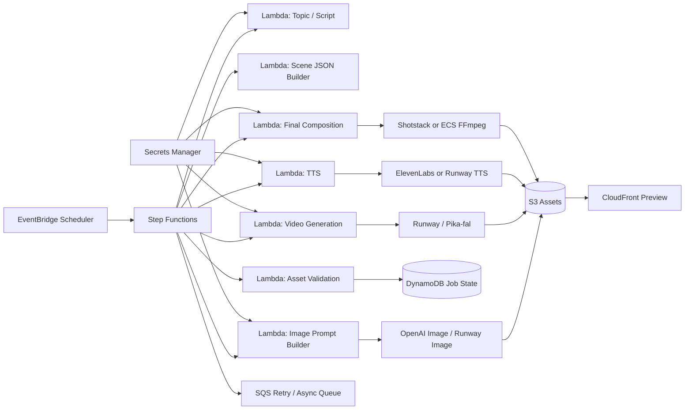
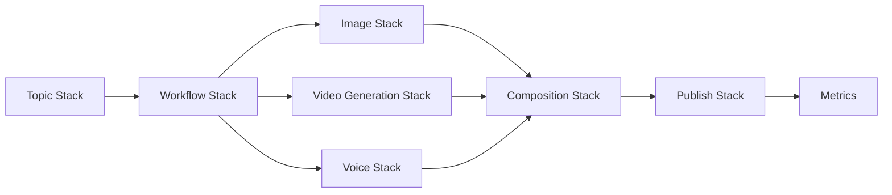

# AWS 기반 AI 영상 생성 자동화 실행 플랜

## 1. 결정 요약

### 최종 방향

- **API 우선 스택으로 구축**
- **Canva/InVideo 같은 편집형 SaaS는 보조 도구로만 사용**
- **장면 JSON 중심 파이프라인 유지**
- **생성, 합성, 업로드를 분리**
- **초기에는 휴먼 검수 포함**
- **모노레포 + 도메인별 스택 분리**

### 추천 결론

- 백엔드 자동화 핵심: `Runway / Pika(fal) / OpenAI Image / ElevenLabs(or Runway TTS) / Shotstack / AWS`
- 편집형 SaaS 활용 범위: 템플릿 자산 관리, 디자인 수정, 일부 마케팅용 산출물
- MVP 기본 렌더 전략: **Shotstack 우선**
- 고급 커스텀 합성 또는 비용 최적화 단계: **ECS Fargate + FFmpeg 추가**

### 핵심 판단

- **풀 자동화는 가능하다.**
- **Canva/InVideo 중심 접근은 반자동 운영에 가깝다.**
- **진짜 백엔드 자동화는 API 기반 생성 서비스 조합이 유리하다.**
- 비용의 대부분은 AWS보다 **외부 생성 모델 호출 비용**에서 발생한다.

---

## 2. 목표

자동화 대상 흐름:

**주제 수집 → 장면 JSON 생성 → 이미지/영상/TTS 생성 → 검증 → 합성/렌더 → 검수 → 업로드 → 성과 반영**

초기 목표:

- 숏폼 영상 자동 생성 파이프라인 구축
- AWS 기반 운영 구조 확보
- 비동기 생성 API를 안정적으로 오케스트레이션
- 장애 격리와 재시도 가능한 구조 확보
- 휴먼 검수 기반 반자동 운영 후 점진적 자동 승인 확대

운영 목표:

- 단일 채널
- 단일 언어
- 하루 3~5개 생성
- 월 100개 수준까지 무리 없이 확장

---

## 3. 설계 원칙

### 3.1 장면 JSON을 기준 데이터로 둔다

- 긴 자유 텍스트 대본이 아니라 **scene-based JSON** 을 기준으로 설계
- 장면 단위로 `duration`, `narration`, `subtitle`, `image/video prompt`, `audio cue`를 고정
- 이후 이미지, 영상, TTS, 자막, 렌더 플랜 모두 이 JSON을 기준으로 생성

예시:

```json
{
  "videoTitle": "Why medieval Korea felt strangely quiet at night",
  "language": "en",
  "scenes": [
    {
      "sceneId": 1,
      "durationSec": 8,
      "narration": "At night, the fortress did not sleep. It listened.",
      "imagePrompt": "moonlit Korean fortress, quiet courtyard, cinematic, mist",
      "videoPrompt": "slow cinematic push-in, moonlit Korean fortress courtyard, mist",
      "bgmMood": "dark_ambient",
      "sfx": ["night_wind", "distant_bell"],
      "subtitle": "The fortress did not sleep."
    }
  ]
}
```

### 3.2 생성과 합성을 분리한다

- 생성: LLM, 이미지 API, 영상 API, TTS API 호출
- 합성: Shotstack 또는 Fargate FFmpeg
- 업로드: YouTube API

생성 API와 최종 렌더를 분리해야 재시도, 비용 관리, 장애 대응이 쉽다.

### 3.3 오케스트레이션은 서버리스로 둔다

- 예약 실행: EventBridge Scheduler
- 상태 머신: Step Functions
- 단계 실행: Lambda
- 비동기 재시도: SQS

외부 생성 API는 대부분 비동기 task 기반이므로 Step Functions가 잘 맞는다.

### 3.4 에셋 검증은 필수다

렌더 전 검증 항목:

- 파일 존재 여부
- MIME/type 정상 여부
- 오디오 길이 0초 여부
- 장면 duration 합 불일치
- 자막 과다 길이
- scene count 제한 초과 여부

### 3.5 초기에는 휴먼 검수를 강제한다

필수 기능:

- approve
- reject
- regenerate
- 제목/설명/썸네일 수정
- 부분 재생성

### 3.6 모노레포 + 도메인별 스택 분리

- 리포지토리: 하나
- 스택: 여러 개
- 배포: 변경된 도메인만 선택 배포

---

## 4. 도구 선택 원칙

### 4.1 디자인 툴 자동화 vs API 우선 재구성

두 방식의 차이:

- **디자인 툴 자동화**: 사람이 쓰는 편집 UI와 템플릿 흐름을 백엔드에서 보조
- **API 우선 재구성**: 생성, 합성, 업로드를 서비스 API 단위로 직접 연결

권장 방향:

- Canva/InVideo를 메인 엔진으로 두지 않는다
- 생성 엔진은 API 제공 서비스로 구성한다
- 디자인 툴은 템플릿, 브랜드 자산, 썸네일 보조 작업에 한정한다

### 4.2 API 지원 및 자동화 적합성

| 서비스 | 공식/실사용 API | 자동화 적합성 | 권장 용도 |
| --- | --- | ---: | --- |
| **Runway** | 있음 | 매우 높음 | text-to-video, image-to-video, text-to-image, TTS |
| **Pika** | 있음, 단 `fal.ai` 경유 | 높음 | 스타일 영상, 짧은 생성 영상 |
| **Canva** | 있음 | 중간 | 자산/템플릿/익스포트 연동 |
| **InVideo** | 공개 개발자 API 확인 어려움 | 낮음 | 수동 편집 보조 수준 |
| **ElevenLabs** | 있음 | 높음 | TTS, 더빙 |
| **Shotstack** | 있음 | 매우 높음 | API 기반 영상 합성/렌더 |
| **Plainly** | 있음 | 높음 | 템플릿 대량 양산형 |
| **n8n** | 있음, 셀프호스팅 가능 | 높음 | 보조 워크플로우 도구 |
| **Midjourney** | 공식 공개 API 없음 | 낮음 | 백엔드 자동화 부적합 |
| **OpenAI Image** | 있음 | 높음 | 이미지 생성 |
| **Stability AI** | 있음 | 높음 | 이미지 생성 대안 |

### 4.3 최종 추천

- **Runway**: 영상 생성 + 이미지 생성 + TTS까지 한 축으로 묶을 수 있는 1순위
- **OpenAI Image**: 이미지 생성 품질/자동화 균형용
- **ElevenLabs**: 음성 품질 우선일 때 사용
- **Shotstack**: MVP 렌더러 1순위
- **Fargate FFmpeg**: 커스텀 합성, burn-in subtitle, 썸네일 배치 생성 시 추가
- **Canva/Plainly**: 템플릿형 콘텐츠 또는 마케팅 자산 보조

---

## 5. 권장 스택

### 5.1 MVP 기본안

- 스크립트/장면 구성: LLM
- 이미지 생성: `OpenAI Image` 또는 `Runway Image`
- 영상 생성: `Runway`
- 음성 생성: `Runway TTS` 또는 `ElevenLabs`
- BGM/SFX: 내부 라이브러리 매핑
- 합성/렌더: `Shotstack`
- 저장: `S3`
- 상태 관리: `DynamoDB`
- 오케스트레이션: `EventBridge + Step Functions + Lambda + SQS`
- 검수/운영: Admin UI
- 업로드: YouTube Data API

### 5.2 대안 스택

#### A안. 가장 자동화 친화적

- 이미지: OpenAI Image 또는 Runway Image
- 영상: Runway
- 음성: Runway TTS 또는 ElevenLabs
- 합성: Shotstack
- 오케스트레이션: AWS Step Functions + Lambda

#### B안. 스타일 영상 중심

- 이미지: OpenAI Image
- 영상: Pika(fal) 또는 Runway
- 합성: Shotstack
- 메모: Pika는 직접 API보다 `fal` 모델 엔드포인트 연동으로 보는 게 정확

#### C안. 템플릿 대량 양산형

- 템플릿: Canva 또는 Plainly
- 합성: Shotstack 또는 Plainly
- 데이터 입력: CSV/JSON
- 적합한 콘텐츠: 부동산, 뉴스 카드, 상품 소개, 랭킹 영상

### 5.3 비권장

- InVideo를 핵심 백엔드 자동화 엔진으로 채택
- Midjourney를 정식 생성 백엔드로 채택
- 초기에 Fargate를 필수 전제로 설계

---

## 6. AWS 아키텍처

### 6.1 전체 구조



### 6.2 이 구조를 채택하는 이유

- 생성 API가 비동기 task 기반이라 Step Functions의 wait/poll 패턴과 맞음
- Lambda는 각 단계를 짧고 작게 유지하기 좋음
- SQS는 실패 재시도, 백프레셔, DLQ 분리에 유리
- S3는 원본/중간/최종 산출물 저장에 적합
- CloudFront는 미리보기와 CDN 배포에 적합
- Secrets Manager로 외부 API 키를 중앙 관리 가능

### 6.3 최소 AWS 구성

- EventBridge Scheduler
- Step Functions
- Lambda
- DynamoDB
- S3
- Secrets Manager
- SQS
- CloudFront
- CloudWatch
- IAM

### 6.4 무거워질 때 추가

- ECS Fargate: FFmpeg 커스텀 합성, 자막 burn-in, 썸네일 배치 생성
- ElastiCache/Redis: rate limit, dedupe, job lock
- RDS: 템플릿/프로젝트 관리형 서비스로 커질 때

### 6.5 n8n 포지션

- 가능은 하지만 메인 오케스트레이터로 두지 않는다
- 내부 운영툴 자동화, 알림, 보조 백오피스 워크플로우에만 사용

---

## 7. 도메인 구조와 배포 전략

### 7.1 리포 전략

**모노레포 유지**

```txt
/apps
  /infra
  /ops-admin
/services
  /topic
  /script
  /image
  /video-generation
  /voice
  /composition
  /publish
  /orchestrator
/packages
  /shared-types
  /event-schema
  /config
  /constructs
  /provider-clients
  /utils
```

### 7.2 도메인별 스택

- `SharedStack`
- `WorkflowStack`
- `TopicStack`
- `ImageGenerationStack`
- `VideoGenerationStack`
- `VoiceGenerationStack`
- `CompositionStack`
- `PublishStack`
- `OpsStack`

### 7.3 분리 기준

- 큐가 다름
- 실패 패턴이 다름
- 비용 구조가 다름
- 실행 시간이 다름
- IAM 권한이 다름
- 스케일링 방식이 다름

### 7.4 배포 원칙

- 변경된 도메인만 배포
- shared 변경 시 관련 스택만 배포
- cross-stack reference 최소화
- 이벤트 계약은 `packages/event-schema` 에서만 공유

---

## 8. 도메인별 책임



### Shared Stack

- 공통 S3 버킷
- CloudFront
- 공통 로깅/알람
- 공통 config/secret wiring

### Workflow Stack

- Step Functions state machine
- SQS retry queue / DLQ
- job orchestration Lambda

### Topic Stack

- EventBridge schedule
- topic planner Lambda
- topic metadata 저장

### ImageGeneration Stack

- 이미지 생성 Lambda
- provider adapter
- image asset metadata 저장

### VideoGeneration Stack

- scene video 생성 Lambda
- Runway/Pika-fal task polling
- video clip metadata 저장

### VoiceGeneration Stack

- TTS Lambda
- BGM/SFX 매핑
- audio metadata 저장

### Composition Stack

- asset validation
- render plan builder
- Shotstack integration
- 선택적 Fargate FFmpeg worker
- rendered artifact 저장

### Publish Stack

- review / approval 처리
- YouTube upload worker
- 업로드 이력 저장

### Ops Stack

- Admin UI
- review queue
- 수동 재실행/재생성
- 운영 알림

---

## 9. 단계별 워크플로우

### 9.1 Topic Planner

입력:

- 채널 설정
- 최근 업로드 성과
- 금지 주제/중복 규칙

출력:

```json
{
  "topicId": "topic_001",
  "channelId": "history_en",
  "titleIdea": "Why medieval Korea felt strangely quiet at night",
  "targetLanguage": "en",
  "targetDurationSec": 48,
  "stylePreset": "dark_ambient_story"
}
```

### 9.2 Script / Scene JSON Generator

세부 단계:

- 아이디어 생성
- 아웃라인 생성
- 장면 JSON 생성
- 제목/설명/태그 초안 생성

권장 기준:

- 장면 수: 5~12개
- 장면당 4~8초
- 자막은 1문장 또는 짧은 2문장 이하

### 9.3 Asset Generation

생성 항목:

- 이미지 생성
- 선택적 짧은 scene video 생성
- TTS 생성
- BGM/SFX 연결
- 결과 S3 저장

운영 원칙:

- 장면마다 `image-only` 또는 `video-clip` 타입을 선택 가능하게 설계
- 같은 장면은 동일 프롬프트 해시 기준으로 중복 생성 방지

### 9.4 Asset Validation

검증 항목:

- S3 파일 존재
- MIME/type 정상
- TTS 길이 > 0
- scene duration 합 일치
- subtitle 길이 제한
- scene count 제한
- provider 응답 메타데이터 정상

### 9.5 Render Plan Builder

역할:

- 장면 JSON + 생성 에셋 + 타이밍 정보를 합쳐 최종 렌더용 JSON 생성

예시:

```json
{
  "renderPlan": {
    "totalDurationSec": 48,
    "scenes": [
      {
        "sceneId": 1,
        "startSec": 0,
        "endSec": 8,
        "visualType": "image",
        "imageS3Key": "s3://bucket/assets/topic_001/scene1.png",
        "voiceS3Key": "s3://bucket/audio/topic_001/scene1.mp3",
        "subtitle": "The fortress did not sleep.",
        "sfx": [{ "key": "s3://bucket/sfx/night_wind.mp3", "atSec": 1.2 }]
      }
    ],
    "bgmS3Key": "s3://bucket/bgm/dark_ambient.mp3"
  }
}
```

### 9.6 Final Composition

MVP 기본:

- Shotstack로 최종 합성
- mp4 및 thumbnail 생성
- 결과를 S3 저장

고급 모드:

- ECS Fargate + FFmpeg
- 고급 트랜지션
- subtitle burn-in
- 썸네일 배치 생성

### 9.7 Review / Approval

필수 기능:

- 영상 미리보기
- approve / reject
- regenerate
- title / description / thumbnail 수정

부분 재생성 범위:

- 이미지만 재생성
- 영상 클립만 재생성
- 음성만 재생성
- 메타데이터만 재생성
- 전체 재렌더

### 9.8 Upload Worker

역할:

- YouTube 업로드
- title/description/tags/playlist/thumbnail/visibility 설정

초기 운영 원칙:

- 기본 업로드는 `private` 또는 `unlisted`
- 승인 후 `public` 전환

### 9.9 Metrics Loop

수집 항목:

- 조회수
- CTR
- retention
- 평균 시청 시간
- topic/style/provider별 성과

성과 데이터는 다음 주제 선정과 프롬프트 개선에 재사용한다.

---

## 10. 상태 관리

### 10.1 권장 상태

- `PLANNED`
- `SCENE_JSON_READY`
- `ASSET_GENERATING`
- `ASSETS_READY`
- `VALIDATING`
- `VALIDATION_FAILED`
- `COMPOSITION_QUEUED`
- `COMPOSING`
- `RENDERED`
- `REVIEW_PENDING`
- `APPROVED`
- `REJECTED`
- `UPLOAD_QUEUED`
- `UPLOADING`
- `UPLOADED`
- `FAILED`

### 10.2 공통 필드

- `retryCount`
- `lastError`
- `estimatedCost`
- `providerCosts`
- `reviewMode`
- `uploadVideoId`
- `approvalActor`
- `regenerationScope`

---

## 11. 저장 구조

### 11.1 DynamoDB 엔티티

#### VideoJob

- `jobId`
- `channelId`
- `topicId`
- `status`
- `language`
- `targetDurationSec`
- `videoTitle`
- `estimatedCost`
- `providerSummary`
- `createdAt`
- `updatedAt`

#### SceneAsset

- `jobId`
- `sceneId`
- `visualType`
- `imageS3Key`
- `videoClipS3Key`
- `voiceS3Key`
- `subtitle`
- `durationSec`
- `validationStatus`

#### RenderArtifact

- `jobId`
- `renderPlanS3Key`
- `finalVideoS3Key`
- `thumbnailS3Key`
- `previewUrl`

#### UploadRecord

- `jobId`
- `platform`
- `uploadStatus`
- `youtubeVideoId`
- `visibility`
- `publishedAt`

### 11.2 S3 구조 예시

```txt
s3://video-factory/
  topics/
  scene-json/
  assets/
    {jobId}/images/
    {jobId}/videos/
    {jobId}/tts/
    {jobId}/bgm/
    {jobId}/sfx/
  render-plans/
  rendered/
    {jobId}/final.mp4
    {jobId}/thumbnail.jpg
  previews/
  logs/
    {jobId}/provider/
    {jobId}/composition/
```

---

## 12. 큐와 비동기 처리

### 12.1 기본 큐

- `topic-queue`
- `asset-queue`
- `composition-queue`
- `upload-queue`

### 12.2 추가 큐

- `provider-callback-queue`
- `review-queue`
- `dead-letter-queue`

### 12.3 처리 원칙

- 외부 생성 API 요청은 idempotency key 적용
- provider task polling은 Step Functions wait state 또는 SQS 재시도 사용
- 실패는 단계별로 끊고 전체 워크플로우를 즉시 폐기하지 않음

---

## 13. 공유 패키지 원칙

### 공유해도 되는 것

- 이벤트 타입
- 공통 로깅
- observability
- env/config loader
- CDK constructs
- 공통 에러 모델
- provider client wrapper interface

### 공유하면 안 되는 것

- 도메인 서비스 로직
- 상태 전이 로직
- provider 구현 세부사항
- 큐 소비 정책

원칙:

- `shared`는 계약과 유틸만 담는다
- 비즈니스 로직은 각 도메인 서비스에 남긴다

---

## 14. MVP 범위

### 포함

- 단일 채널
- 단일 언어
- 하루 3~5개 생성
- scene JSON 기반 생성
- 이미지 생성
- TTS 생성
- 선택적 scene video 생성
- validation
- Shotstack 기반 합성
- review UI
- YouTube private 업로드
- 기본 metrics 수집

### 제외

- 다중 플랫폼 동시 업로드
- 완전 자동 public publish
- 고급 A/B 테스트
- 다계정/다팀 운영
- 자체 영상 편집 SaaS 개발
- 초반부터 전면 Fargate 전환

---

## 15. 월 비용 추정

### 15.1 가정

- 월 `100개` 쇼츠
- 영상당 `20초`
- 영상당 이미지 `6장`
- TTS 내레이션 포함
- 최종 렌더는 Shotstack 사용
- AWS는 서버리스 중심

### 15.2 시나리오 1. 자동화 MVP

- 이미지: 약 `$24`
- 영상 생성: 약 `$100`
- TTS: 약 `$6`
- Shotstack: 약 `$39`
- AWS: 약 `$5~20`

**합계: 약 `$174~189 / 월`**

### 15.3 시나리오 2. 공격적 운영

가정:

- 월 `200개` 쇼츠
- 영상당 `30초`

예상:

- 이미지: 약 `$48`
- 영상 생성: 약 `$300`
- TTS: 약 `$20`
- Shotstack: `$39 + usage 확인`
- AWS: 약 `$10~30`

**합계: 약 `$417~437+ / 월`**

### 15.4 비용 해석

- 고정비보다 **생성량에 비례하는 외부 API 비용**이 크다
- AWS 오케스트레이션 비용은 MVP 단계에서 상대적으로 작다
- 최우선 비용 관리 포인트는 `scene 수`, `초당 생성 영상 길이`, `재생성 비율`이다

---

## 16. 실행 로드맵

### Phase 1. MVP 골격

- 모노레포 구조 생성
- Shared/Workflow/Topic/Image/Voice/Composition/Publish 스택 정의
- Step Functions 상태 머신 생성
- DynamoDB, S3, Secrets Manager, CloudWatch 기본 구성

### Phase 2. 생성 파이프라인

- Topic Planner 구현
- Scene JSON Generator 구현
- OpenAI Image 또는 Runway Image 연동
- ElevenLabs 또는 Runway TTS 연동
- asset validation 구현

### Phase 3. 합성과 검수

- Shotstack 연동
- preview URL 생성
- Admin UI의 approve/reject/regenerate 구현
- YouTube private 업로드 구현

### Phase 4. 운영 안정화

- provider fallback 추가
- 부분 재생성 범위 세분화
- 비용 대시보드 추가
- CloudFront 미리보기 최적화
- 필요 시 Fargate FFmpeg 도입

---

## 17. 최종 요약

- **장면 JSON 중심으로 설계**
- **디자인 툴 자동화보다 API 우선 스택 채택**
- **Step Functions 기반 서버리스 오케스트레이션**
- **Runway/OpenAI/ElevenLabs/Shotstack 조합 우선**
- **Canva/InVideo는 보조 도구로 한정**
- **초기 합성은 Shotstack, 고급 합성은 Fargate FFmpeg**
- **모노레포 유지, 도메인별 스택 분리, changed-domain only 배포**

한 줄 요약:

**생성은 API로 표준화하고, AWS는 오케스트레이션과 상태 관리를 맡으며, 편집형 SaaS는 보조로만 쓴다.**
