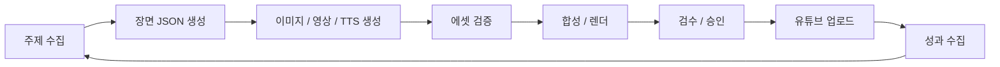
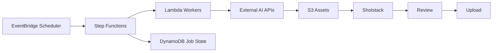

# AI 영상 자동화 아키텍처

## 개요

이 시스템은 AI로 숏폼 영상을 자동 생성하고, 검수 후 업로드하는 파이프라인이다. 기준 데이터는 자유 텍스트 대본이 아니라 장면 단위 `scene JSON` 이다.

## 처리 흐름

## 시스템 구조

## 핵심 선택

- 생성은 API 우선 스택으로 구성한다.
- Canva/InVideo는 보조 도구로만 사용한다.
- 오케스트레이션은 `Step Functions + Lambda + SQS` 로 둔다.
- 저장은 `S3 + DynamoDB` 로 둔다.
- MVP 렌더는 `Shotstack` 를 사용한다.
- 고급 합성은 이후 `ECS Fargate + FFmpeg` 로 확장한다.

## 리포 방향

- `storytalk-infra` 스타일의 단일 TypeScript CDK 리포를 따른다.
- `bin` 은 CDK 진입점만 둔다.
- `lib` 는 스택과 인프라 모듈만 둔다.
- `services` 는 Lambda 런타임 로직만 둔다.

## 범위

초기 MVP는 단일 채널, 단일 언어, scene JSON 기반 생성, 이미지/TTS 생성, 선택적 scene video 생성, review UI, YouTube private 업로드까지를 대상으로 한다.

상세 구현 계획은 `docs/plan.md` 에서 관리한다.

**현재 코드 기준 개요**(Admin GraphQL, 발행·발굴·에이전트 축 포함)는 `docs/plan.md` 의 “현재 레포와의 관계”와 [`implementation-overview-external-review.md`](./implementation-overview-external-review.md)를 함께 본다.
