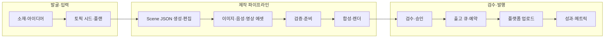
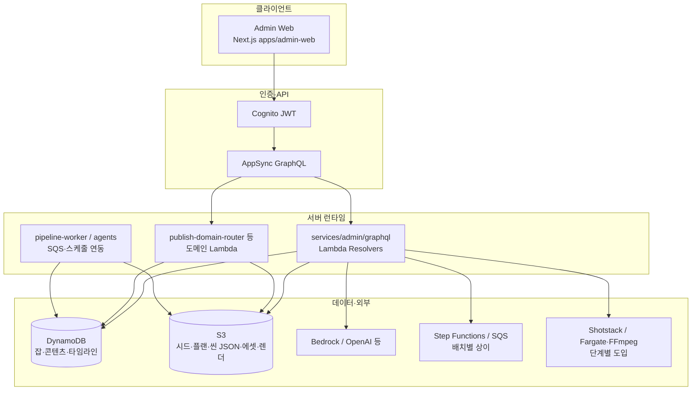

# AI 영상 자동화 아키텍처

## 한 줄 요약

**장면 단위 `scene JSON`을 기준 데이터**로 두고, 토픽·씬·에셋·렌더·검수·발행까지를 **Admin 콘솔(AppSync GraphQL) + Lambda + AWS 관리형 서비스**로 묶는 숏폼 제작 파이프라인이다. 설계안상의 Step Functions·SQS·스케줄 기반 오케스트레이션과, 실제 코드의 **명령 접수·비동기 워커·S3/Dynamo 원장**이 함께 존재하며, 세부 경계는 CDK 스택과 GraphQL 스키마가 정본이다.

---

## 핵심 데이터·도메인 단위

| 개념                      | 역할                                                                                                                                 |
| ------------------------- | ------------------------------------------------------------------------------------------------------------------------------------ |
| **Scene JSON**            | 자유 텍스트 대본이 아니라 장면별 `duration`, 나레이션, 자막, 이미지/영상 프롬프트 등 **렌더 중립** 구조. 생성·합성·검수의 공통 계약. |
| **Content (`contentId`)** | 운영 카탈로그의 채널/라인. 유튜브 등 매체 연결·출고 큐·스케줄의 맥락.                                                                |
| **Job (`jobId`)**         | 한 편의 제작 실행 인스턴스. 시드·토픽 플랜·씬 JSON·에셋·상태·실행 이력의 본체.                                                       |

미연결 잡은 placeholder 콘텐츠 ID로 두었다가 이후 채널에 붙이는 흐름이 있다.

---

## 논리 처리 흐름 (제품 관점)

운영자가 보는 단계와 설계상 파이프라인을 한 그림에 맞춘 것이다. 실제 비동기 분기·재시도는 스택별로 다를 수 있다.

---

## 런타임 구조 (현재 구현 기준)

관리 UI와 API가 제작 파이프라인의 **주 운영 표면**이다. Lambda 리졸버는 입력 검증·원장 갱신·**긴 작업의 비동기 트리거**까지를 담당하고, 무거운 생성·렌더는 워커·Step Functions·외부 API 조합으로 이어진다(스택·함수별 상이).

- **GraphQL 스키마 정본:** `lib/modules/publish/graphql/schema.graphql`
- **클라이언트 계약:** `packages/graphql` + 공유 `zod` 계약(요청·입력 파싱)
- **리졸버 구현:** `services/admin/graphql/**` — 핸들러는 얇게, `index.ts` / `usecase` / `repo` 분리 컨벤션

---

## 운영 표면: Admin과 주요 기능 묶음

| 영역          | 구현 방향 (요약)                                                                      |
| ------------- | ------------------------------------------------------------------------------------- |
| **인증**      | Cognito — Admin 그룹 기반 접근                                                        |
| **제작 허브** | 채널(콘텐츠) 카탈로그, 전역 제작 아이템 목록, 잡 상세(토픽·씬·에셋·렌더·검수·출고 탭) |
| **발굴**      | `/discovery` — 채널 필터, 소재·후보·트렌드 등(발행·발굴 도메인과 연동)                |
| **검수·실행** | 검수함, 실행 이력·파이프라인 execution 타임라인                                       |
| **설정**      | LLM 스텝 설정, 보이스, 채널·매체 연결, 발행 정책 등                                   |

UI 정보 구조·데이터 계층 요약은 [`admin-client-ia-and-data.md`](./admin-client-ia-and-data.md), 잡 상세 탭별 조작 목록은 [`job-detail-sections-and-data.md`](./job-detail-sections-and-data.md)를 본다.

---

## 보조 축: 발행·발굴·에이전트

제작 파이프라인(Job·토픽·씬·에셋)과 **느슨히** 연결된 운영 축이 있다.

- **Publish 도메인:** 소재(SourceItem), 출고 드래프트·타깃, 플랫폼 연결, 아이디어 후보·트렌드·에이전트 실행 이력 등 — `publish-domain-router` 등으로 라우팅.
- **에이전트·큐:** SQS + Lambda(예: 트렌드 스카우트 수동 큐 적재). 세부는 CDK·`services/agents`·스키마를 따른다.

상세 목록은 [`implementation-overview-external-review.md`](./implementation-overview-external-review.md) §3.1·§6.

---

## 인프라·저장 (설계와 코드의 공통 축)

| 계층               | 역할                                                                          |
| ------------------ | ----------------------------------------------------------------------------- |
| **오케스트레이션** | EventBridge, Step Functions, Lambda, SQS — 배포 스택마다 연결 범위 상이       |
| **저장**           | S3(아티팩트), DynamoDB(잡·콘텐츠·타임라인·설정)                               |
| **비밀·설정**      | Secrets Manager, Dynamo `llm-config` 등(스텝별 모델·프롬프트)                 |
| **관측**           | CloudWatch                                                                    |
| **외부 생성**      | 이미지·영상·TTS 등 API 우선(프로젝트별 provider 추상화)                       |
| **렌더**           | Shotstack 중심 MVP, 고급 합성·자막 번인 등은 ECS Fargate + FFmpeg 등으로 확장 |

---

## 핵심 기술 선택

- 생성은 **API 우선** 스택으로 구성한다.
- Canva/InVideo는 **보조 도구**로만 둔다.
- 오케스트레이션은 **Step Functions + Lambda + SQS**를 기본 축으로 두되, **Resolver 동기 장시간 처리**는 피하고 비동기 워크플로로 넘긴다.
- 저장은 **S3 + DynamoDB**를 원장·아티팩트로 둔다.
- MVP 렌더는 **Shotstack**; 무거운 미디어 처리는 **Lambda에 억지로 넣지 않고** Fargate·외부 렌더로 분리하는 방향(실행 원칙은 `implementation-overview-external-review.md` §10).

---

## 리포지토리 구조

- **storytalk-infra 스타일**의 단일 TypeScript CDK 모노레포(Yarn workspaces).
- `bin/` — CDK 진입점만.
- `lib/` — 스택·인프라 모듈.
- `services/` — Lambda 런타임(Admin GraphQL, publish-domain, pipeline-worker, agents 등).
- `apps/admin-web/` — Admin 프론트(FSD 레이어 규칙).

---

## 범위·문서 맵

**초기 MVP 목표(요약):** 단일 채널 중심 운영에 가깝게 시작하되, 코드베이스는 멀티 채널·발행·발굴 축을 포함해 확장 중이다. scene JSON 기반 생성, 이미지·TTS·선택적 씬 영상, 검수 UI, YouTube 업로드 경로, 출고 큐·예약 등이 구현·설계 문서에 흩어져 있다.

| 문서                                                                                         | 용도                                                 |
| -------------------------------------------------------------------------------------------- | ---------------------------------------------------- |
| **본 문서 (`architecture.md`)**                                                              | 전체 구조·도메인·런타임을 한 번에 잡는 **짧은 개괄** |
| [`plan.md`](./plan.md)                                                                       | 실행 설계안·의사결정·상세 워크플로(장문)             |
| [`implementation-overview-external-review.md`](./implementation-overview-external-review.md) | 코드 기준 스냅샷, API 표면, 실행 원칙(§10~)          |
| [`recent-work-summary.md`](./recent-work-summary.md)                                         | 최근 변경 시계열                                     |
| [`plans/`](./plans/)                                                                         | 도메인·IA·로드맵 초안                                |

**계약의 정본:** GraphQL 스키마, 공유 `zod`·contracts. 배포 후 AppSync·Lambda에 반영된다.
