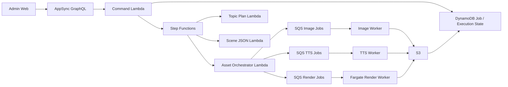

# Automata Studio / AI Pipeline Studio — 구현 개요 및 아키텍처 실행 기준 (외부 평가용)

**정본 파일명:** `docs/implementation-overview-external-review.md`  
(`implemention-overview-…` 철자 오류본은 사용하지 않는다.)

본 문서는 (1) 코드베이스 **현재 구현**을 개괄하고, (2) 외부 피드백을 반영한 **실행 목표·경계(명령 / 오케스트레이션 / 워커 / 저장)**를 한곳에 둔다. 기술 실사·파트너 검토·내부 핸드오프용이다. 세부 API 스펙은 GraphQL 스키마 및 공유 `zod` 계약을 우선한다.

**최근에 반영된 구체적 변경**(파이프라인 실행 이력·비동기 워커·`adminJobs` 병합 목록·Admin 용어·브레드크럼·제작 아이템 허브 등)은 [`recent-work-summary.md`](./recent-work-summary.md)에 정리해 두었다.

**Admin 전면 개선 방향(도메인·후보/채택·상세 IA·백엔드 우선순위) — Cursor 전달용:** [`plans/admin-improvement-direction-cursor-handoff.md`](./plans/admin-improvement-direction-cursor-handoff.md)

### 이 문서가 커버하는 범위 (직독 시 참고)

이 파일 **하나만**으로 **전체 코드베이스의 모든 모듈·모든 화면·모든 엣지 케이스**를 대체할 수는 없다. 역할은 다음으로 고정한다.

| 역할 | 내용 |
| --- | --- |
| **본 문서** | 외부 검토용 **아키텍처·도메인 요약**, **실행 목표·경계(§10~)**, 제품·스택 한 장 요약 |
| **최근 변경 스냅샷** | [`recent-work-summary.md`](./recent-work-summary.md) — 파이프라인 실행 이력·비동기 워커·허브 UI 등 시계열 변경 |
| **세부 설계·로드맵** | `docs/plans/` (예: 콘텐츠·잡·토픽, Admin IA, 에이전트/발행 통합) |
| **계약의 정본** | `lib/modules/publish/graphql/schema.graphql`, 공유 `zod`·`lib/modules/*/contracts` |

**발행·발굴·에이전트**처럼 제작 파이프라인 옆에 붙은 축은 아래 §3.1에서 요약하고, 필드·뮤테이션 목록은 스키마를 우선한다.

---

## 1. 제품 목적 (한 줄)

**숏폼 영상 제작 파이프라인**을 운영하기 위한 백오피스·자동화 스택으로, **콘텐츠(채널 단위) → 잡(한 편의 실행) → 토픽/씬/에셋/업로드** 단계를 **Admin UI + GraphQL + Lambda + AWS 관리형 서비스**로 묶어 둔다.

---

## 2. 저장소·기술 스택

| 구분           | 내용                                                                           |
| -------------- | ------------------------------------------------------------------------------ |
| 언어 / 런타임  | TypeScript, Node.js 20 (Lambda)                                                |
| 인프라 as 코드 | AWS CDK (`lib/`, `bin/`)                                                       |
| Admin API      | AWS AppSync (GraphQL), Cognito(관리자 인증)                                    |
| 데이터         | Amazon DynamoDB(잡 메타·GSI), S3(시드·브리프·토픽 플랜·씬 JSON·에셋·로그)      |
| LLM            | Amazon Bedrock(기본), OpenAI 등은 공유 LLM 추상화·폴백 경로 존재               |
| 설정           | DynamoDB `llm-config` 테이블(스텝별 프롬프트/모델), Secrets Manager(API 키 등) |
| 검증           | 공유 `zod` 스키마(`services/shared/lib/contracts/`)를 요청·입력 파싱에 사용    |
| Admin 프론트   | Next.js 앱 `apps/admin-web`, FSD(Feature-Sliced Design) 레이어 규칙 적용       |

모노레포: Yarn workspaces — `apps/*`, `packages/*`(GraphQL 클라이언트, UI, 설정 등).

---

## 3. 아키텍처 개요 (현재 구현)

```
[Admin Web (Next.js)]
        │ Cognito JWT
        ▼
[AppSync GraphQL API] ── Lambda Resolvers (services/admin/graphql/*)
        │
        ├── DynamoDB: 잡 메타, 콘텐츠 메타, 리뷰·타임라인 등
        ├── S3: topic-seed, content brief, topic plan, scene json, 렌더 산출물
        ├── Bedrock / OpenAI: 토픽 플랜·씬 JSON 등 구조화 생성
        └── Step Functions / SQS 등: 발행·리뷰·업로드 등 워크플로(스택 구성에 따름)
```

- **핸들러 규칙**: Lambda `handler.ts`는 진입만 두고, 오케스트레이션은 동일 폴더 `index.ts`·`usecase/`·`repo/`로 분리하는 컨벤션이 있다.
- **CDK**: `PublishStack` 등에서 GraphQL 리졸버 Lambda, IAM(S3/DynamoDB/Bedrock/Secrets/`llm-config` 읽기 등), 버킷·테이블을 연결한다.

후반부(§10 이후)는 **목표 실행 모델**로, Step Functions·SQS·워커 경계를 더 분명히 한다.

### 3.1 발행·발굴·에이전트 (현재 구현 축, 요약)

제작 파이프라인(Job·토픽·씬·에셋)과 **느슨하게** 연결된 운영 축이 코드에 존재한다. 세부는 GraphQL·CDK·`services/agents/*`를 본다.

- **Publish 도메인 (AppSync):** 단일 `publish-domain` Lambda 라우터가 소재(SourceItem), 출고 드래프트/타깃, 플랫폼 연결·프로필, 아이디어 후보·트렌드 신호·에이전트 실행 이력·워치리스트·채널 에이전트 설정 등을 다룬다 (`services/admin/graphql/publish-domain-router/`).
- **에이전트 워커:** `PublishStack`에서 SQS + Lambda(예: 트렌드 스카우트·채널 평가)로 연결. 초기 일부는 Dynamo에 `AgentRun` 등을 남기는 **플레이스홀더**이며, YouTube Data API 등 외부 수집은 단계적으로 연결한다.
- **Admin UI:** 전역 **`/discovery`(발굴·벤치마크)** — 운영 라인(채널) 필터, 워치리스트·후보·트렌드 탭. 외부 API 쿼터·비용을 고려해 **트렌드 스카우트는 스케줄 없이** `enqueueTrendScoutJob` 뮤테이션으로 **수동 큐 적재**하는 경로를 둔다.
- **메트릭 등:** 스택에 따라 주기 수집 Lambda 등이 있을 수 있으나, 본 개요의 핵심은 **제작 + 발행·발굴**의 분리다.

---

## 4. 도메인 모델 (요약)

| 개념                      | 역할                                                                                                         |
| ------------------------- | ------------------------------------------------------------------------------------------------------------ |
| **Content (`contentId`)** | 운영 카탈로그 상의 채널/라인 단위. 유튜브 연동·라벨 등 발행 맥락.                                            |
| **Job (`jobId`)**         | 한 번의 파이프라인 실행 인스턴스. 시드·플랜·씬 JSON·에셋·상태의 본체.                                        |
| **Topic seed**            | LLM 입력용 메타(언어, 제목 아이디어, 길이, 스타일 등). S3 시드 JSON + 선택적 **기획 메모(`creativeBrief`)**. |
| **Topic plan**            | 시드 기반으로 생성·저장되는 플랜 산출물(`topicS3Key`, 예: `topics/{jobId}/topic.json`).                      |
| **Scene JSON**            | 장면별 나레이션·이미지/영상 프롬프트 등 **렌더 중립** 구조. 토픽 플랜과 시드 메모를 프롬프트에 반영.         |
| **미연결 잡**             | `contentId` 생략 시 placeholder `__unassigned__`. 이후 `attachJobToContent`로 실제 콘텐츠에 연결 가능.       |

상세 용어·관계는 [`content-job-topic-domain.md`](./plans/content-job-topic-domain.md)를 본다.

---

## 5. Admin에서의 주요 사용자 흐름 (구현 기준)

1. **콘텐츠 / 잡 허브**  
   채널(콘텐츠) 선택 또는 **잡 전용 허브**에서 잡 생성·목록·상세로 진입.

2. **잡 생성 (`createDraftJob`)**  
   기본적으로 **토픽 플랜까지 연쇄 실행**(`runTopicPlan !== false`). 시드만 두려면 옵션으로 비활성화 가능.

3. **토픽·시드 (Ideation)**  
   시드 필드 편집·저장, **토픽 플랜 재실행**, 선택적 **기획 메모**로 씬 방향 보강.

4. **스크립트 / Scene JSON**  
   `runSceneJson`으로 LLM 기반 씬 JSON 생성, 수동 편집·`updateSceneJson` 저장.

5. **이미지·음성·영상·검수·업로드**  
   단계별 UI 탭과 `runAssetGeneration`, 리뷰·업로드 뮤테이션 등으로 이어지며, 실제 에셋 파이프라인 깊이는 스택·도메인별로 단계적 구현.

---

## 6. API 표면 (Admin GraphQL)

- **Query (코어 파이프라인·운영):** `adminContents`, `adminJobs`, `adminJob`, `jobDraft`, `pendingReviews`, `jobTimeline`, `jobExecutions`, `llmSettings`, `channelPublishQueue`, `platformConnections` 등.
- **Query (발행·발굴 도메인):** `ideaCandidatesForChannel`, `trendSignalsForChannel`, `agentRunsForChannel`, `channelAgentConfig`, `channelWatchlist`, `latestChannelScoreSnapshotsForChannel`, `sourceItem` / `sourceItemsForChannel`, `platformPublishProfile`, `contentPublishDraft`, `publishTargetsForJob`, `performanceInsightsForJob` 등.
- **Mutation (코어):** `createDraftJob`, `attachJobToContent`, `updateTopicSeed`, `runTopicPlan`, `runSceneJson`, `updateSceneJson`, `runAssetGeneration`, `approvePipelineExecution`, `createContent` / `updateContent` / `deleteContent`, `deleteJob`, 리뷰·업로드 등.
- **Mutation (발행·연결·발굴):** `enqueueToChannelPublishQueue`, `runPublishOrchestration`, 소재·연결·드래프트 갱신, 아이디어 후보 승격/거절, 워치리스트·에이전트 설정, **`enqueueTrendScoutJob`**(트렌드 스카우트 SQS 수동 1건) 등.

스키마 단일 소스: `lib/modules/publish/graphql/schema.graphql`. 클라이언트는 `packages/graphql`에서 쿼리/뮤테이션 문자열을 유지한다.

---

## 7. 품질·운영 관련 구현 포인트

- **계약**: Admin·리졸버 입력은 가능한 한 **공유 `zod` 스키마**와 일치시킨다 (프로젝트 규칙).
- **에러**: GraphQL 리졸버는 공통 매핑으로 사용자 메시지를 정리하며, 내부 원인은 감사 로그·핸들러 로깅으로 추적 가능하도록 구성되어 있다.
- **IAM**: LLM 스텝 설정 테이블(`llm-config`) 읽기, Bedrock 호출, S3/DynamoDB 접근은 **해당 Lambda 역할에 명시적으로 부여**해야 한다(배포 시 CDK에서 처리).
- **프론트**: Admin은 FSD로 레이어 의존 방향을 제한한다(예: `features` → `widgets` 직접 참조 금지, 공통 타입은 `entities` 등으로 상향).

---

## 8. 문서·한계 (평가 시 참고)

- **문서화**: `docs/plans/`에 도메인·IA 계획이 일부 있다. 본 문서 상반부는 **코드 기준 스냅샷**이며, 세부 화면 문구·모든 엣지 케이스는 코드·스키마를 함께 본다.
- **배포**: 스키마 필드 추가·IAM 변경은 **CDK 재배포** 후 AppSync/ Lambda에 반영된다.
- **범위**: 외부 SaaS 수준의 완전한 멀티테넌트·청구·감사 대시보드 등은 본 개요의 초점이 아니며, **영상 파이프라인 운영자 콘솔 + AWS 백엔드**에 가깝다.

---

## 9. 외부 검토 요약 (실행 목표의 출발점)

| 항목             | 내용                                                                                                                                                                            |
| ---------------- | ------------------------------------------------------------------------------------------------------------------------------------------------------------------------------- |
| **총평**         | **8/10**. Admin Web → AppSync GraphQL → Lambda Resolver → DynamoDB/S3/LLM/워크플로 축은 콘텐츠 파이프라인 운영 콘솔에 적합하다.                                                 |
| **핵심 결론**    | **CDK 기반 서버리스는 적절**하나, **모든 단계를 Lambda 중심으로 끌고 가면 안 된다.** Step Functions, SQS, 필요 시 Fargate/Batch/외부 렌더러를 **핵심 실행 모델**로 올려야 한다. |
| **정리된 한 줄** | **서버리스 백오피스 + 비동기 파이프라인 제어 + 일부 컨테이너/외부 렌더 혼합**이 목표 형태다.                                                                                    |

문제의 본질은 “서버리스냐 아니냐”가 아니라, **명령·상태·오케스트레이션·무거운 작업의 경계가 어디에 있느냐**다.  
핵심 목표는 “AWS CDK 기반 서버리스”라는 레이블이 아니라, **운영 콘솔·비동기 파이프라인 제어·무거운 미디어 처리 책임을 올바르게 분리하는 것**이다.

코드 세부는 GraphQL 스키마, 공유 `zod` 계약, CDK 스택 설계를 우선한다.

---

## 10. 아키텍처 원칙

본 시스템은 아래 원칙을 따른다.

1. **Resolver는 얇게 유지한다.**
   - GraphQL Resolver는 명령 접수, 권한 검증, 입력 검증, Execution 생성, 비동기 트리거까지만 담당한다.
   - 긴 작업을 Resolver 내부에서 동기로 처리하지 않는다.

2. **긴 작업은 비동기 워크플로로 이동한다.**
   - 토픽 플랜, 씬 JSON, 에셋 생성, 렌더, 업로드 등은 Step Functions, SQS, 워커를 통해 처리한다.

3. **씬 JSON은 렌더 중립 계약으로 유지한다.**
   - Shotstack, FFmpeg, 외부 렌더러 등 구체 구현과 분리된 상위 명세로 유지한다.

4. **무거운 미디어 처리는 Lambda에 억지로 넣지 않는다.**
   - FFmpeg 합성, 긴 렌더, 고비용 후처리는 Fargate, Batch 또는 외부 렌더러를 사용한다.

5. **DynamoDB는 운영 원장 중심으로 사용한다.**
   - 상태 저장과 조회 최적화는 하되, 복합 검색·운영 통계·실패 분석까지 모두 떠안기지 않는다.

6. **Admin UI는 편집기가 아니라 운영 콘솔이다.**
   - 자유 편집기나 NLE를 만들지 않고, 생성 결과를 검수·보정·재실행하는 콘솔을 목표로 한다.

---

## 11. 유지할 것

다음은 현재 방향을 바꾸지 않고 **강화·명문화**한다.

- **Admin 백오피스 + 인증 + CRUD + 상태 조회** — AppSync + Cognito + Lambda Resolver 구조 유지
- **잡 메타·상태·인덱싱** — DynamoDB 및 필요한 GSI 유지
- **대용량 산출물·중간 JSON·에셋** — S3 유지
- **LLM 단계별 설정 분리** — `llm-config` + Secrets Manager 유지
- **씬 JSON을 렌더 중립 명세로 유지** — 프리뷰/최종 렌더 분리, 렌더러 교체, 씬 단위 재생성에 유리
- **콘텐츠와 잡 분리** — `contentId`, `jobId`, `__unassigned__` 개념 유지
- **CDK로 IAM·리소스 관계 명시** — 장기 유지보수 및 권한 추적성 확보
- **서비스 레이어링** — `handler.ts` → `index.ts` → `usecase/` → `repo/` 구조 유지

---

## 12. 보완해야 할 문제

### 12.1 긴 GraphQL mutation

- 긴 작업을 mutation 응답 안에서 끝내려는 구조는 피한다.
- 타임아웃, 사용자 대기 시간, 장애 분석, 재시도 정책이 모두 악화된다.

### 12.2 Resolver의 책임 과다

- Resolver가 다단계 오케스트레이션을 수행하면 경계가 무너진다.
- Resolver는 API 진입점이지 워크플로 엔진이 아니다.

### 12.3 Lambda 만능주의

- 이미지/TTS 호출은 Lambda에 적합할 수 있으나, FFmpeg 렌더·긴 작업·고용량 변환은 Lambda에 부적합하다.

### 12.4 DynamoDB 과대 사용

- 운영 검색, 실패 분석, 통계 집계까지 DynamoDB 단일 모델로 처리하려는 가정은 위험하다.

### 12.5 상태 전이 미정의

- Job 상태, Step 상태, Asset 상태, Review 상태, Publish 상태를 명확히 나누지 않으면 운영성이 급격히 떨어진다.

---

## 13. 권장 레이어 분리

| 레이어                  | 역할                                | 주요 기술                                |
| ----------------------- | ----------------------------------- | ---------------------------------------- |
| **사용자 인터랙션**     | Admin UI, 인증, 화면 상태           | Next.js, Cognito                         |
| **파이프라인 제어**     | 명령 접수, 실행 시작, 단계 전이     | AppSync, Lambda, Step Functions          |
| **에셋 생성·렌더 워커** | LLM, 이미지, TTS, 렌더, 업로드 작업 | Lambda, SQS, Fargate, Batch, 외부 렌더러 |
| **저장·추적**           | 잡, 실행 이력, 에셋, 결과물, 로그   | DynamoDB, S3                             |

현재 구조는 사용자 인터랙션과 저장 레이어는 비교적 잘 잡혀 있고, **파이프라인 제어와 무거운 워커 레이어를 더 명확히 분리하는 것**이 핵심이다.

---

## 14. 목표 아키텍처



### 역할 정의

- **GraphQL** — 명령 접수, 권한 검증, 실행 레코드 생성
- **Command Lambda** — 입력 정규화, 도메인 커맨드 진입, 비동기 시작
- **Step Functions** — 단계 제어, 분기, 재시도, 타임아웃, 실패 추적
- **SQS** — 팬아웃, 백프레셔, 재시도 완충
- **Lambda Worker** — 짧은 생성 작업, 외부 API 호출, 상태 갱신
- **Fargate / Batch / 외부 렌더러** — FFmpeg, 긴 합성, 무거운 처리
- **DynamoDB** — 운영 원장, 실행 상태, 현재 결과 참조
- **S3** — 입력 산출물, 중간 결과, 최종 결과 저장

---

## 15. 비동기 실행 표준

모든 긴 작업 mutation은 아래 패턴을 따른다.

1. Mutation 호출
2. Execution 레코드 생성
3. Job / Step 상태를 `QUEUED` 또는 `RUNNING`으로 전환
4. Step Functions 또는 SQS로 비동기 실행 시작
5. Admin UI는 폴링, 구독, 상세 상태 조회로 결과를 반영

### 금지 사항

- mutation 응답 안에서 LLM 완료까지 대기
- mutation 응답 안에서 렌더 완료까지 대기
- Resolver 내부에서 여러 스텝을 직렬로 실행
- UI가 단일 HTTP 응답에 성공/실패를 모두 기대하는 구조

---

## 16. 상태 모델 보강

단일 `Job`만으로는 운영성이 부족하므로, 최소 아래 개념을 분리한다.

### 16.1 핵심 엔티티

- `Job`
- `JobStepExecution`
- `AssetTask`
- `ReviewTask`
- `PublishTask`

### 16.2 목적

- 같은 스텝을 여러 번 재실행해도 실행 이력이 남아야 한다.
- 어떤 설정 버전으로 실행했는지 추적 가능해야 한다.
- 최신 성공본과 실패 이력을 구분할 수 있어야 한다.
- 누가 재실행했는지, 어떤 이유였는지 남아야 한다.

### 16.3 권장 상태 예시

**Job:** `DRAFT`, `QUEUED`, `RUNNING`, `REVIEW_REQUIRED`, `READY_TO_PUBLISH`, `PUBLISHED`, `FAILED`

**JobStepExecution:** `QUEUED`, `RUNNING`, `SUCCEEDED`, `FAILED`, `CANCELLED`

**AssetTask:** `QUEUED`, `RUNNING`, `PARTIAL`, `SUCCEEDED`, `FAILED`

**PublishTask:** `REQUESTED`, `RUNNING`, `SUCCEEDED`, `FAILED`

상태 이름은 도메인에 맞춰 조정할 수 있으나, **Job 상태와 Step 실행 상태는 반드시 분리**한다.

---

## 17. Asset generation 분해 원칙

`runAssetGeneration`은 내부적으로 하나의 동작처럼 보여도, 실행 모델은 분해한다.

### 최소 분해 단위

- 이미지 생성
- TTS 생성
- BGM/SFX 선택 또는 생성
- 자막 타이밍 계산
- 프리뷰 렌더
- 최종 렌더

### 권장 방식

- 씬별 이미지 생성은 fan-out
- 씬별 TTS는 fan-out 또는 묶음 처리
- 렌더 전 집계 단계에서 누락 에셋 확인
- 프리뷰 렌더와 최종 렌더는 별도 작업으로 취급

### 목표

- 일부 실패 시 전체를 처음부터 재실행하지 않도록 한다.
- 실패한 씬 또는 실패한 에셋만 재생성 가능하도록 한다.

---

## 18. 업로드·발행 분리

발행은 렌더의 후속 단계이지만, 같은 작업으로 강결합하지 않는다.

### 권장 상태 전이

`RenderComplete` → `ReviewApproved` → `PublishRequested` → `PublishSucceeded` / `PublishFailed`

### 이유

- 메타데이터만 바꾸고 재발행할 수 있어야 한다.
- 렌더는 성공했지만 플랫폼 업로드만 실패할 수 있다.
- 플랫폼별 업로드 정책을 별도로 둘 수 있어야 한다.

---

## 19. `llm-config` 확장 방향

초기 구조는 유지하되, 운영을 위해 아래 필드까지 관리하는 것을 권장한다.

- `stepKey`, `provider`, `model`
- `promptVersion`, `outputSchemaVersion`
- `timeoutSec`, `retryPolicy`, `fallbackChain`, `costTier`

가능하면 요청/응답 계약 버전도 함께 추적한다.

---

## 20. DynamoDB 역할 한정

DynamoDB는 아래 역할에 집중한다.

- 현재 Job 상태
- Step 실행 상태
- 최신 성공 결과 참조
- Admin 목록 조회에 필요한 주요 인덱스

다만 복합 검색, 운영 통계, 실패 원인 분석, 장기 추세 분석, 자유 필터 기반 대시보드 등은 **별도 경로**를 고려한다. 초기에는 “향후 별도 분석 경로 고려”로 명시하고, 필요 시 S3 + Athena, OpenSearch, 별도 read model 중 하나를 선택한다.

---

## 21. Admin 범위 명시

### 포함

- 콘텐츠 생성/수정, 잡 생성/조회
- 토픽 플랜 실행/재실행, 씬 JSON 실행/보정
- 에셋 상태 조회, 프리뷰 확인
- 리뷰 승인/반려, 업로드 요청/재시도, 실패 원인 확인

### 제외

- 자유 타임라인 기반 편집기, 범용 NLE
- 트랙 중심 모션 편집기, 복잡한 키프레임 애니메이션 에디터

즉, Admin은 **운영 콘솔 + 보정 UI**이지, 영상 편집기가 아니다.

---

## 22. 단계별 로드맵

| 단계  | 초점                                      | 산출물                                |
| ----- | ----------------------------------------- | ------------------------------------- |
| **A** | 상태 모델, Execution 모델, 상태 전이 정의 | 도메인 문서, 스키마 초안              |
| **B** | 긴 mutation 비동기화                      | Step Functions / SQS 연동             |
| **C** | Asset fan-out 분리                        | 워커 구조, 큐 구조, 실패 재처리       |
| **D** | 무거운 렌더 경로 분리                     | Fargate / Batch / 외부 렌더 연동      |
| **E** | 검색·분석 체계 보강                       | Athena / OpenSearch / read model 검토 |

---

## 23. 최종 결론 (목표 구조)

현재 방향은 유지할 가치가 있다. 다만 “CDK 기반 서버리스”를 슬로건으로 삼기보다, 아래를 목표로 잡는다.

- **AppSync / Lambda** — 관리자 명령과 조회
- **Step Functions / SQS** — 파이프라인 제어와 비동기 실행
- **Fargate / Batch / 외부 렌더러** — 무거운 미디어 처리
- **DynamoDB / S3** — 상태와 결과물 저장

즉 본 시스템의 목표는 **서버리스 백오피스 + 비동기 파이프라인 제어 + 일부 전용 워커 혼합 구조**다.

---

## 24. 관련 문서

| 문서                                                                 | 내용                                           |
| -------------------------------------------------------------------- | ---------------------------------------------- |
| [`plan.md`](./plan.md) | **최초 실행 설계안**(의도·스택·리포 구조); 현재 레포와의 관계·교차 참조는 해당 문서 §0 보강 참고 |
| [`architecture.md`](./architecture.md) | 짧은 아키텍처 개요·다이어그램 |
| [`recent-work-summary.md`](./recent-work-summary.md) | 최근 코드 변경 스냅샷 |
| [`content-job-topic-domain.md`](./plans/content-job-topic-domain.md) | 콘텐츠·잡·토픽 관계, 미연결 잡, 용어           |
| [`admin-job-authoring.md`](./plans/admin-job-authoring.md)           | Admin IA·콘텐츠 운영 방향(일부 목표/현재 혼재) |

구 아키텍처 플랜 단독 파일은 [`architecture-improvement-plan.md`](./plans/architecture-improvement-plan.md)에 **이 문서로 통합되었음**을 안내한다.

---

_마지막 갱신: 저장소 현재 브랜치 기준 구현(상반부) 및 외부 피드백 기준 실행 목표(하반부). **전체 구현 현황**은 본 문서 + `recent-work-summary.md` + GraphQL 스키마·`docs/plans/`를 함께 본다. 버전 태그·배포 환경별 차이는 별도 확인이 필요하다._
