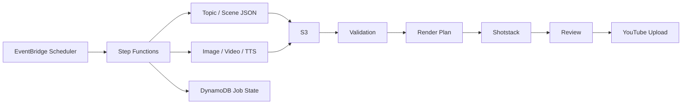
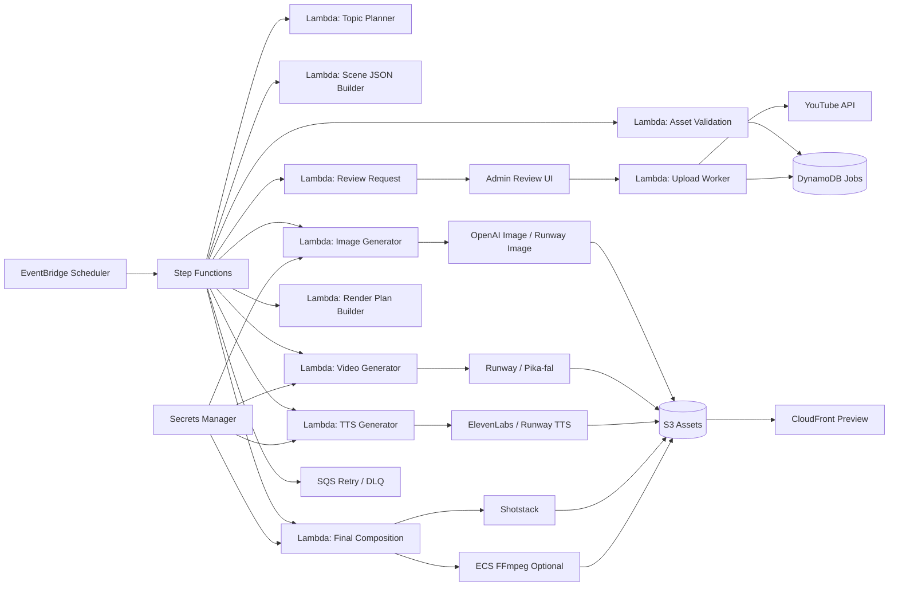

# AWS 기반 AI 영상 생성 자동화 실행 설계안

## 0. 빠른 개요

### 의도

이 문서는 실제 코드 작성과 인프라 구현을 위한 실행 기준 문서다. `architecture.md` 가 개괄 설명이라면, 이 문서는 리포 구조, 스택, 이벤트, 저장소, 워크플로우를 구현 가능한 수준으로 고정하는 데 목적이 있다.

### 구조도



### 핵심 리소스

- 오케스트레이션: `EventBridge`, `Step Functions`, `Lambda`, `SQS`
- 저장: `S3`, `DynamoDB`
- 시크릿: `Secrets Manager`
- 관측성: `CloudWatch`
- 외부 생성: `Runway`, `OpenAI Image`, `ElevenLabs`, `Pika(fal)`
- 렌더: `Shotstack`
- 확장 렌더: `ECS Fargate + FFmpeg`

### 기본 의사결정

- 기준 데이터는 `scene JSON`
- 생성과 합성은 분리
- 초기에는 휴먼 검수 필수
- MVP는 `Shotstack` 우선
- 리포 구조와 컨벤션은 `storytalk-infra` 스타일 준수

## 1. 결정 요약

### 최종 방향

- **API 우선 스택으로 구축**
- **Canva/InVideo 같은 편집형 SaaS는 보조 도구로만 사용**
- **장면 JSON 중심 파이프라인 유지**
- **생성, 합성, 업로드를 분리**
- **초기에는 휴먼 검수 포함**
- **기본 리포 구조는 `storytalk-infra` 스타일을 따른다**

### 추천 스택

- 스크립트/장면 구성: LLM
- 이미지 생성: `OpenAI Image` 또는 `Runway Image`
- 짧은 영상 생성: `Runway` 또는 `Pika(fal)`
- 음성 생성: `ElevenLabs` 또는 `Runway TTS`
- 합성/렌더: `Shotstack` 우선, 필요 시 `ECS Fargate + FFmpeg`
- 저장/상태: `S3 + DynamoDB`
- 오케스트레이션: `EventBridge + Step Functions + Lambda + SQS`
- 업로드: `YouTube Data API`

### 핵심 판단

- 풀 자동화는 가능하다.
- Canva/InVideo 중심은 반자동 운영에 가깝다.
- 비용의 대부분은 AWS보다 외부 생성 API에서 발생한다.
- 초기 MVP는 `Shotstack` 중심이 가장 빠르다.
- 커스텀 합성, 자막 burn-in, 썸네일 배치 생성은 이후 `Fargate`로 확장한다.

---

## 2. 목표

자동화 대상 흐름:

**주제 수집 → 장면 JSON 생성 → 이미지/영상/TTS 생성 → 검증 → 합성/렌더 → 검수 → 업로드 → 성과 반영**

초기 목표:

- 숏폼 영상 자동 생성 파이프라인 구축
- AWS 기반 운영 구조 확보
- 비동기 생성 API를 안정적으로 오케스트레이션
- 장애 격리와 재시도 가능한 구조 확보
- 휴먼 검수 기반 반자동 운영 후 점진적 자동 승인 확대

운영 목표:

- 단일 채널
- 단일 언어
- 하루 3~5개 생성
- 월 100개 수준까지 무리 없이 확장

---

## 3. 설계 원칙

### 3.1 장면 JSON을 기준 데이터로 둔다

- 긴 자유 텍스트 대본이 아니라 `scene-based JSON` 을 기준으로 설계
- 장면 단위로 `duration`, `narration`, `subtitle`, `imagePrompt`, `videoPrompt`, `audio cue`를 고정
- 이미지, 영상, TTS, 자막, 렌더 플랜은 모두 이 JSON을 기준으로 생성

예시:

```json
{
  "videoTitle": "Why medieval Korea felt strangely quiet at night",
  "language": "en",
  "scenes": [
    {
      "sceneId": 1,
      "durationSec": 8,
      "narration": "At night, the fortress did not sleep. It listened.",
      "imagePrompt": "moonlit Korean fortress, quiet courtyard, cinematic, mist",
      "videoPrompt": "slow cinematic push-in, moonlit Korean fortress courtyard, mist",
      "bgmMood": "dark_ambient",
      "sfx": ["night_wind", "distant_bell"],
      "subtitle": "The fortress did not sleep."
    }
  ]
}
```

### 3.2 생성과 합성을 분리한다

- 생성: LLM, 이미지 API, 영상 API, TTS API 호출
- 합성: Shotstack 또는 Fargate FFmpeg
- 업로드: YouTube API

### 3.3 오케스트레이션은 서버리스로 둔다

- 예약 실행: EventBridge Scheduler
- 상태 머신: Step Functions
- 단계 실행: Lambda
- 비동기 재시도: SQS

외부 생성 API는 task 기반 비동기 응답이 많아서 Step Functions의 wait/poll 패턴과 잘 맞는다.

### 3.4 에셋 검증은 필수다

렌더 전 검증 항목:

- S3 파일 존재 여부
- MIME/type 정상 여부
- 오디오 길이 0초 여부
- 장면 duration 합 일치 여부
- subtitle 길이 초과 여부
- scene count 제한 초과 여부
- provider 메타데이터 정상 여부

### 3.5 초기에는 휴먼 검수를 강제한다

필수 기능:

- approve
- reject
- regenerate
- 제목/설명/썸네일 수정
- 부분 재생성

### 3.6 리포는 하나로 유지하고, 내부는 모듈화한다

- 리포지토리: 하나
- CDK app entry: 하나
- stack assembly: 명시적
- infra modules: 도메인별 분리
- runtime services: 도메인별 분리

---

## 4. 기본 리포 구조

`storytalk-infra`를 기준으로, 초기 구조는 워크스페이스 분할보다 **단일 TypeScript CDK 리포 + 도메인별 폴더 분리**로 시작한다.

```txt
ai-pipeline-studio/
├── bin/
│   └── automata-studio.ts
├── lib/
│   ├── shared-stack.ts
│   ├── workflow-stack.ts
│   ├── publish-stack.ts
│   └── modules/
│       ├── shared/
│       ├── topic/
│       ├── image/
│       ├── video-generation/
│       ├── voice/
│       ├── composition/
│       ├── publish/
│       └── ops/
├── services/
│   ├── topic/
│   │   ├── handler.ts
│   │   ├── buildTopic/
│   │   │   ├── index.ts
│   │   │   ├── usecase/
│   │   │   ├── repo/
│   │   │   ├── normalize/
│   │   │   └── mapper/
│   ├── script/
│   ├── image/
│   ├── video-generation/
│   ├── voice/
│   ├── composition/
│   ├── publish/
│   └── shared/
│       └── lib/
│           ├── auth/
│           ├── aws/
│           ├── errors/
│           ├── logging/
│           ├── observability/
│           ├── providers/
│           ├── schema/
│           └── util/
├── types/
│   ├── events/
│   ├── jobs/
│   └── render/
├── scripts/
│   ├── seed-channel-config.ts
│   ├── validate-scene-json.ts
│   └── smoke-run-job.ts
├── env/
│   └── config.json
├── docs/
│   ├── architecture/
│   ├── conventions/
│   └── runbooks/
├── cdk.json
├── package.json
├── tsconfig.json
└── eslint.config.js
```

### 구조 원칙

- `bin/`: CDK 진입점만 둔다
- `lib/`: 스택 조립과 인프라 모듈만 둔다
- `services/`: Lambda 런타임 로직만 둔다
- `types/`: 이벤트, DTO, 렌더 플랜 타입 계약
- `scripts/`: 시드, 검증, 스모크 테스트
- `env/`: 환경별 설정
- `docs/`: 아키텍처, 컨벤션, 운영 문서

---

## 5. CDK 설계

### 5.1 CDK app entry

`storytalk-infra`처럼 `bin/automata-studio.ts`에서 다음을 수행한다.

- `@envFile` context로 `env/config.json` 로드
- `region`, `projectPrefix` 결정
- 단일 환경 기준으로 스택 인스턴스 생성
- 공통 태그 주입

예상 흐름:

```ts
const app = new App();
const envFile = app.node.tryGetContext('@envFile');
const envConfig = loadEnvConfig(envFile);

new SharedStack(app, `${envConfig.projectPrefix}-shared`, { ... });
new WorkflowStack(app, `${envConfig.projectPrefix}-workflow`, { ... });
new PublishStack(app, `${envConfig.projectPrefix}-publish`, { ... });
```

### 5.2 스택 조립 방식

각 스택 파일은 리소스를 직접 길게 생성하지 않고 `lib/modules/**` 의 팩토리 함수만 조립한다.

권장 패턴:

- `createStorage()`
- `createTopicRuntime()`
- `createImageGenerationRuntime()`
- `createVoiceGenerationRuntime()`
- `createCompositionRuntime()`
- `createReviewUi()`
- `createObservability()`

### 5.3 스택 목록

#### `SharedStack`

- S3 버킷
- CloudFront
- 공통 KMS
- 공통 로그/알람
- Secrets Manager 참조

#### `WorkflowStack`

- EventBridge Scheduler
- Step Functions state machine
- SQS retry queue / DLQ
- DynamoDB jobs table
- topic/script/image/video-generation/voice/composition Lambda

#### `PublishStack`

- review API
- review UI용 리소스
- upload Lambda
- metrics collector Lambda

### 5.4 스택 분리 기준

- 실패 패턴이 다름
- 배포 빈도가 다름
- IAM 권한이 다름
- 비용 구조가 다름
- 장애 범위를 좁히기 쉬움

---

## 6. AWS 전체 구조



### MVP 기본 구성

- EventBridge Scheduler
- Step Functions
- Lambda
- SQS
- DynamoDB
- S3
- Secrets Manager
- CloudFront
- CloudWatch
- IAM

### 확장 시 추가

- ECS Fargate
- ElastiCache
- RDS

---

## 7. 서비스 계층 설계

`storytalk-infra`의 `services/**` 구조를 따라 서비스는 얇은 진입점과 작은 유스케이스로 쪼갠다.

### 7.1 서비스 폴더 규칙

예시:

```txt
services/image/requestSceneImage/
├── index.ts
├── usecase/
│   └── requestSceneImage.ts
├── repo/
│   ├── imageProviderRepo.ts
│   └── sceneAssetRepo.ts
├── normalize/
│   └── normalizeImagePrompt.ts
└── mapper/
    └── mapImageProviderResponse.ts
```

### 7.2 역할 분리

- `handler.ts`: Lambda entry. 라우팅, DI, 에러 변환만 담당
- `index.ts`: 입력 파싱, 검증, usecase 호출만 담당
- `usecase/`: 도메인 흐름 제어
- `repo/`: S3, DynamoDB, 외부 API I/O
- `normalize/`: 입력 정규화
- `mapper/`: provider 응답 변환

### 7.3 공통 라이브러리

`services/shared/lib/` 아래에 둔다.

- `errors/`: AppError, errorCodes
- `logging/`: request/job logger
- `observability/`: tracing, metrics, structured logs
- `providers/`: Runway, OpenAI Image, ElevenLabs, Shotstack client wrapper
- `schema/`: zod 또는 JSON schema
- `util/`: id, clock, hash, retry helper

---

## 8. 린트와 코드 컨벤션

`storytalk-infra`의 ESLint/TypeScript 규칙을 그대로 참고한다.

### 8.1 TypeScript

- `strict: true`
- `target: ES2022`
- `module: CommonJS`
- `resolveJsonModule: true`
- `outDir: cdk.out-ts`

### 8.2 ESLint 기본 원칙

- ESLint flat config 사용
- `@typescript-eslint/no-floating-promises`: `error`
- `@typescript-eslint/no-explicit-any`: `warn`
- `no-console`: `warn`, 단 `error`, `warn`, `info` 허용
- `no-debugger`: `error`
- `no-duplicate-imports`: `error`
- `eqeqeq`: `error`
- `curly`: `error`

### 8.3 서비스 계층 규칙

- `services/**/*.ts` 에는 `default export` 금지
- 핸들러는 얇게 유지
- usecase는 정책 흐름만 관리
- repo는 I/O 경계만 담당
- normalize/mapper는 순수 함수로 유지

### 8.4 코드 헬스 규칙

`storytalk-infra`의 `code-health-backend` 스타일을 그대로 적용한다.

- `handler.ts`: 가장 짧고 단순하게 유지
- `index.ts`: 파싱/검증 + usecase 호출만 수행
- `usecase/`: 중간 복잡도 허용
- `repo/`: 파일 길이는 다소 허용하되 함수 복잡도는 제한
- `lib/**/*.ts`, `bin/**/*.ts`: 인프라 배선 특성상 일부 규칙 완화
- 테스트 파일은 규칙 완화

### 8.5 명명 규칙

- CDK 모듈 함수: `createXxx`
- 라우트/권한 연결: `registerXxx`, `grantXxx`
- 서비스 usecase: 동사 시작
- 리소스 이름 helper: `name('jobs-table') -> <projectPrefix>-jobs-table`
- 모든 runtime service는 named export만 사용

---

## 9. 환경 설정과 배포 명령

### 9.1 `env/config.json`

예시:

```json
{
  "region": "ap-northeast-2",
  "projectPrefix": "automata-studio",
  "reviewUiDomain": "review.example.com",
  "channelId": "history-en",
  "defaultLanguage": "en",
  "enableFargateComposition": false,
  "runwaySecretId": "automata-studio/runway",
  "openAiSecretId": "automata-studio/openai",
  "elevenLabsSecretId": "automata-studio/elevenlabs",
  "shotstackSecretId": "automata-studio/shotstack"
}
```

### 9.2 package scripts

단일 환경 기준으로 스크립트를 고정한다.

```json
{
  "scripts": {
    "build": "tsc",
    "test": "jest",
    "lint": "eslint . --ext .ts",
    "lint:fix": "eslint . --ext .ts --fix",
    "synth": "tsc && cdk synth -c @envFile=env/config.json",
    "diff": "tsc && cdk diff -c @envFile=env/config.json",
    "deploy": "tsc && cdk deploy -c @envFile=env/config.json"
  }
}
```

### 9.3 Secrets Manager

- provider API 키는 평문 env에 두지 않는다
- `services/shared/lib/providers/**` 에서 secret을 읽어 client 생성
- secret id만 `env/config.json` 에 둔다

---

## 10. 단계별 워크플로우

### 10.1 Step Functions 상태 흐름

1. `PlanTopic`
2. `BuildSceneJson`
3. `GenerateSceneAssets`
4. `ValidateAssets`
5. `BuildRenderPlan`
6. `ComposeFinalVideo`
7. `RequestReview`
8. `AwaitReviewDecision`
9. `UploadYoutube`
10. `CollectMetrics`

### 10.2 장면별 병렬 처리

`GenerateSceneAssets` 는 장면 단위 `Map` state로 구현한다.

장면별 처리:

- 이미지 생성
- 선택적 짧은 영상 생성
- TTS 생성
- 메타데이터 저장

### 10.3 리뷰 처리

리뷰는 두 단계로 둔다.

- 상태 머신은 `REVIEW_PENDING` 에서 대기
- Admin UI가 승인/거절/재생성 범위를 기록

재생성 범위:

- image only
- video clip only
- voice only
- metadata only
- full recompose

---

## 11. 이벤트 스키마

이벤트 계약은 `types/events/` 에 둔다.

### 11.1 이벤트 종류

- `job.planned.v1`
- `scene-json.ready.v1`
- `scene-asset.requested.v1`
- `scene-asset.ready.v1`
- `assets.validation.failed.v1`
- `render-plan.ready.v1`
- `composition.completed.v1`
- `review.requested.v1`
- `review.approved.v1`
- `review.rejected.v1`
- `upload.completed.v1`

### 11.2 공통 이벤트 필드

```json
{
  "eventName": "scene-asset.ready.v1",
  "eventId": "01HV...",
  "jobId": "job_20260319_001",
  "channelId": "history_en",
  "occurredAt": "2026-03-19T12:00:00.000Z",
  "producer": "services/image/requestSceneImage",
  "payload": {}
}
```

### 11.3 권장 타입 파일

- `types/events/base-event.ts`
- `types/events/job-events.ts`
- `types/events/review-events.ts`
- `types/events/upload-events.ts`

---

## 12. DynamoDB 키 설계

제어 평면은 단일 테이블 `VideoJobsTable` 로 시작한다.

### 12.1 기본 키

- `PK`
- `SK`

### 12.2 아이템 종류

#### Job metadata

- `PK = JOB#<jobId>`
- `SK = META`

#### Scene asset

- `PK = JOB#<jobId>`
- `SK = SCENE#<sceneId>`

#### Render artifact

- `PK = JOB#<jobId>`
- `SK = ARTIFACT#FINAL`

#### Upload record

- `PK = JOB#<jobId>`
- `SK = UPLOAD#YOUTUBE`

#### Review record

- `PK = JOB#<jobId>`
- `SK = REVIEW#<timestamp>`

### 12.3 GSI

#### `GSI1`: 상태별 조회

- `GSI1PK = STATUS#<status>`
- `GSI1SK = <updatedAt>`

#### `GSI2`: 채널별 조회

- `GSI2PK = CHANNEL#<channelId>`
- `GSI2SK = <createdAt>#JOB#<jobId>`

#### `GSI3`: 토픽 중복 체크

- `GSI3PK = TOPIC#<topicHash>`
- `GSI3SK = <createdAt>#JOB#<jobId>`

### 12.4 Job metadata 필드

- `jobId`
- `channelId`
- `topicId`
- `topicHash`
- `status`
- `language`
- `targetDurationSec`
- `videoTitle`
- `estimatedCost`
- `providerCosts`
- `reviewMode`
- `retryCount`
- `lastError`
- `createdAt`
- `updatedAt`

### 12.5 Scene item 필드

- `sceneId`
- `visualType`
- `durationSec`
- `narration`
- `subtitle`
- `imagePrompt`
- `videoPrompt`
- `imageS3Key`
- `videoClipS3Key`
- `voiceS3Key`
- `validationStatus`

---

## 13. S3 구조

```txt
s3://automata-studio/
  topics/
    {jobId}/topic.json
  scene-json/
    {jobId}/scene.json
  assets/
    {jobId}/images/
    {jobId}/videos/
    {jobId}/tts/
    {jobId}/bgm/
    {jobId}/sfx/
  render-plans/
    {jobId}/render-plan.json
  rendered/
    {jobId}/final.mp4
    {jobId}/thumbnail.jpg
  previews/
    {jobId}/preview.mp4
  logs/
    {jobId}/provider/
    {jobId}/composition/
```

원칙:

- 원본과 최종 산출물을 분리
- jobId 기준으로 경로를 고정
- 로그와 provider raw response를 분리 저장

---

## 14. 큐와 비동기 처리

### 14.1 기본 큐

- `asset-queue`
- `provider-poll-queue`
- `composition-queue`
- `upload-queue`
- `review-queue`
- `dead-letter-queue`

### 14.2 사용 원칙

- 외부 생성 API 요청은 idempotency key 적용
- provider task polling은 Step Functions wait state 우선
- 긴 폴링이나 fallback 재시도는 SQS 사용
- 실패는 단계별로 끊고 전체 job을 즉시 폐기하지 않음

---

## 15. 렌더 전략

### 15.1 MVP

- Shotstack로 최종 합성
- 이미지 시퀀스 + TTS + BGM + 자막 오버레이 중심
- 결과를 S3에 저장

### 15.2 확장

다음 요구가 생기면 `Fargate + FFmpeg` 로 확장한다.

- 커스텀 트랜지션
- burn-in subtitle
- 프레임 단위 제어
- 썸네일 다중 생성
- Shotstack 비용 최적화

### 15.3 장면 visual type

각 scene은 다음 중 하나를 가진다.

- `image`
- `video`
- `image+motion`

---

## 16. MVP 범위

### 포함

- 단일 채널
- 단일 언어
- scene JSON 기반 생성
- 이미지 생성
- 선택적 짧은 scene video 생성
- TTS 생성
- asset validation
- Shotstack 기반 합성
- review UI
- YouTube private 업로드
- 기본 metrics 수집

### 제외

- 다중 플랫폼 동시 업로드
- 완전 자동 public publish
- 고급 A/B 테스트
- 다계정/다팀 운영
- 자체 영상 편집 SaaS 개발
- 초기부터 전면 Fargate 전환

---

## 17. 구현 순서

### Phase 1. 리포 골격

- `bin`, `lib`, `services`, `types`, `scripts`, `env`, `docs` 생성
- `eslint.config.js`, `tsconfig.json`, `cdk.json`, `package.json` 구성
- `storytalk-infra` 스타일의 build/lint/synth/deploy 스크립트 구성

### Phase 2. 인프라 골격

- `SharedStack`, `WorkflowStack`, `PublishStack` 생성
- S3, DynamoDB, Step Functions, SQS, Secrets Manager, CloudWatch 생성
- `lib/modules/**` 팩토리 함수 패턴으로 리소스 분리

### Phase 3. 런타임 구현

- topic planner
- scene JSON builder
- image generator
- video generator
- voice generator
- asset validator
- render plan builder

### Phase 4. 합성과 운영

- Shotstack integration
- preview URL 발급
- review API/UI
- YouTube upload

### Phase 5. 안정화

- provider fallback
- partial regeneration
- 비용 대시보드
- Fargate composition 옵션 추가

---

## 18. 최종 요약

- 장면 JSON 중심으로 설계한다.
- 생성은 API 우선 스택으로 구성한다.
- 오케스트레이션은 `Step Functions + Lambda + SQS` 로 둔다.
- 리포 기본 구조와 배포 스크립트는 `storytalk-infra` 스타일을 따른다.
- 코드 컨벤션도 `storytalk-infra`의 TypeScript strict, ESLint flat config, 얇은 handler/usecase/repo 분리 방식을 따른다.
- MVP 합성은 `Shotstack`, 고급 합성은 `Fargate + FFmpeg` 로 확장한다.

한 줄 요약:

**리포와 컨벤션은 `storytalk-infra`처럼 가져가고, 생성 파이프라인은 API 우선 영상 자동화 구조로 구현한다.**
