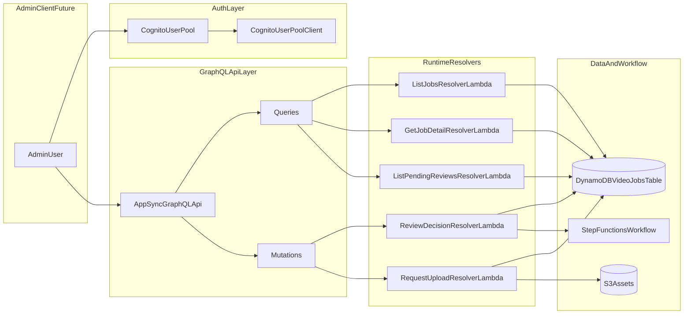

# Admin GraphQL + Cognito 실행 계획

## 목표와 범위

- 현재 REST 기반 publish API를 보완/대체하여 **어드민 운영 API를 GraphQL(AppSync)로 통합**한다.
- 어드민 인증은 **Cognito User Pool 기반 로그인**으로 구성한다.
- 이번 단계는 **인프라+백엔드(API/인증/리졸버/권한)**까지 포함하고, UI 클라이언트 구현은 제외한다.
- 기존 파이프라인 상태 저장소(DynamoDB `VideoJobsTable`)와 Step Functions task-token 승인 흐름을 그대로 재사용한다.

## 현재 상태 정리 (기준선)

- Publish API는 REST 2개 엔드포인트만 존재: [lib/modules/publish/api.ts](/Users/drew/Desktop/ai-pipeline-studio/lib/modules/publish/api.ts), [lib/publish-stack.ts](/Users/drew/Desktop/ai-pipeline-studio/lib/publish-stack.ts)
- 리뷰 승인 핵심 로직은 Lambda에 존재: [services/publish/review/index.ts](/Users/drew/Desktop/ai-pipeline-studio/services/publish/review/index.ts)
- 업로드 요청 로직은 Lambda에 존재: [services/publish/upload/index.ts](/Users/drew/Desktop/ai-pipeline-studio/services/publish/upload/index.ts)
- 인증/인가 리소스(Cognito), GraphQL 리소스(AppSync)는 아직 없음.

## 목표 아키텍처

## GraphQL 스키마/도메인 설계

- 신규 스키마 파일 도입: `graphql/admin/schema.graphql` (또는 `lib/modules/publish/graphql/schema.graphql`)
- 핵심 Query
  - `adminJobs(status, channelId, limit, nextToken)`
  - `adminJob(jobId)`
  - `pendingReviews(limit, nextToken)`
  - `jobTimeline(jobId)` (review/upload/artifact 이력)
- 핵심 Mutation
  - `submitReviewDecision(jobId, action, regenerationScope)`
  - `requestUpload(jobId)`
  - (선택) `retryStep(jobId, step)`
- 타입 규칙
  - 기존 `video-jobs` 아이템을 GraphQL 응답 DTO로 매핑 (`mapper/` 분리)
  - 내부 상태값(`PLANNED`, `REVIEW_PENDING` 등)은 GraphQL enum으로 표준화

## Cognito 인증/인가 설계

- PublishStack 또는 신규 Auth 모듈에 Cognito 추가
  - `UserPool` (email sign-in)
  - `UserPoolClient` (SRP/Hosted UI 대응 옵션)
  - 초기 운영을 위한 `Admin` 그룹 생성
- AppSync 기본 인증: Cognito User Pool
- 인가 정책
  - Query: 인증 사용자 허용
  - 위험 Mutation(`submitReviewDecision`, `requestUpload`): `Admin` 그룹 또는 커스텀 claim 검사
- 환경 설정 확장
  - [lib/config.ts](/Users/drew/Desktop/ai-pipeline-studio/lib/config.ts), [env/config.json](/Users/drew/Desktop/ai-pipeline-studio/env/config.json)
  - 예: `adminUserPoolDomainPrefix`, `adminAllowedEmailDomains`, `enableAdminSignup`

## CDK 모듈 분해 계획 (현재 구조 유지)

- 기존 `storytalk-infra` 스타일 유지: Stack는 조립, 상세는 module factory
- 추가/변경 파일(핵심)
  - [lib/publish-stack.ts](/Users/drew/Desktop/ai-pipeline-studio/lib/publish-stack.ts): GraphQL/Auth 조립 진입점
  - 신규 `lib/modules/publish/auth.ts`: Cognito 리소스 생성
  - 신규 `lib/modules/publish/graphql-api.ts`: AppSync API/데이터소스/리졸버 생성
  - 기존 [lib/modules/publish/api.ts](/Users/drew/Desktop/ai-pipeline-studio/lib/modules/publish/api.ts): 점진적 마이그레이션용 유지 또는 deprecate
- 출력값(Output)
  - GraphQL endpoint
  - UserPoolId / UserPoolClientId
  - (필요 시) Cognito domain

## Resolver 런타임 설계 (services 계층 규칙 준수)

- 신규 런타임 루트: `services/admin/graphql/`
- operation별 디렉터리 분리
  - `list-jobs/handler.ts -> index.ts -> usecase/repo/normalize/mapper`
  - `get-job/...`
  - `pending-reviews/...`
  - `submit-review-decision/...` (기존 [services/publish/review/index.ts](/Users/drew/Desktop/ai-pipeline-studio/services/publish/review/index.ts) 로직 재사용)
  - `request-upload/...` (기존 [services/publish/upload/index.ts](/Users/drew/Desktop/ai-pipeline-studio/services/publish/upload/index.ts) 로직 재사용)
- 공통 라이브러리
  - `services/shared/lib/auth/`에 Cognito claim/group validator
  - 기존 `services/shared/lib/store/video-jobs.ts` 재사용 + 읽기 쿼리 보강

## 데이터 접근/분석 API 확장

- 조회/분석 요구 대응을 위해 DDB 쿼리 패턴 보강
  - 상태별 목록: existing `GSI1`
  - 채널별 목록: existing `GSI2`
  - 토픽 중복/검색: existing `GSI3`
- 필요 시 추가 인덱스 검토
  - 최근 리뷰 대기순/최근 실패순 같은 운영 관점 정렬키
- 분석용 응답은 read model로 제공
  - 처리 시간, 실패 사유, 재시도 횟수, provider 비용 요약

## 마이그레이션 전략 (중단 최소화)

1. Cognito + AppSync 생성 (기존 REST 유지)
2. Query resolver 먼저 오픈 (read-only)
3. Mutation resolver(`submitReviewDecision`, `requestUpload`) 연결
4. 내부 운영에서 GraphQL 검증 완료 후 REST deprecated
5. 최종적으로 [lib/modules/publish/api.ts](/Users/drew/Desktop/ai-pipeline-studio/lib/modules/publish/api.ts) 정리 여부 결정

## 보안/운영 가드레일

- AppSync 레벨 인증 + Resolver 내부 권한 2중 체크
- 모든 mutation에 감사로그 남김 (jobId, actor, action, timestamp)
- 에러 표준화
  - 사용자 노출 메시지와 내부 원인 분리
  - GraphQL error extension 코드 표준화
- CloudWatch 대시보드
  - resolver 오류율, 인증 실패율, review 승인 처리 latency

## 테스트/검증 계획

- 단위 테스트
  - normalize/mapper/usecase 분리 단위
- 통합 테스트
  - GraphQL Query/Mutation happy path + 권한 거부 시나리오
- 배포 검증
  - `cdk diff`로 권한 과다 부여 여부 점검
  - 관리자 계정 로그인 후 `pendingReviews -> submitReviewDecision` end-to-end 확인

## 결과물 정의 (이번 단계 완료 기준)

- AppSync GraphQL endpoint + Cognito 인증 동작
- 조회/분석 Query 3~4개 운영 가능
- 리뷰/승인/업로드 Mutation 최소 2개 운영 가능
- 기존 워크플로우와 충돌 없이 병행 운영 가능
- Admin client는 다음 단계에서 endpoint/auth 설정만 연결하면 바로 시작 가능한 상태
