# Admin Job Authoring Plan

## Goal

현재 `admin-web`이 리뷰/설정 중심 콘솔에 머물러 있는 상태에서, 관리자가 직접 잡을 생성하고 단계별로 결과를 검토/수정하며 다음 단계로 진행할 수 있는 authoring 플로우를 추가한다.

목표 플로우:
`아이디어 초안 제출 -> 플랜 구체화 -> scene-json 생성 -> 이미지/영상/음성 생성 -> 기존 리뷰/업로드 흐름 연결`

## Current State

현재 Admin은 조회/리뷰/설정 기능만 제공한다.

핵심 제약:

- GraphQL에는 잡 생성용 mutation이 없음: `[lib/modules/publish/graphql/schema.graphql](/Users/drew/Desktop/ai-pipeline-studio/lib/modules/publish/graphql/schema.graphql)`
- Admin 네비게이션에는 Dashboard / Reviews / Settings만 존재: `[apps/admin-web/src/app/(dashboard)/layout.tsx](</Users/drew/Desktop/ai-pipeline-studio/apps/admin-web/src/app/(dashboard)`/layout.tsx>)
- 워크플로우는 `PlanTopic -> BuildSceneJson -> GenerateSceneAssets -> ...` 순으로 한 번에 진행됨: `[lib/workflow-stack.ts](/Users/drew/Desktop/ai-pipeline-studio/lib/workflow-stack.ts)`
- `PlanTopic`은 실행 입력을 읽지 않고 내부에서 topic seed를 생성함: `[services/topic/index.ts](/Users/drew/Desktop/ai-pipeline-studio/services/topic/index.ts)`, `[services/topic/usecase/create-topic-plan.ts](/Users/drew/Desktop/ai-pipeline-studio/services/topic/usecase/create-topic-plan.ts)`

이 상태에서는 사용자가 `titleIdea`, `targetDurationSec`, `stylePreset` 등을 직접 넣고 단계별로 제어하는 운영 플로우를 만들 수 없다.

## Product Direction

구현 방향은 `step-by-step` + `full-topic-seed` 기반의 편집형 파이프라인으로 잡는다.

원칙:

- 초안 입력은 Admin이 직접 작성한다.
- 각 단계 결과는 저장되고, 사람이 검토/수정한 뒤 다음 단계로 넘긴다.
- 기존 리뷰/업로드 기능은 파이프라인 후반부에 그대로 재사용한다.
- 초기 MVP에서는 Step Functions 전체를 admin에서 직접 한 번에 시작하지 않고, 단계별 Admin action으로 제어한다.
- 생성형 AI는 소재/스크립트/에셋 생성기로 제한하고, 최종 조립은 scene JSON 기반 렌더 파이프라인이 담당한다.
- 내부 표준 계약은 renderer neutral한 scene package/scene JSON이며, Shotstack 포맷은 adapter에서만 생성한다.
- Admin UI는 옵션 실험과 결과 비교를 먼저 지원해야 하며, 좋은 조합을 템플릿/레시피로 승격할 수 있어야 한다.

## Target Flow

```mermaid
flowchart LR
  adminUser[AdminUser] --> createDraft[CreateDraftJob]
  createDraft --> reviewSeed[ReviewTopicSeed]
  reviewSeed --> runPlan[RunTopicPlan]
  runPlan --> reviewPlan[ReviewEditPlan]
  reviewPlan --> runSceneJson[RunSceneJson]
  runSceneJson --> reviewSceneJson[ReviewEditSceneJson]
  reviewSceneJson --> runAssets[RunAssetGeneration]
  runAssets --> assetReview[ReviewAssets]
  assetReview --> continueReview[ExistingReviewUploadFlow]
```

## MVP Scope

MVP는 아래 범위로 제한한다.

- Admin에서 draft job 생성
- Job detail 화면에서 topic seed 확인/수정
- `Run Topic Plan` 실행
- Plan 결과 확인/수정
- `Run Scene JSON` 실행
- Scene JSON 결과 확인/수정
- `Run Asset Generation` 실행
- 이후 기존 review/upload 흐름 연결

MVP 제외:

- drag-and-drop 고급 editor
- job duplicate / template library
- 단계별 diff viewer
- 병렬 멀티-job batch create
- state machine 전체 재설계

## Backend Changes

### 1. GraphQL Contract 확장

새 mutation과 조회를 추가한다.

주요 파일:

- `[lib/modules/publish/graphql/schema.graphql](/Users/drew/Desktop/ai-pipeline-studio/lib/modules/publish/graphql/schema.graphql)`
- `[lib/modules/publish/graphql-api.ts](/Users/drew/Desktop/ai-pipeline-studio/lib/modules/publish/graphql-api.ts)`
- `[lib/publish-stack.ts](/Users/drew/Desktop/ai-pipeline-studio/lib/publish-stack.ts)`

추가 대상 예시:

- `createDraftJob(input: CreateDraftJobInput!): AdminJob!`
- `runTopicPlan(input: RunTopicPlanInput!): AdminJob!`
- `runSceneJson(input: RunSceneJsonInput!): AdminJob!`
- `runAssetGeneration(input: RunAssetGenerationInput!): AdminJob!`
- 필요 시 `updateTopicSeed`, `updateTopicPlan`, `updateSceneJson` mutation

조회 보강:

- 기존 `adminJob(jobId)`를 실제 프론트에서 사용하도록 hook 추가
- 기존 `jobTimeline(jobId)`를 프론트에서 사용 가능하게 hook 추가
- 가능하면 사람이 읽기 쉬운 상세 조회 DTO도 별도로 설계

### 2. Admin Resolver 추가

기존 패턴대로 `services/admin/graphql/<feature>/` 구조로 구현한다.

예상 폴더:

- `services/admin/graphql/create-draft-job/`
- `services/admin/graphql/run-topic-plan/`
- `services/admin/graphql/run-scene-json/`
- `services/admin/graphql/run-asset-generation/`
- 선택: `services/admin/graphql/update-job-draft/`

구조 원칙:

- `handler.ts`는 얇게 유지
- orchestration은 `index.ts`
- 도메인 로직은 `usecase/`
- 저장소 접근은 `repo/`

### 3. Job Draft 저장 모델 추가

기존 job 저장소를 확장해 draft/plan/scene-json editable snapshot을 저장한다.

주요 파일:

- `[services/shared/lib/store/video-jobs.ts](/Users/drew/Desktop/ai-pipeline-studio/services/shared/lib/store/video-jobs.ts)`
- `[services/topic/repo/persist-topic-plan.ts](/Users/drew/Desktop/ai-pipeline-studio/services/topic/repo/persist-topic-plan.ts)`
- `[services/script/repo/persist-scene-json.ts](/Users/drew/Desktop/ai-pipeline-studio/services/script/repo/persist-scene-json.ts)`

저장 대상:

- topic seed draft
- topic plan snapshot
- scene json snapshot
- 각 단계 상태와 `updatedAt`, `updatedBy`
- 선택: provider metadata, last run result, validation errors

권장 상태 확장:

- `DRAFT`
- `PLANNING`
- `PLANNED`
- `SCENE_JSON_BUILDING`
- `SCENE_JSON_READY`
- `ASSET_GENERATING`
- `ASSETS_READY`
- 이후 기존 상태 유지

### 4. Topic 단계 입력 수용

현재 `PlanTopic`은 Step input을 읽지 않으므로, Admin draft를 반영할 수 있도록 변경이 필요하다.

주요 파일:

- `[services/topic/index.ts](/Users/drew/Desktop/ai-pipeline-studio/services/topic/index.ts)`
- `[services/topic/usecase/create-topic-plan.ts](/Users/drew/Desktop/ai-pipeline-studio/services/topic/usecase/create-topic-plan.ts)`
- `[services/topic/normalize/load-topic-config.ts](/Users/drew/Desktop/ai-pipeline-studio/services/topic/normalize/load-topic-config.ts)`

방향:

- `channelId`, `targetLanguage`, `titleIdea`, `targetDurationSec`, `stylePreset`를 입력으로 받을 수 있게 함
- full seed가 있으면 그것을 우선 사용
- 부족한 값만 LLM 또는 default로 보완
- 기존 `TopicPlanResult` contract는 유지

### 5. Scene JSON / Asset 단계의 Admin 실행 경로 추가

기존 usecase를 재사용하되, Admin mutation에서 직접 호출 가능한 orchestration을 만든다.

관련 파일:

- `[services/script/usecase/build-scene-json.ts](/Users/drew/Desktop/ai-pipeline-studio/services/script/usecase/build-scene-json.ts)`
- `services/image/usecase/*`
- `services/video-generation/usecase/*`
- `services/voice/usecase/*`
- `services/composition/validate-assets/usecase/validate-generated-assets.ts`

방향:

- `runSceneJson`은 persisted topic seed/plan을 읽어 `scene-json` 생성
- `runAssetGeneration`은 persisted `sceneJson.scenes` 기준으로 이미지/영상/음성 생성
- asset generation이 완료되면 상태를 `ASSETS_READY`로 갱신

## Frontend Changes

### 1. Navigation 확장

주요 파일:

- `[apps/admin-web/src/app/(dashboard)/layout.tsx](</Users/drew/Desktop/ai-pipeline-studio/apps/admin-web/src/app/(dashboard)`/layout.tsx>)

추가 메뉴:

- `Jobs`
- `New Job`

### 2. Draft Job 생성 페이지

예상 파일:

- `apps/admin-web/src/app/(dashboard)/jobs/new/page.tsx`

입력 필드:

- `channelId`
- `targetLanguage`
- `titleIdea`
- `targetDurationSec`
- `stylePreset`
- 선택: 운영 메모

동작:

- `createDraftJob` mutation 호출
- 성공 시 `jobs/[jobId]`로 이동

### 3. Job Detail Authoring 페이지

예상 파일:

- `apps/admin-web/src/app/(dashboard)/jobs/[jobId]/page.tsx`

화면 섹션:

- `Topic Seed`
- `Topic Plan`
- `Scene JSON`
- `Assets`
- `Next Actions`
- `Production Option Tracks`
- `Variant Comparison`

버튼 예시:

- `Save Draft`
- `Run Topic Plan`
- `Run Scene JSON`
- `Run Asset Generation`
- 이후 `Open Review`

### 4. GraphQL Client Hook 추가

주요 파일:

- `[packages/graphql/src/admin.ts](/Users/drew/Desktop/ai-pipeline-studio/packages/graphql/src/admin.ts)`

추가 항목:

- `useCreateDraftJobMutation`
- `useAdminJobQuery`
- `useJobTimelineQuery`
- `useRunTopicPlanMutation`
- `useRunSceneJsonMutation`
- `useRunAssetGenerationMutation`
- 선택: `useUpdateDraftJobMutation`

## Data Model Notes

Admin 편집형 플로우에서는 `job meta` 외에 단계별 snapshot이 필요하다.

권장 원칙:

- 최종 산출물과 편집 중 draft를 구분 저장
- `scene-json`은 텍스트 편집 가능성을 고려해 raw JSON snapshot 저장
- 모든 단계 변경은 timeline에 남김
- UI는 low-level timeline 원문보다 요약된 상태를 우선 사용
- job 식별자는 `job_{date}_{contentType}_{variant}` 규칙으로 생성해 콘텐츠 단위 재고를 분리
- `content-brief`에는 최소 `contentType`, `variant`, `autoPublish`, `publishAt`를 포함
- 채널별 YouTube OAuth secret과 업로드 기본값은 `channelConfigs[channelId]` 및 `youtubeSecrets[channelId]`로 분리
- scene JSON/scene package는 렌더러 비종속 포맷으로 유지하고, 렌더러는 `ShotstackRenderer`, `FfmpegRenderer` 같은 adapter로 분리
- asset generation은 `Asset First, Composition Second` 원칙을 유지하고, 실패 시 이미지 fallback/TTS retry 같은 대체 전략을 둔다

## Experiment UX Notes

Admin은 콘텐츠 생산 도구이면서 동시에 옵션 비교 툴이어야 한다.

- 콘텐츠 관리 화면은 채널 -> 콘텐츠 타입 -> variant/job 순서로 drill-down한다.
- 각 콘텐츠 타입 안에서 layout preset, caption style, asset strategy, renderer track을 옵션 축으로 본다.
- 비교 관점은 최소 `hook`, `asset quality`, `render path`, `review/publish mode`, `estimated score`를 노출한다.
- 글로벌 대시보드는 전체 병목/에러 외에 현재 실험 중인 renderer/asset/layout 옵션 축도 보여준다.

## Workflow Strategy

MVP에서는 기존 Step Functions 전체 경로를 그대로 admin 진입점으로 쓰지 않는다.

이유:

- 현재 state machine은 처음부터 끝까지 직선형 흐름이다: `[lib/workflow-stack.ts](/Users/drew/Desktop/ai-pipeline-studio/lib/workflow-stack.ts)`
- `PlanTopic`이 입력을 소비하지 않는다: `[services/topic/index.ts](/Users/drew/Desktop/ai-pipeline-studio/services/topic/index.ts)`
- step-by-step authoring 요구사항과 충돌한다.

따라서 MVP는:

- Admin mutation -> 단계별 usecase 직접 호출
- 후속 단계에서 기존 render/review/upload 체인을 재사용
- workflow 경로는 렌더 완료 후 `autoPublish === true`면 review 대기 없이 YouTube 업로드로 바로 진행

향후 확장:

- authoring 완료 후 Step Functions에 넘기는 하이브리드 구조
- 또는 state machine을 단계별 resumable 구조로 재설계

## Implementation Order

1. GraphQL schema와 AppSync resolver 확장
2. Draft job 저장 모델 및 job detail 조회 설계
3. `createDraftJob` 구현
4. `topic` 단계가 draft seed를 읽도록 변경
5. `runTopicPlan` 구현
6. `runSceneJson` 구현
7. `runAssetGeneration` 구현
8. GraphQL client hooks 추가
9. Admin `jobs/new` 페이지 추가
10. Admin `jobs/[jobId]` authoring 페이지 추가
11. 기존 review/upload 흐름과 연결 검증

## Risks

- 기존 상태 enum과 Admin UI 가정이 깨질 수 있음
- `jobTimeline`이 low-level raw event라 상세 UI에 바로 쓰기 어려움
- topic/scene-json 저장 구조가 현재는 final-output 중심일 수 있어 editable snapshot 구조 정리가 필요함
- 자산 생성은 시간이 길 수 있어 mutation 동기 실행 범위를 조절해야 함

## Success Criteria

- Admin에서 새 draft job을 생성할 수 있다.
- 생성된 job에서 topic seed를 수정하고 `Run Topic Plan`을 실행할 수 있다.
- 생성된 plan을 바탕으로 `Run Scene JSON`을 실행할 수 있다.
- scene json을 검토한 후 `Run Asset Generation`을 실행할 수 있다.
- 생성 결과는 기존 리뷰 흐름과 자연스럽게 연결된다.
- 기존 Dashboard / Reviews / Settings 동작은 깨지지 않는다.
