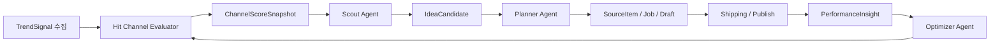

# 에이전트 계층 추가 계획 (기존 발행 파이프라인 위 덧씌우기)

> **목적**: 별도 “에이전트 플랫폼”을 새로 짓지 않고, 이미 있는 **채널(Content) → Job → SourceItem → ContentPublishDraft → PublishTarget → 채널 출고 큐 → `runPublishOrchestration`** 축 위에 **발굴·판단·수정** 자동화만 얹는다.  
> **범위**: 도메인 관계, 추가 엔티티, 에이전트 역할 매핑, AWS 실행 모델, GraphQL/Lambda 부착 원칙, UI 최소 확장, 단계별 롤아웃, 리스크·주의사항.  
> **관련 참고**: `docs/plans/project-publish-architecture-design-status.md`, `docs/plans/youtube-channel-metadata-publish-queue-revision.md`  
> **구현 핸드오프 (게이트·플래그·TODO 포함):** [`cursor-handoff-agent-publish-integration.md`](./cursor-handoff-agent-publish-integration.md)

---

## 한 줄 요약

**기존 발행 파이프라인은 그대로 두고**, 앞단에 **아이디어 발굴 에이전트**, 중간에 **제작 지시 에이전트**, 뒷단에 **성과 분석·수정 에이전트**를 붙인다.  
즉 **입력**과 **피드백**만 자동화하고, 검증된 출고 축은 재사용한다.

### 현실적인 1차 목표 (완전 무인화 아님)

- **가능한 것:** 자동 생성, 룰 기반 1차 검수(Gate A), 자동 측정, **다음 실험을 위한 가설·제안**(Optimizer는 진실 판별기가 아님).
- **제한적인 것:** 완전 무인 운영은 **특정 채널·낮은 리스크·화이트리스트**에서만; 그 외는 **채널별 자동화 플래그 + 사람 승인(Gate B)**.
- **프로젝트가 지향하는 그림:** “콘텐츠 공장 완전 자동”이 아니라 **운영자가 소수로도 굴릴 수 있는 반자동 시스템** — 검수는 **기능**이 아니라 **게이트(A/B/C)** 로 설계한다. 상세는 핸드오프 문서 §1.1–1.3.

**히트 채널 평가 레이어:** 발굴(Scout) **앞**에만 두지도, Optimizer **뒤**에만 두지도 않고, **Scout와 Planner 사이의 별도 평가 단계**로 둔다. 영상·키워드 단위 트렌드(`TrendSignal`)와 달리, **외부 채널이 포맷을 재현하며 잘 터뜨리는지**는 `ChannelSignal` → `ChannelScoreSnapshot`으로 별도 점수화하고, Scout는 고득점 채널·스냅샷을 참조해 트렌드 가중치를 두고, Planner는 동일 스냅샷·포맷 라벨을 입력으로 받아 **재현 가능한 초안**을 만든다. Optimizer는 우리 채널 성과로 `nicheFitScore` 등을 **역주입**해 평가 규칙을 보정한다.

> 히트 채널 평가는 영상 단위 트렌드와 별도 레이어로 다룬다. 외부 API를 통해 채널의 최근 업로드 cadence, Shorts hit ratio, 조회수 분포, 포맷 반복성, 주제 적합성, 상업성 등을 수집하여 `ChannelSignal`과 `ChannelScoreSnapshot`으로 저장한다. Scout와 Planner는 아이디어 후보를 평가할 때 해당 원본 채널의 최신 점수를 참조하되, 이를 아이디어 점수에 직접 흡수하지 않고 별도 근거로 유지한다. Optimizer는 실제 우리 채널 성과를 바탕으로 `nicheFitScore` 및 재현 가능성 점수를 주기적으로 보정한다.

---

## 1. 왜 이 방향인가

현재 구조에 이미 핵심 골격이 있다.

| 구성요소                                                   | 역할                                                                                                        |
| ---------------------------------------------------------- | ----------------------------------------------------------------------------------------------------------- |
| `SourceItem`                                               | 기획·소재 단위. Job은 `JobMeta.sourceItemId`로 연결                                                         |
| `ContentPublishDraft`, `PublishTarget`, 채널 publish queue | 출고 준비·대기                                                                                              |
| `runPublishOrchestration`                                  | 실제 업로드 확정(현재 YouTube 중심)                                                                         |
| Admin UI                                                   | `/jobs`, `/jobs/[jobId]/overview`, `/jobs/[jobId]/publish`, `/content/[contentId]/connections` 등 책임 분리 |

**아직 없는 것**은 “자동으로 다음 소재를 찾고, Job을 만들고, 초안을 채우고, 성과를 보고 다음 액션을 결정하는 레이어”다. 뼈대는 있고 **두뇌가 수동**인 상태다.

---

## 2. 도메인 유지 + AgentRun 계층 추가

새 도메인을 과하게 만들지 않는다. 기존 도메인은 유지하고 아래 **추가 엔티티**만 둔다.

| 엔티티                                           | 역할                                                                    |
| ------------------------------------------------ | ----------------------------------------------------------------------- |
| **TrendSignal**                                  | 외부 수집 원본 — **영상·키워드·트렌드 등 단위**                         |
| **ChannelSignal**                                | 외부 수집 원본 — **타사 채널** 메타·통계·최근 N개 영상 요약 등          |
| **ChannelScoreSnapshot**                         | 히트 채널 **평가 결과**(주기 스냅샷; 영구 단일 점수 아님)               |
| **ChannelWatchlist**                             | 우리가 **추적할 외부 채널** 목록(자동 발견·수동)                        |
| **IdeaCandidate**                                | 발굴된 후보. 아이디어 점수는 **채널 강도와 섞지 않고** 별도 근거로 참조 |
| **AgentRun**                                     | 어떤 에이전트가 언제 어떤 입력으로 어떤 결정을 했는지                   |
| **OptimizationNote** 또는 **PerformanceInsight** | 게시 후 성과 해석·다음 수정 제안 · **채널 평가 규칙 역주입**            |

### 관계 (개념도)

보조 데이터: `ChannelSignal`은 Evaluator 입력, `ChannelWatchlist`는 평가 대상 큐, `AgentRun`은 감사 추적(도식 생략).

### 기존 엔티티 역할 고정 (갈아엎기 금지)

- **`SourceItem`**: 에이전트가 만들어내는 **기획 단위**로 계속 사용
- **`Job`**: **제작 단위**로 계속 사용
- **`ContentPublishDraft`**: **게시 메타 초안**으로 계속 사용
- **`PublishTarget` / Queue / Orchestration**: **기존 그대로** 사용

새 파이프라인을 병행하면 기존 시스템이 **유령도시**가 되기 쉽다. **도메인 갈아엎기 금지**가 원칙이다.

---

## 3. 에이전트 역할 ↔ 기존 구조 매핑

### A. Scout Agent (발굴)

**역할**

- 유튜브·트렌드 소스에서 뜨는 포맷 발굴
- **원본 영상의 채널**에 대해 최신 `ChannelScoreSnapshot`이 있으면 트렌드·후보 **가중치**에 반영(점수를 `IdeaCandidate.score`에 직접 합성하지 않음 — 핸드오프 P10)
- 채널별 아이템 후보 생성 → `IdeaCandidate` 저장
- 기준 충족 시 `SourceItem` 생성

**기존 연결**

- `createSourceItem`
- 채널별 `sourceItemsForChannel`

사람이 `/jobs`에서 “새 소재 만들기” 하던 것을 **일부 자동화**. 허브·Job 상세의 소재 UX는 **부수지 않고** 자동 입력만 추가.

### B. Planner Agent (제작 지시)

**역할**

- 특정 `SourceItem` 기준 제작 가치 판단
- 후킹·길이·톤·CTA·플랫폼별 변형안
- `Job` 생성 또는 기존 Job에 `sourceItemId` 연결
- `ContentPublishDraft` 초안 작성

**기존 연결**

- `setJobSourceItem`
- `updateContentPublishDraft`

Job 개요의 소재 연결 + Publish 탭 초안 작성을 **보조 또는 자동화**.

### C. Shipping Agent (출고 스케줄링)

**역할**

- `PlatformConnection`, `PlatformPublishProfile` 참고
- 기본 타깃 세팅, 큐 적재 여부, 예약 출고 시점

**기존 연결**

- `platformConnections`
- `platformPublishProfile`
- `enqueueToChannelPublishQueue`
- `buildDefaultPublishTargetsForJob`

이미 있는 출고 큐에 **“누가 언제 넣을지”**만 자동화.

### D. Optimizer Agent (성과·수정)

**역할**

- 업로드 후 성과 수집, 저성과 원인 분류
- 다음 배치 프롬프트·소재 기준·초안 템플릿 수정
- **우리 채널 성과를 바탕으로** 외부 벤치마크 채널의 `nicheFitScore`·재현성 가중 규칙을 **가설 수준으로 보정**(맹신 금지; 핸드오프 §1.2)
- 필요 시 `SourceItem` 아카이브, 새 후보 생성

**기존 연결**

- `SourceItem.status` (`IDEATING` \| `READY_FOR_DISTRIBUTION` \| `ARCHIVED`)
- `ContentPublishDraft` 재작성
- 다음 `Job` 생성 기준 조정

에이전트가 **승격·보류·폐기** 판단을 붙이기 좋은 상태 모델이다.

---

## 4. AWS: “상시 봇”이 아니라 에이전트 런 오케스트레이션

**상시 돌아가는 LLM 봇 하나**는 운영 난이도가 높다. 대신 **짧은 실행 단위**로 설계한다.

| 방식                               | 용도                                                                                                                                         |
| ---------------------------------- | -------------------------------------------------------------------------------------------------------------------------------------------- |
| **스케줄 (EventBridge Scheduler)** | 15분 Scout, 1시간 Planner backlog, 하루 2회 Optimizer, 예약 직전 Shipping 등                                                                 |
| **큐 (SQS)**                       | `channel-evaluation-jobs`, `trend-scout-jobs`, `idea-planning-jobs`, `draft-generation-jobs`, `publish-scheduling-jobs`, `optimization-jobs` |
| **조정 (Step Functions Standard)** | SourceItem/Job 단위 멀티스텝, 재시도, 인간 승인 대기, 점수 미달 시 중단                                                                      |
| **실행**                           | Lambda: 가벼운 판단·저장·라우팅 / Fargate: 렌더·FFmpeg·브라우저·장시간 작업                                                                  |

에이전트는 **장기 생존 프로세스**가 아니라 **DB 읽기 → 판단 → 저장 → 다음 작업 enqueue**의 짧은 실행이어야 한다.

---

## 5. GraphQL / Lambda에 안전하게 붙이는 원칙

### 원칙 1: 기존 mutation·usecase 재사용

새 내부 우회 함수보다 **기존 서비스·usecase**를 호출한다. “사람이 누르던 버튼을 에이전트가 대신 누른다” 수준에서 시작.

| 에이전트       | 재사용 예                                       |
| -------------- | ----------------------------------------------- |
| Scout          | `createSourceItem`                              |
| Planner        | `setJobSourceItem`, `updateContentPublishDraft` |
| Shipping       | `enqueueToChannelPublishQueue`                  |
| 업로드 워커 측 | 기존 `runPublishOrchestration`                  |

`Publish Domain Router`가 이미 단일 Lambda에서 발행 도메인 주요 필드를 처리하는 구조와 정합된다.

### 원칙 2: Agent 전용 entrypoint는 별도

Admin GraphQL resolver에 억지로 넣지 않고 **별도 application service**로 둔다.

예시 경로(개념):

- `services/agents/channel-evaluator/handler.ts` (채널 신호 수집·스냅샷·워치리스트)
- `services/agents/trend-scout/handler.ts`
- `services/agents/idea-planner/handler.ts`
- `services/agents/publish-scheduler/handler.ts`
- `services/agents/performance-optimizer/handler.ts`

내부에서 shared usecase를 호출해 **Admin UI 요청과 배치 요청이 꼬이지 않게** 한다.

---

## 6. 권장 확장 순서

### 1단계: SourceItem 자동 생성 (가장 덜 위험·빠른 가치)

- 채널별 **ScoutPolicy** (관심/금지 주제, 목표 플랫폼·길이, 수익 지향 등)
- 스케줄러 → TrendSignal 수집 → LLM → `IdeaCandidate` → 점수 높으면 `SourceItem` 생성
- 사람은 `/jobs` 또는 Job 모달에서 후보 확인 후 채택

### 1.5단계 (권장 삽입): Hit Channel Evaluator — **M2.5**

- **Scout가 후보를 만들기 전·Planner가 초안을 쓰기 전**에 쓸 **채널 단위** 신호가 필요할 때 배치한다.
- `ChannelWatchlist` → `ChannelSignal` 수집(YouTube API 등) → 규칙 기반·점진적 ML → `ChannelScoreSnapshot` (`ACTIVE` / `STALE` / `REJECTED`, TTL·최신성 규칙)
- Scout는 “뜨는 영상”만이 아니라 **지속적으로 잘 터뜨리는 채널에서 온 트렌드**를 우선
- Planner·UI에는 `rationale[]`, `riskFlags[]`를 노출해 **점수 맹신 방지**

### 2단계: Publish Draft 자동 채움

- `SourceItem` + 채널 프로필 + 최근 성과 기준으로 제목·설명·해시태그·플랫폼 `metadata`
- `updateContentPublishDraft`로 저장 (`ContentPublishDraft` / `platformDrafts[].metadata` 구조 활용)

### 3단계: 큐 자동 적재

- 렌더 완료 + 초안 완료 + 최소 점수 충족 시 `enqueueToChannelPublishQueue`, `PublishTarget` 자동 세팅, 예약 시간 결정

### 4단계: 성과 기반 수정

- 게시 후 1h / 24h / 72h 스냅샷
- 조회 속도·완주율·클릭률·댓글 반응 분류 → `PerformanceInsight` 저장
- 다음 Source / Job / Draft에 반영

---

## 7. UI: 기존 라우트에 최소 변경

새 메뉴 남발 대신 아래에 패널·카드·섹션을 **추가**한다.

| 라우트                             | 추가 내용                                                                                                                                         |
| ---------------------------------- | ------------------------------------------------------------------------------------------------------------------------------------------------- |
| `/discovery`                       | **발굴·벤치마크** 전역 허브; 탭·`?channel=`은 운영 라인 **렌즈**. 외부 벤치마크는 채널 하위 부속이 아니라는 UX 문구. 상세는 `cursor-handoff` §7.1 |
| `/jobs/[jobId]/overview`           | 에이전트 제안 카드, 연결 추천 Source, 훅·포맷·CTA, 적용 버튼                                                                                      |
| `/jobs/[jobId]/publish`            | 자동 작성 초안, 플랫폼별 diff, 점수 근거, 큐 적재 추천                                                                                            |
| `/content/[contentId]/connections` | 멀티 플랫폼 확장 시 사용. **현 단계는 YouTube 우선**                                                                                              |

**게시 프로필 전용 UI가 아직 미구현**이면, 에이전트가 채널별 정책을 읽을 수 없어 **엉뚱한 초안**이 반복된다. 자동화 본격화 전에 **이 화면을 메우는 것**이 중요하다.

---

## 8. 특히 조심할 것

### `channelContentItemId` vs `jobId`

문서상 위험 표시가 있는 경계다. 일부 구간에서 동일 취급된다. 에이전트 자동화가 붙으면 경계가 더 빨리 드러난다.

- **1차 자동화는 `jobId` 기준**으로 유지
- `channelContentItemId` 완전 분리는 **후순위** (초반에 건드리면 전역 영향)

### 타 플랫폼 발행

`runPublishOrchestration`은 YouTube 중심이고 타 플랫폼은 `SKIPPED` 등으로 열려 있을 수 있다. **1차 자동화는 YouTube 전용**. TikTok/Instagram은 구조만 열어두고 연결은 후순위.

### 게시 프로필 UI 부재

에이전트가 읽을 **채널별 기본 정책**이 UI로 관리되지 않으면 운영이 막힌다. 자동화 전에 **프로필·정책 입력 경로**를 갖추는 것이 선행 조건이다.

### 히트 채널 오해·낡은 스냅샷

- **히트 영상 ≠ 히트 채널.** 조회 한 번 뜬 영상만 보고 벤치마킹하면 단발성 추격이 된다.
- **스냅샷은 금방 낡는다**(특히 Shorts). 7일·14일 등 **STALE / Scout 입력 제외** 규칙을 둔다.
- **overallScore만 믿지 말고** `nicheFitScore`·`riskFlags`·`rationale`을 같이 본다. Optimizer가 우리 성과로 점수표를 **보정**하지 않으면 남의 채널 맹신 시스템이 된다.

---

## 9. 단계별 제품 권장안 (Phase)

### Phase 1

- **YouTube만**
- Scout → `SourceItem` 자동 생성
- Planner → `ContentPublishDraft` 자동 초안
- **사람 승인 후** 큐 적재

### Phase 2

- 점수 조건 충족 시 자동 `enqueueToChannelPublishQueue`
- `runPublishOrchestration` 재사용
- 게시 후 성과 스냅샷 수집

### Phase 3

- Optimizer가 저성과 포맷·주제 분류
- 다음 `SourceItem` 생성 기준 업데이트
- 반자동 → 준자동 → 완전 자동으로 확장

---

## 10. 최종 결론

**`SourceItem`을 에이전트의 출력물**, **`ContentPublishDraft`를 작업 캔버스**, **`PublishQueue` / Orchestration을 최종 실행축**으로 쓰는 것이 정답이다.  
새 공장을 짓는 게 아니라 **이미 있는 공장에 자동 분류기와 자동 작업지시기를 붙이는 방식**으로 간다.

**“무슨 영상이 떴는가”만이 아니라 “어떤 채널이 포맷을 재현하며 잘 터뜨리는가”** 는 `TrendSignal` / `IdeaCandidate`와 분리된 **`ChannelScoreSnapshot` 계층**으로 두고, Scout·Planner의 **입력 근거**로 쓴다.

---

## 11. 다음 문서로 내릴 수 있는 세부 설계 (선택)

필요 시 같은 축으로 아래를 별도 섹션·문서로 쪼개 작성할 수 있다.

- CDK 스택 구성
- DynamoDB PK/SK·GSI 설계 (`TrendSignal`, `ChannelSignal`, `ChannelScoreSnapshot`, `ChannelWatchlist`, `IdeaCandidate`, `AgentRun`, `PerformanceInsight`)
- GraphQL 스키마 확장안 (에이전트 전용이 아닌 조회·승인용 최소 필드)
- Step Functions 상태 머신 (승인 게이트·점수 분기)
