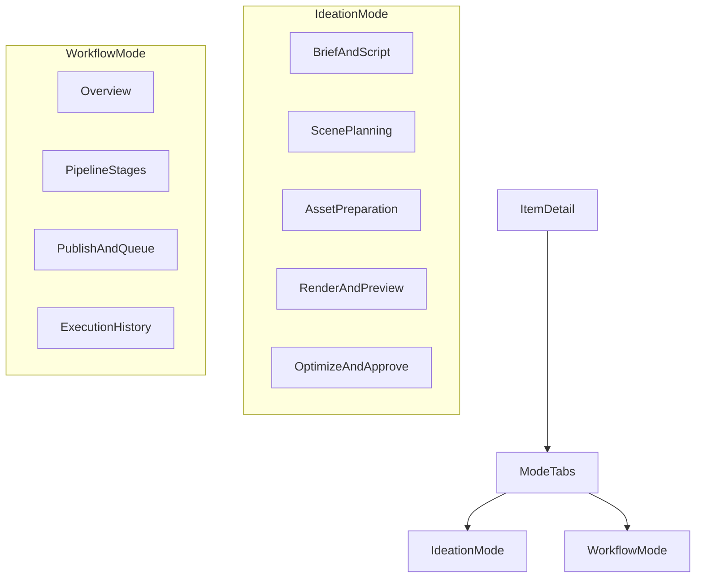

# 아이템 하위 모드 분기 구조 제안

본 문서는 제작 아이템 상세 화면에 `아이데이션`과 `워크플로`의 2개 하위 모드를 추가하는 정보구조 제안이다.

핵심 원칙은 단순하다.

- 기존 `워크플로 기반 UI`는 유지한다.
- 단건 제작, 미리보기, 렌더 최적화는 별도 모드로 추가한다.
- 두 모드는 아이템 상세 하위에서 사용자가 직접 선택한다.

관련 파일:

- `apps/admin-web/src/_pages/content-job-detail/ui/content-job-detail-page.tsx`
- `apps/admin-web/src/widgets/content-job-detail/lib/detail-workspace-tabs.ts`
- `apps/admin-web/src/widgets/content-job-detail/lib/content-job-workflow.ts`
- `apps/admin-web/src/widgets/content-job-detail/lib/content-job-workflow-internal.ts`
- `apps/admin-web/src/widgets/content-job-detail/ui/shell/content-job-workflow-bar.tsx`
- `apps/admin-web/src/widgets/content-job-detail/ui/shell/content-job-detail-stage-panel.tsx`

---

## 1. 한 줄 결론

제작 아이템 상세는 앞으로 아래 두 모드로 나눈다.

- `아이데이션`: 단건 제작 실험, 스크립트 조정, 에셋 생성, 렌더 미리보기, 수정 반복
- `워크플로`: 기존 단계 진행, 검수, 출고 준비, 예약·발행, 실행 이력 관리

즉, 사용자는 같은 아이템 안에서 아래 두 질문 중 하나를 선택하게 된다.

1. 지금 이 아이템을 한 편 기준으로 직접 다듬고 싶은가
2. 지금 이 아이템의 운영 단계와 출고 상태를 관리하고 싶은가

---

## 2. 왜 이 분리가 필요한가

현재 상세 화면은 `단건 제작 스튜디오`라기보다 `파이프라인 진행 관리 화면`에 가깝다.

현재 구조에서 강한 시그널은 아래와 같다.

- 상단은 `작업 플로우`와 `준비 상태` 중심이다.
- 본문은 `현재 작업`과 `다음 단계` 구조로 짜여 있다.
- 워크플로 단계는 `overview -> idea -> script -> assets -> review -> publishDraft -> queue -> schedule -> result` 순으로 운영된다.
- 사용자는 자연스럽게 한 편을 실험하는 대신 다음 단계로 밀려간다.

이 구조는 운영 관점에서는 유효하지만, 아래 목적에는 맞지 않는다.

- 스크립트 하나를 바탕으로 단건 영상을 충분히 테스트하기
- 씬과 에셋 조합을 보며 빠르게 수정하기
- 렌더 결과를 확인하며 반복 최적화하기
- 이 포맷이 충분히 검증되었을 때만 자동화 파이프라인으로 올리기

따라서 상세 화면은 하나로 유지하되, 아이템 하위에서 사용 목적을 먼저 고르게 해야 한다.

---

## 3. 현재 구조 요약

### 3.1 현재 페이지 조합

메인 상세 조합은 `apps/admin-web/src/_pages/content-job-detail/ui/content-job-detail-page.tsx` 에 있다.

- 상단 헤더
- `ContentJobWorkflowBar`
- readiness checklist
- `ContentJobDetailStagePanel`
- 단계별 본문 뷰

즉, 현재 페이지의 중심은 이미 `워크플로 shell`이다.

### 3.2 현재 라우트 탭

`apps/admin-web/src/widgets/content-job-detail/lib/detail-workspace-tabs.ts` 기준 현재 탭은 아래와 같다.

- `overview`
- `ideation`
- `scene`
- `assets`
- `publish`
- `timeline`

이 탭 구조는 표면상 작업 공간처럼 보이지만, 실제 설명은 대부분 단계 진행과 파이프라인 상태 확인에 가깝다.

### 3.3 현재 워크플로 모델

`apps/admin-web/src/widgets/content-job-detail/lib/content-job-workflow-internal.ts` 기준 현재 워크플로 단계는 아래와 같다.

1. `개요`
2. `아이디어`
3. `스크립트`
4. `에셋`
5. `검수`
6. `발행 문구`
7. `출고 대기`
8. `예약·발행`
9. `결과`

이 단계는 운영 흐름에는 적합하지만, 단건 제작의 핵심인 `렌더·미리보기`를 독립된 작업 공간으로 충분히 드러내지 못한다.

### 3.4 현재 렌더 단계의 한계

현재 구조에서는 최종 조합 결과를 다루는 스튜디오가 약하다.

- `assets` 탭은 씬별 이미지, 음성, 영상 클립 생성과 확인 중심이다.
- `publish` 탭은 검수, 발행 문구, 출고 준비 중심이다.
- 최종 렌더 결과를 보고 수정하는 루프가 독립적인 작업 개념으로 드러나지 않는다.

즉, `소재 생성`과 `최종 조합 검증` 사이가 사용자 경험상 충분히 분리되어 있지 않다.

---

## 4. 제안 정보구조

제안의 핵심은 아이템 상세를 없애거나 갈아엎는 것이 아니다.

- 아이템 상세라는 진입점은 유지한다.
- 상세 하위에 `모드 탭`을 추가한다.
- `워크플로`는 현재 화면 구조를 최대한 보존한다.
- `아이데이션`은 신규 단건 제작 shell로 추가한다.

---

## 5. 모드 구조

### 5.1 모드 명칭

우선 추천 명칭은 아래와 같다.

- `아이데이션`
- `워크플로`

이 명칭이 좋은 이유는 아래와 같다.

- `아이데이션`은 단건 실험과 제작 탐색의 성격을 잘 드러낸다.
- `워크플로`는 현재 화면의 운영 중심 의미와 자연스럽게 이어진다.
- 같은 아이템 안에서 `실험`과 `운영`의 관점을 나눈다는 의도가 분명하다.

대안으로는 아래도 가능하지만 우선순위는 낮다.

- `단건 제작` / `워크플로`
- `스튜디오` / `운영`

현재 코드와 팀 대화 문맥상 `아이데이션 / 워크플로`가 가장 자연스럽다.

### 5.2 아이데이션 모드

목적:

- 한 편의 영상을 충분히 실험하고 최적화하는 공간

핵심 질문:

- 이 스크립트 구성이 실제 영상으로 자연스러운가
- 씬 구성과 나레이션, 이미지, 클립의 조합이 괜찮은가
- 렌더 결과를 보고 무엇을 수정해야 하는가
- 이 포맷을 자동화로 넘겨도 될 만큼 확신이 생겼는가

핵심 특징:

- 단계 완료보다 반복 실험이 중요하다.
- `다음 단계`보다 `수정 후 재실행`이 중요하다.
- 에셋 준비와 렌더 미리보기가 동등한 핵심 단계다.

### 5.3 워크플로 모드

목적:

- 현재 잡의 상태, 선행 조건, 검수, 출고, 예약·발행을 운영하는 공간

핵심 질문:

- 지금 이 잡은 어디까지 진행되었는가
- 무엇이 막혀 있는가
- 검수나 출고 준비가 끝났는가
- 예약·발행과 결과는 어떠한가

핵심 특징:

- 기존 `workflow bar`, `stage panel`, `readiness chips`를 그대로 재사용할 수 있다.
- 파이프라인 추적과 운영 액션에 적합하다.

---

## 6. 권장 UX 구조

### 6.1 아이템 상세 상단 구조

아이템 상세 진입 후 화면 상단은 아래 3층으로 권장한다.

1. 아이템 헤더
2. 모드 탭
3. 모드별 본문 shell

예시:

- 헤더: 제목, 상태, 연결된 소재, 최근 갱신 시각
- 모드 탭: `아이데이션`, `워크플로`
- 본문:
  - `아이데이션` 선택 시 단건 제작 스튜디오
  - `워크플로` 선택 시 기존 워크플로 상세

### 6.2 워크플로 모드의 유지 범위

아래 요소는 현재 구조를 유지하는 것이 좋다.

- `ContentJobWorkflowBar`
- `ContentJobDetailStagePanel`
- readiness checklist
- `overview`, `assets`, `publish`, `timeline` 중심의 운영 UI

즉, `워크플로` 모드는 현재 상세 화면의 운영 성격을 보존하는 역할을 맡는다.

### 6.3 아이데이션 모드의 신규 구성

아이데이션 모드는 아래 흐름을 기본으로 한다.

1. 스크립트 초안과 입력 조건 확인
2. 씬 설계와 구조 수정
3. 이미지, 음성, 영상 에셋 준비
4. 렌더 요청
5. 최종 미리보기 확인
6. 수정 후 재렌더
7. 충분히 검증되면 자동화 승격 판단

---

## 7. 단계 모델 제안

### 7.1 아이데이션 모드 내부 단계

추천 단계는 아래와 같다.

1. `개요`
2. `스크립트`
3. `씬 설계`
4. `에셋 준비`
5. `렌더·미리보기`
6. `수정·확정`

여기서 핵심은 `렌더·미리보기`를 독립 단계로 다루는 것이다.

이 단계에서는 최소한 아래를 제공해야 한다.

- 씬별 이미지, 음성, 클립 준비 상태
- 최종 렌더 요청 버튼
- 렌더 결과 미리보기
- 실패와 재시도 상태
- 수정 후 재렌더 루프

### 7.2 워크플로 모드 내부 단계

워크플로 모드는 현재 운영 흐름을 유지한다.

1. `개요`
2. `아이디어`
3. `스크립트`
4. `에셋`
5. `검수`
6. `발행 문구`
7. `출고 대기`
8. `예약·발행`
9. `결과`

즉, `워크플로` 모드는 운영 캔버스로 남기고, `아이데이션` 모드가 단건 제작 스튜디오 역할을 맡는다.

---

## 8. 라우팅 제안

### 8.1 이상적인 구조

상위에 `mode` 세그먼트를 도입하는 구조가 가장 명확하다.

- `/jobs/:jobId/ideation/overview`
- `/jobs/:jobId/ideation/script`
- `/jobs/:jobId/ideation/assets`
- `/jobs/:jobId/ideation/render`
- `/jobs/:jobId/workflow/overview`
- `/jobs/:jobId/workflow/assets`
- `/jobs/:jobId/workflow/publish`
- `/jobs/:jobId/workflow/timeline`

장점:

- URL만 봐도 사용 목적이 드러난다.
- 같은 탭명이라도 모드별 의미를 분리할 수 있다.
- 이후 자동화 관련 하위 섹션을 확장하기 쉽다.

### 8.2 최소 변경 구조

초기 구현은 더 작게 시작해도 된다.

- 기존 `/jobs/:jobId/:step` 구조 유지
- 상단에 `모드 선택 UI`만 먼저 추가
- `아이데이션` 선택 시 신규 studio shell 렌더
- `워크플로` 선택 시 현재 shell 유지

이 접근은 기존 링크 구조를 깨지 않으면서 신규 모드를 빠르게 추가할 수 있다.

---

## 9. 컴포넌트 분리 방향

### 9.1 유지할 컴포넌트

기존 워크플로 모드에서는 아래 파일을 중심으로 유지한다.

- `apps/admin-web/src/_pages/content-job-detail/ui/content-job-detail-page.tsx`
- `apps/admin-web/src/widgets/content-job-detail/ui/shell/content-job-workflow-bar.tsx`
- `apps/admin-web/src/widgets/content-job-detail/ui/shell/content-job-detail-stage-panel.tsx`
- `apps/admin-web/src/widgets/content-job-detail/ui/shell/content-job-detail-stage-panel-sidebar.tsx`
- `apps/admin-web/src/widgets/content-job-detail/lib/content-job-workflow.ts`
- `apps/admin-web/src/widgets/content-job-detail/lib/content-job-workflow-internal.ts`

### 9.2 추가할 컴포넌트 후보

아이데이션 모드 도입 시 아래 구조가 자연스럽다.

- `apps/admin-web/src/widgets/content-job-detail/ui/shell/content-job-detail-mode-tabs.tsx`
- `apps/admin-web/src/widgets/content-job-detail/ui/ideation/content-job-detail-ideation-studio-view.tsx`
- `apps/admin-web/src/widgets/content-job-detail/ui/ideation/content-job-detail-render-preview-view.tsx`

필요 시 아래 재사용도 가능하다.

- 기존 `scene` 관련 뷰
- 기존 `assets` 관련 뷰
- 기존 에셋 셀, 씬별 자산 카드, 프리뷰 컴포넌트

즉, 신규 모드는 완전 신규 구현보다 `scene/assets 재사용 + render preview 신규 추가`가 적절하다.

---

## 10. 문구 가이드

### 10.1 아이데이션 모드

추천 톤:

- `단건 제작 실험 공간`
- `스크립트와 미디어 조합을 빠르게 테스트합니다`
- `렌더 결과를 보며 수정 포인트를 찾습니다`
- `검증된 구성을 나중에 자동화 파이프라인으로 확장합니다`

피해야 할 톤:

- 지나치게 선형적인 `다음 단계로 이동`
- 운영 큐 중심의 `출고 준비 완료`
- 파이프라인 내부 상태를 앞세우는 설명

### 10.2 워크플로 모드

현재 톤을 대부분 유지할 수 있다.

- 현재 단계
- 준비 상태
- 다음 단계
- 검수
- 출고 대기
- 예약·발행

즉, 운영 액션과 상태 추적은 `워크플로` 모드에서 계속 담당한다.

---

## 11. 구현 우선순위

1. 아이템 상세에 `모드 탭` 추가
2. 기존 상세 화면을 `워크플로 모드` shell로 감싸서 유지
3. 신규 `아이데이션 모드` shell 추가
4. 기존 `scene/assets` 일부를 재사용해 단건 제작 스튜디오 구성
5. `렌더·미리보기` 전용 섹션 추가
6. 이후 필요 시 `자동화로 승격` CTA 추가

---

## 12. 핵심 결정

- `워크플로 기반 UI`는 유지한다.
- `단건 제작`은 별도 모드로 추가한다.
- 두 메뉴의 분기는 `아이템 하위`에서 선택한다.
- 메뉴 명칭은 우선 `아이데이션 / 워크플로` 방향이 가장 자연스럽다.
- 단건 모드의 핵심은 `스크립트 -> 에셋 -> 렌더 미리보기 -> 수정 반복`이다.
- 자동화는 단건 검증이 끝난 뒤 확장하는 개념으로 다룬다.
