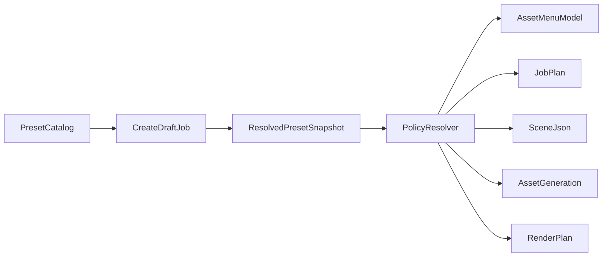
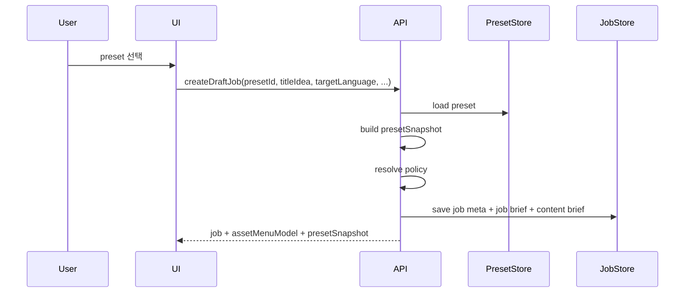

# 콘텐츠 프리셋 카탈로그 아키텍처 제안

## Goal

콘텐츠 분류 정책을 단순 라벨이 아니라, 잡 생성 시 선택 가능한 독립 `Preset` 엔터티로 승격한다.

이 프리셋은 아래 3가지를 동시에 결정해야 한다.

- 어떤 유형의 콘텐츠를 만들 것인가
- 어떤 생성 정책으로 파이프라인을 실행할 것인가
- 어떤 에셋 메뉴와 입력 UI를 사용자에게 보여줄 것인가

핵심은 `분류`와 `실행 정책`과 `작업 UI`를 같은 프리셋에서 파생시키는 것이다.

## 한 줄 결론

새 정책은 기존 `contentType` / `variant` / `stylePreset`를 대체하는 단일 문자열 필드로 넣는 것이 아니라, DB에 저장되는 독립 `Preset Catalog`로 설계하는 것이 맞다.

잡 생성 시 사용자는 `presetId`를 선택하고, 서버는 해당 프리셋을 읽어:

- `jobBrief`
- `contentBrief`
- `job meta`
- `resolvedPolicy`
- `asset menu model`

을 함께 결정한다.

즉, 프리셋은 단순 추천 태그가 아니라 `잡 생성의 시작점`이 된다.

## 왜 이 구조가 필요한가

현재 구조에는 이미 일부 분류 필드가 존재하지만, 프리셋 엔터티는 없다.

- `services/shared/lib/contracts/canonical-io-schemas.ts` 에는 `stylePreset`, `contentType`, `variant`, `targetDurationSec`가 존재한다.
- `services/admin/jobs/create-draft-job/repo/create-draft-job.ts` 는 신규 잡 생성 시 `contentType = "default"`, `variant = "default"` 를 넣는다.
- `services/plan/usecase/create-job-plan.ts` 와 `services/script/usecase/build-scene-json.ts` 는 주로 `stylePreset`와 `creativeBrief`를 프롬프트 변수로 쓴다.
- `services/composition/render-plan/index.ts` 는 렌더 규칙을 거의 고정값으로 둔다.

즉, 현재 코드는 `분류 카탈로그`보다 `자유 입력 + 일부 하드코딩 정책`에 가깝다.

이 상태에서 새 5분류를 그대로 기존 문자열 필드에 덮어쓰면 아래 문제가 생긴다.

- 잡 생성 시 선택 가능한 운영 단위가 되지 못한다.
- 프리셋별 에셋 메뉴 분기가 자연스럽게 나오지 않는다.
- 나중에 프리셋 정의가 바뀌면 기존 잡도 의미가 흔들린다.
- UI와 파이프라인이 서로 다른 기준으로 분기하게 된다.

따라서 `Preset Catalog -> Job Snapshot -> Resolved Policy`의 3단 구조가 필요하다.

## 목표 모델



### 1. Preset Catalog

운영자가 관리하는 독립 프리셋 목록이다.

예시:

- `Generative Horror Story`
- `News Bold Caption Short`
- `Still Motion Quote`
- `Narrated Documentary Short`
- `Cinematic Ambient Visual`

이 레벨은 재사용 가능한 상품 카탈로그다.

### 2. Resolved Preset Snapshot

잡 생성 시 선택된 프리셋의 실행용 스냅샷이다.

중요한 원칙:

- 잡에는 `presetId`만 저장하지 않는다.
- 선택 당시의 프리셋 내용을 함께 스냅샷 저장한다.

이유:

- 이후 프리셋이 수정되어도 기존 잡의 재생성 결과가 갑자기 바뀌지 않게 해야 한다.
- 승인, 재실행, 디버깅 시 어떤 정책으로 생성되었는지 추적 가능해야 한다.

### 3. Policy Resolver

파이프라인 단계는 프리셋 원본을 직접 읽지 않고, 스냅샷에서 계산된 `resolvedPolicy`만 사용한다.

이 레이어가 있어야 프리셋 정의와 실행 로직을 분리할 수 있다.

## 프리셋의 핵심 속성

프리셋은 아래 5축을 기본으로 가진다.

- `format`
- `duration`
- `platformPreset`
- `styleTags`
- `assetStrategy`

추천 기본 `format` 값:

- `generative-video`
- `template-short`
- `still-motion-short`
- `narrated-explainer`
- `cinematic-visual`

추천 `styleTags` 값:

- `cinematic`
- `minimal`
- `bold-caption`
- `news`
- `horror`
- `luxury`
- `cute`
- `retro`
- `meme`
- `documentary`
- `dramatic`
- `aesthetic`

추천 `assetStrategy` 값:

- `ai-video`
- `ai-image`
- `stock-video`
- `stock-image`
- `mixed`

하지만 실제 운영에서 더 중요한 것은 위 분류값 자체보다 `capabilities`다.

## 에셋 메뉴를 바꾸는 기준

사용자가 프리셋을 고르면 에셋 메뉴가 자연스럽게 바뀌게 하려면, UI는 `format` 이름이 아니라 `capabilities`를 읽어야 한다.

예:

- `requiresNarration`
- `requiresSubtitles`
- `supportsAiVideo`
- `supportsAiImage`
- `supportsStockVideo`
- `supportsStockImage`
- `supportsBgm`
- `supportsSfx`
- `supportsVoiceProfile`
- `supportsOverlayTemplate`
- `layoutMode`
- `subtitleMode`
- `voiceMode`

즉, UI는 "이 프리셋이 어떤 포맷이냐"보다 "이 프리셋으로 무엇을 입력받고 무엇을 생성할 수 있느냐"를 기준으로 메뉴를 그린다.

### 예시 1. Narrated Explainer

- `voiceMode = required`
- `subtitleMode = required`
- `layoutMode = free-scene`
- `supportsAiImage = true`
- `supportsAiVideo = optional`
- `supportsStockImage = true`
- `supportsStockVideo = true`
- `supportsBgm = true`

노출 메뉴 예시:

- 스크립트
- 나레이션/TTS
- 자막
- 보조 이미지
- 보조 영상
- 배경음

### 예시 2. Cinematic Visual

- `voiceMode = disabled`
- `subtitleMode = minimal`
- `layoutMode = cinematic`
- `supportsAiVideo = true`
- `supportsAiImage = true`
- `supportsStockVideo = true`
- `supportsStockImage = true`
- `supportsBgm = true`
- `supportsSfx = true`

노출 메뉴 예시:

- 비주얼 클립
- 이미지 소스
- 배경음
- 환경음 / 효과음
- 최종 룩 앤 필

숨김 또는 비권장 메뉴:

- TTS
- 긴 자막 편집

### 예시 3. Still Motion Short

- `voiceMode = optional`
- `subtitleMode = required`
- `layoutMode = still-motion`
- `supportsAiImage = true`
- `supportsAiVideo = false`
- `supportsStockImage = true`
- `supportsStockVideo = false`
- `supportsBgm = true`
- `supportsOverlayTemplate = true`

노출 메뉴 예시:

- 이미지 시퀀스
- 문구/카피
- 자막/텍스트 애니메이션
- 배경음

## 추천 DB 모델

현재 레포는 RDB보다 Dynamo 중심 구조이므로, 프리셋도 카탈로그 아이템으로 저장하는 편이 자연스럽다.

예시 개념 모델:

```ts
type ContentPresetItem = {
  PK: `PRESET#${presetId}`;
  SK: "META";
  presetId: string;
  name: string;
  description?: string;
  isActive: boolean;
  format:
    | "generative-video"
    | "template-short"
    | "still-motion-short"
    | "narrated-explainer"
    | "cinematic-visual";
  duration: "short" | "long";
  platformPresets: Array<
    "9:16" | "1:1" | "4:5" | "16:9" | "tiktok-reels-shorts"
  >;
  styleTags: string[];
  assetStrategy:
    | "ai-video"
    | "ai-image"
    | "stock-video"
    | "stock-image"
    | "mixed";
  capabilities: {
    voiceMode: "required" | "optional" | "disabled";
    subtitleMode: "required" | "optional" | "minimal" | "disabled";
    layoutMode: "template" | "free-scene" | "still-motion" | "cinematic";
    supportsAiVideo: boolean;
    supportsAiImage: boolean;
    supportsStockVideo: boolean;
    supportsStockImage: boolean;
    supportsBgm: boolean;
    supportsSfx: boolean;
    supportsVoiceProfile: boolean;
    supportsOverlayTemplate: boolean;
  };
  defaultPolicy: {
    sceneCountMin?: number;
    sceneCountMax?: number;
    subtitleStylePreset?: string;
    renderPreset?: string;
    preferredImageProvider?: string;
    preferredVideoProvider?: string;
    preferredVoiceProfileId?: string;
  };
  createdAt: string;
  updatedAt: string;
};
```

## 잡 저장 원칙

잡에는 아래 3종을 구분 저장한다.

### 1. `presetId`

사용자가 무엇을 골랐는지 식별하는 용도다.

### 2. `presetSnapshot`

선택 당시 프리셋의 핵심 내용을 얼려 저장한다.

### 3. `resolvedPolicy`

실행 직전에 계산된 정책 결과물이다.

이 구분이 필요한 이유는 다음과 같다.

- `presetId`만 저장하면 과거 잡 재현성이 약하다.
- `presetSnapshot`만 저장하면 카탈로그 연동이 약하다.
- `resolvedPolicy`가 없으면 각 단계가 프리셋을 제각각 해석하게 된다.

## 현재 구조와의 관계

새 프리셋은 기존 필드와 아래처럼 공존시키는 것이 안전하다.

### 유지할 것

- `stylePreset`
- `contentType`
- `variant`

### 역할 재정의

- `stylePreset`
  - 단기에는 프롬프트 호환용 파생값으로 유지
  - 중기에는 `presetSnapshot.styleTags` 기반 파생 필드로 축소
- `contentType`
  - 콘텐츠 라인 식별 축으로 유지하는 것이 낫다
- `variant`
  - 기존 호환 또는 라인 내부 버전 구분 용도로 제한

즉, 새 5분류는 `contentType`에 덮어쓰지 않고 `preset.format`으로 분리하는 것이 맞다.

이 방향은 기존 문서에서 말한 `channel -> content line -> job` 구조와도 충돌이 적다.

## 추천 계약 변경

### Shared Contract

우선 `services/shared/lib/contracts/canonical-io-schemas.ts` 에 아래 개념을 추가한다.

- `contentPresetRefSchema`
- `presetSnapshotSchema`
- `resolvedPolicySchema`

그리고 아래 입력/저장 계약에 연결한다.

- `CreateDraftJobInput`
- `JobBrief`
- `ContentBrief`

권장 입력 형태:

```ts
type CreateDraftJobInput = {
  contentId?: string;
  presetId: string;
  targetLanguage: string;
  titleIdea: string;
  targetDurationSec: number;
  stylePreset?: string;
  creativeBrief?: string;
  autoPublish?: boolean;
  publishAt?: string;
  runJobPlan?: boolean;
};
```

중요한 점:

- `presetId`는 필수
- `stylePreset`는 초기 호환을 위해 optional 또는 server-derived로 전환 검토

### GraphQL

`lib/modules/publish/graphql/schema.graphql` 에 아래가 필요하다.

- `type ContentPreset`
- `type ContentPresetCapability`
- `type ResolvedPresetSnapshot`
- `query contentPresets(...)`
- `mutation createContentPreset(...)` 또는 초기에는 settings/admin seed 기반 관리
- `CreateDraftJobInput.presetId`
- `AdminJob.presetId`
- `AdminJob.presetSnapshot`

### Store

`services/shared/lib/store/video-jobs.ts` 에는 잡 리스트/필터링용 요약만 denormalize 한다.

추천:

- `presetId`
- `presetFormat`
- `presetDuration`
- `presetPlatformPreset`
- 필요 시 `presetStyleSummary`

`styleTags` 전체 배열을 무리하게 인덱싱하기보다, 1차는 S3 snapshot + 요약 필드 조합이 낫다.

## 파이프라인 반영 방식

### 1. Create Draft Job

`services/admin/jobs/create-draft-job/repo/create-draft-job.ts`

현재는 초기에 legacy 기본값을 만들고 `contentBrief`를 저장한다.

여기에 아래 흐름이 추가되어야 한다.

1. `presetId`로 preset 로드
2. preset 을 `presetSnapshot`으로 정리
3. 입력값과 프리셋을 합쳐 `resolvedPolicy` 생성
4. `jobBrief`, `contentBrief`, `jobMeta`에 저장

### 2. Job Plan

`services/plan/usecase/create-job-plan.ts`

현재는 `stylePreset`, `contentType`, `variant` 중심 프롬프트다.

향후에는 아래를 함께 넘긴다.

- `presetFormat`
- `styleTags`
- `voiceMode`
- `subtitleMode`
- `layoutMode`
- `assetStrategy`

이렇게 해야 플랜 결과가 프리셋의 의도와 맞게 나온다.

### 3. Scene JSON

`services/script/usecase/build-scene-json.ts`

씬 생성은 프리셋별로 달라져야 한다.

- `template-short`: 자막 카드와 레이아웃 중심 씬
- `still-motion-short`: 이미지 중심 씬
- `narrated-explainer`: 내레이션 우선 씬
- `cinematic-visual`: 무자막, 무나레이션 또는 최소 텍스트 씬

즉, Scene JSON도 프리셋 영향을 직접 받아야 한다.

### 4. Asset Generation

`services/admin/generations/run-asset-generation/usecase/run-asset-generation.ts`

이 단계가 에셋 메뉴와 가장 직접 연결된다.

예:

- `supportsAiVideo = false` 면 scene video 생성 메뉴와 기본 실행을 비활성화
- `voiceMode = disabled` 면 voice generation을 숨기거나 스킵
- `supportsOverlayTemplate = true` 면 후속 render overlay 구성을 허용
- `assetStrategy = stock-image` 면 기본 소스가 stock 쪽으로 기울도록 정책화

즉, "어떤 에셋을 받아야 하는가"는 이 단계의 capability 모델과 동일한 기준을 써야 한다.

### 5. Render Plan

`services/composition/render-plan/index.ts`

현재 렌더는 거의 고정이다.

하지만 프리셋 구조가 들어오면 최소한 아래는 달라질 수 있어야 한다.

- 화면 비율
- subtitle burn-in 기본값
- subtitle style preset
- overlay preset
- preview duration
- scene gap policy

이 단계까지 반영되어야 프리셋이 실제 결과물 형식을 결정하게 된다.

## 에셋 메뉴 노출 모델

UI가 직접 프리셋을 해석하지 않게 하려면, 서버가 `assetMenuModel` 또는 `jobCapabilities`를 반환하는 편이 좋다.

예:

```ts
type AssetMenuModel = {
  showScript: boolean;
  showNarration: boolean;
  showSubtitles: boolean;
  showImageAssets: boolean;
  showVideoAssets: boolean;
  showStockPicker: boolean;
  showBgm: boolean;
  showSfx: boolean;
  showOverlayEditor: boolean;
  recommendedGenerationOrder: string[];
};
```

이렇게 하면 UI는 단순히 서버가 준 모델대로 메뉴를 그리면 된다.

즉:

- 프리셋 선택
- 서버가 snapshot / policy / asset menu 계산
- UI는 계산 결과를 그대로 사용

이 흐름이 가장 안정적이다.

## 추천 API 흐름



## 1차 구현 범위 권장안

처음부터 프리셋 CRUD 전체를 다 만들 필요는 없다.

가장 현실적인 1차 범위:

### Phase 1

- 프리셋 스키마와 저장 모델 정의
- 소수의 seed preset 등록
- `createDraftJob` 에 `presetId` 추가
- 잡에 `presetSnapshot` 저장
- `asset-generation` 에 capability 기반 기본 분기 추가

### Phase 2

- `jobDraft` 조회에 `assetMenuModel` 노출
- `updateJobBrief` 에 preset 변경 또는 재적용 규칙 추가
- `render-plan` 에 platform/layout/subtitle preset 반영

### Phase 3

- 프리셋 목록/필터 API
- 프리셋 관리 화면
- 채널 또는 콘텐츠 라인 단위 default preset 지정
- preset versioning / archival

## 운영상 중요한 원칙

### 1. 프리셋은 템플릿 이름이 아니라 정책 묶음이다

이름만 고르면 안 된다.

반드시 아래를 포함해야 한다.

- 생성 정책
- 입력 가능 자산 종류
- 출력 형식 기본값
- UI 메뉴 노출 규칙

### 2. 잡은 선택 당시 스냅샷을 가져야 한다

프리셋 정의가 바뀌어도 과거 잡은 재현 가능해야 한다.

### 3. UI와 백엔드는 같은 capability 모델을 봐야 한다

프론트가 프리셋 이름을 하드코딩 분기하면 반드시 drift가 생긴다.

### 4. 기존 `stylePreset`는 바로 제거하지 않는다

현재 프롬프트 파이프라인이 이 필드에 기대고 있으므로, 초기에는 호환 필드로 유지하는 것이 안전하다.

## 최종 권장안

정리하면, 현재 구조 위에 얹을 가장 적절한 방식은 아래다.

1. `Preset Catalog`를 DB의 독립 엔터티로 만든다.
2. 잡 생성 입력에서 `presetId`를 필수 선택값으로 받는다.
3. 서버가 `presetSnapshot`과 `resolvedPolicy`를 계산해 잡에 저장한다.
4. 같은 계산 결과에서 `assetMenuModel`도 함께 만들어 UI 메뉴를 제어한다.
5. 기존 `stylePreset` / `contentType` / `variant`는 즉시 제거하지 말고 호환용으로 병행한다.

이렇게 해야 사용자가 "이 프리셋으로 만들겠다"라고 선택했을 때,

- 플랜이 그 성격에 맞게 생성되고
- 씬 구성이 그 포맷에 맞게 바뀌고
- 필요한 에셋 메뉴가 자연스럽게 달라지고
- 렌더 결과도 그 프리셋의 출력 성격을 따르게 된다.
