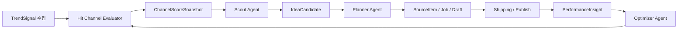

# Cursor 전달용: 에이전트 ↔ 발행 파이프라인 통합

**문서 ID:** `cursor-handoff-agent-publish-integration`  
**목적:** 아이디어 메모가 아니라 **바로 구현에 들어갈 수 있는** 통합 원칙, 엔티티, 인프라, 코드 경로, 단계별 순서, **TODO 체크리스트**를 한곳에 고정한다.  
**선행 읽기:** [`agent-layer-on-publish-pipeline.md`](./agent-layer-on-publish-pipeline.md) (개념·Phase), [`project-publish-architecture-design-status.md`](./project-publish-architecture-design-status.md) (현행 도메인·스토어).

> 본 시스템의 1차 목표는 완전 무인화가 아니라, **자동 생성·자동 측정·자동 제안이 가능한 반자동 운영체계**를 만드는 것이다. Scout/Planner/Optimizer는 기본적으로 자동 실행하되, **Queue 적재 및 실제 Publish**는 채널별 정책과 **승인 게이트**를 통과한 경우에만 자동 진행한다. Optimizer의 출력은 인과적으로 확정된 결론이 아니라 **다음 실험을 위한 가설**로 취급하며, 고위험 수정은 **사람 승인** 또는 **화이트리스트 채널**에 한해 자동 반영한다.

> 히트 채널 평가는 영상 단위 트렌드와 별도 레이어로 다룬다. 외부 API를 통해 채널의 최근 업로드 cadence, Shorts hit ratio, 조회수 분포, 포맷 반복성, 주제 적합성, 상업성 등을 수집하여 `ChannelSignal`과 `ChannelScoreSnapshot`으로 저장한다. Scout와 Planner는 아이디어 후보를 평가할 때 해당 원본 채널의 최신 점수를 참조하되, 이를 아이디어 점수에 직접 흡수하지 않고 별도 근거로 유지한다. Optimizer는 실제 우리 채널 성과를 바탕으로 `nicheFitScore` 및 재현 가능성 점수를 주기적으로 보정한다.

---

## 0. 비목표 (이번 통합에서 하지 않는 것)

- [ ] 별도 “에이전트 플랫폼” 마이크로서비스 신설
- [ ] 기존 `Content → Job → SourceItem → Draft → Target → Queue → runPublishOrchestration` 축 대체
- [ ] `channelContentItemId` vs `jobId` 경계 재설계 (1차는 **`jobId` 기준** 유지)
- [ ] TikTok/Instagram 자동 발행 (1차는 **YouTube만**; 타 플랫폼은 `SKIPPED`/구조만)

---

## 1. 기존 파이프라인 위 통합 원칙 (필수)

| #   | 원칙                                | 실무 해석                                                                                                                                                                                                      |
| --- | ----------------------------------- | -------------------------------------------------------------------------------------------------------------------------------------------------------------------------------------------------------------- |
| P1  | **출고 실행축은 재사용**            | `enqueueToChannelPublishQueue`, `runPublishOrchestration`, 업로드 워커 경로를 우회하지 않는다.                                                                                                                 |
| P2  | **에이전트는 기존 usecase를 호출**  | 스토어를 Lambda에서 직접 “꼼수”로 만지기보다, 이미 있는 **router usecase / shared store 함수**를 import 해 재사용한다.                                                                                         |
| P3  | **Admin GraphQL과 배치 경로 분리**  | 사람용 mutation은 기존 `publish-domain-router` 및 개별 resolver에 둔다. **스케줄·SQS·SFN**은 `services/agents/**` 별도 entry에서 동일 usecase를 호출한다.                                                      |
| P4  | **Zod가 계약의 단일 기준**          | 새 필드·payload는 `lib/modules/publish/contracts/` 또는 전용 `lib/modules/agents/contracts/`에 스키마를 두고 `parse`한다. ([`.cursor/rules/api-zod-contracts.mdc`](../../.cursor/rules/api-zod-contracts.mdc)) |
| P5  | **서비스 레이어 규칙**              | `handler.ts`는 얇게, `index.ts`의 `run`, `usecase/`, `repo/` 분리. ([`.cursor/rules/services-handler-convention.mdc`](../../.cursor/rules/services-handler-convention.mdc))                                    |
| P6  | **짧은 실행 단위**                  | 상시 LLM 데몬 금지. EventBridge/SQS/SFN로 **트리거 → 한 번 판단 → 저장 → 다음 메시지** 패턴.                                                                                                                   |
| P7  | **검수는 추상어가 아니라 게이트**   | 아래 **Gate A/B/C**를 코드·상태머신·Zod/룰로 구현한다. “검수 기능”으로 흐릿하게 두지 않는다.                                                                                                                   |
| P8  | **Optimizer는 가설 생성기**         | `PerformanceInsight`의 진단·제안은 **정답이 아니라 가설**. 인과 확정을 주장하지 않는다.                                                                                                                        |
| P9  | **채널별 자동화 수준**              | 아래 **자동화 플래그**로 채널마다 다르게 켠다. 전 채널 동일 룰은 운영 사고를 부른다.                                                                                                                           |
| P10 | **히트 채널 vs 아이디어 점수 분리** | 영상 단위 인기와 **채널 단위 재현성**은 다른 문제. `IdeaCandidate.score`에 채널 강도를 직접 섞지 말고 `ChannelScoreSnapshot`을 **별도 근거**로 저장한 뒤 Scout/Planner에서 참조한다.                           |
| P11 | **채널 점수는 스냅샷**              | 채널은 뜨고 식는다. 단일 영구 랭킹이 아니라 `ChannelScoreSnapshot`으로 버전 관리하고 **TTL·STALE·Scout 입력 제외** 규칙을 둔다.                                                                                |

### 1.1 검수는 기능이 아니라 게이트 (Gate A / B / C)

검수를 UI 문구가 아니라 **통과 조건**으로 고정한다. Step Functions 분기·Lambda early-return·`AgentRun` 기록과 연결한다.

| 게이트                        | 성격             | 통과 조건 (예)                                                                                        |
| ----------------------------- | ---------------- | ----------------------------------------------------------------------------------------------------- |
| **Gate A — 정책 검수 (자동)** | 룰·스키마·프로필 | 금지어 / 플랫폼 필수 metadata / 길이·포맷 / `PlatformConnection`·`PlatformPublishProfile` 존재·유효성 |
| **Gate B — 브랜드·민감도**    | 사람 또는 예외   | 사람 승인, 또는 **화이트리스트 채널**만 자동 통과                                                     |
| **Gate C — 출고 가능**        | 파이프라인 준비  | 에셋(렌더 등) 준비, draft 준비, publish target 준비, (선택) **score threshold** 충족                  |

- Queue 적재(`enqueueToChannelPublishQueue`)와 실제 Publish(`runPublishOrchestration`)는 **Gate C + 채널 플래그**가 허용할 때만 자동.
- Gate A 실패는 **자동 거절 + 이유 기록**(`AgentRun` 또는 별도 거절 이벤트).

### 1.2 Optimizer: “진실 판별기”가 아니라 “실험 제안기”

- Optimizer 출력은 **정답이 아니라 가설**이다. `PerformanceInsight.diagnosis`·`suggestedActions`는 **휴리스틱 + (선택) LLM 서술** 수준이며, 인과 추론으로 확정되지 않는다.
- 다음 라운드 반영 규칙을 둘로 나눈다.
  - **자동 반영 가능**: 저위험·숫자 임계값 기반(예: `minIdeaScoreToCreateSource` 조정)
  - **승인 후 반영**: 프롬프트·금지 주제·브랜드 톤 등 **고위험** 변경
- 팀이 LLM 진단을 과신하지 않도록, UI/문서에 **가설** 레이블을 유지한다.

### 1.3 채널 단위 자동화 플래그 (feature flags)

저장 위치는 `ScoutPolicy`와 동일하게 **Content 메타 확장** 또는 **`PK = CONTENT#<id>`, `SK = AGENT_AUTOMATION_CONFIG`** 등 Dynamo 한 행으로 둘 수 있다. 구현 시 Zod 스키마로 고정.

| 플래그                | 의미                                                    |
| --------------------- | ------------------------------------------------------- |
| `autoScoutEnabled`    | 트렌드 수집·후보 생성 실행                              |
| `autoDraftEnabled`    | Planner 초안 자동 작성                                  |
| `autoEnqueueEnabled`  | 조건 충족 시 큐 적재                                    |
| `autoPublishEnabled`  | (해당 시) 오케스트레이션까지 자동 — **매우 제한적으로** |
| `autoOptimizeEnabled` | 성과 스냅샷·Insight 기록                                |
| `humanReviewRequired` | Gate B 강제 — true면 브랜드 검수 없이 자동 진행 금지    |

초기에는 채널마다 다른 조합을 허용해 **한 채널 사고가 전체로 퍼지지 않게** 한다.

---

## 2. 신규 엔티티 (도메인 정의)

모두 **같은 Jobs DynamoDB 테이블**(`JOBS_TABLE_NAME`)에 적재하는 것을 1안으로 둔다. (운영 단순화; 별도 테이블은 트래픽·쿼리 패턴이 커지면 분리.)

### 2.1 공통 필드 (권장)

- `createdAt`, `updatedAt` (ISO 8601)
- `contentId` (채널 스코프; 없으면 글로벌 수집용으로 `null` 허용 여부를 스키마에서 명시)

### 2.2 `TrendSignal`

| 항목          | 설명                                                                                                     |
| ------------- | -------------------------------------------------------------------------------------------------------- |
| **의미**      | 외부 수집 **원본** (API 응답 스냅샷, URL, 키워드, 댓글 샘플 등)                                          |
| **id**        | `tsig_` + uuid 등 고정 prefix                                                                            |
| **핵심 필드** | `sourceKind` (YOUTUBE_TREND, KEYWORD, …), `rawPayload` (JSON), `fetchedAt`, `dedupeKey` (수집 중복 방지) |

**Dynamo (안)**

- `PK`: `TREND_SIGNAL#<signalId>`
- `SK`: `META`
- **GSI (선택):** `GSI1PK = CONTENT#<contentId>#TREND`, `GSI1SK = fetchedAt` — 채널별 최근 시그널 조회용

### 2.3 `IdeaCandidate`

| 항목          | 설명                                                                                                                                     |
| ------------- | ---------------------------------------------------------------------------------------------------------------------------------------- |
| **의미**      | LLM/룰이 만든 **후보** (채널 적합성, 점수, 근거)                                                                                         |
| **id**        | `idea_` + uuid                                                                                                                           |
| **핵심 필드** | `contentId`, `trendSignalIds[]`, `title`, `hook`, `rationale`, `score` (0–1), `status` (`PENDING` \| `PROMOTED_TO_SOURCE` \| `REJECTED`) |
| **연결**      | 승격 시 `promotedSourceItemId` 설정                                                                                                      |

**Dynamo (안)**

- `PK`: `IDEA_CANDIDATE#<id>` / `SK`: `META`
- **GSI (선택):** 파티션 `CONTENT#<contentId>#IDEAS`, 소트 `status#score`

### 2.4 `AgentRun`

| 항목          | 설명                                                                                                                                                                                     |
| ------------- | ---------------------------------------------------------------------------------------------------------------------------------------------------------------------------------------- |
| **의미**      | 감사·재현용 **실행 로그** (어떤 에이전트가 어떤 입력으로 무엇을 출력했는지)                                                                                                              |
| **id**        | `arun_` + uuid                                                                                                                                                                           |
| **핵심 필드** | `agentKind` (`CHANNEL_EVALUATOR`, SCOUT, PLANNER, SHIPPING, OPTIMIZER), `trigger` (SCHEDULE, SQS, SFN, …), `inputRef` (id들), `outputRef`, `modelId?`, `tokenUsage?`, `status`, `error?` |

**Dynamo (안)**

- `PK`: `AGENT_RUN#<id>` / `SK`: `META`
- 또는 **상위 엔티티에 붙는 자식 패턴**: `PK = IDEA_CANDIDATE#<id>`, `SK = AGENT_RUN#<time>#<id>` (후보 단위 이력 조회)

### 2.5 `PerformanceInsight`

| 항목          | 설명                                                                                                                                                 |
| ------------- | ---------------------------------------------------------------------------------------------------------------------------------------------------- |
| **의미**      | 게시 후 **성과 스냅샷 + 해석 + 다음 액션 제안**                                                                                                      |
| **id**        | `perf_` + uuid                                                                                                                                       |
| **핵심 필드** | `jobId`, `publishTargetId?`, `snapshotKind` (`T1H` \| `T24H` \| `T72H`), `metrics` (JSON), `diagnosis`, `suggestedActions[]`, `relatedSourceItemId?` |
| **주의**      | `diagnosis`는 **인과 확정이 아닌 가설·휴리스틱 기반 제안**으로 취급 (§1.2).                                                                          |

**Dynamo (안)**

- `PK`: `JOB#<jobId>` (기존 job 패턴과 정렬) / `SK`: `PERF_INSIGHT#<snapshotKind>#<id>`
- 또는 `PK`: `PERF_INSIGHT#<id>` / `SK`: `META` + GSI로 job 조회

### 2.6 `ScoutPolicy` (설정; 엔티티 또는 Content 확장)

채널별 자동 발굴 규칙. **저장 위치 후보:**

- **A안:** Content 메타(JSON) 확장 필드 (빠름, UI와 같이 배포)
- **B안:** Dynamo 전용 행 `PK = CONTENT#<id>`, `SK = SCOUT_POLICY` (에이전트만 쓰는 설정 분리)

필드 예: `allowedTopics[]`, `blockedTopics[]`, `targetPlatforms[]`, `targetDurationSec`, `revenueMode`, `minIdeaScoreToCreateSource`.

같은 설정 블록 또는 인접 행에 **§1.3 자동화 플래그**를 두어 ScoutPolicy와 함께 로드한다.

### 2.7 `ChannelSignal` (외부 채널 원천 데이터)

| 항목          | 설명                                                                                                                                                                                                            |
| ------------- | --------------------------------------------------------------------------------------------------------------------------------------------------------------------------------------------------------------- |
| **의미**      | API로 수집한 **타사 채널** 메타·통계·최근 창 통계                                                                                                                                                               |
| **id**        | `chsig_` + uuid 등                                                                                                                                                                                              |
| **핵심 필드** | `platform` (1차 `YOUTUBE`), `externalChannelId`, `title`, `handle?`, `stats` (구독·영상 수·총조회 등), `recentWindow` (샘플 수·Shorts 비중·avg/median/p90 views, 업로드 cadence 등), `fetchedAt`, `rawPayload?` |

**Dynamo (안):** `PK = CHANNEL_SIGNAL#<id>`, `SK = META`; 채널별 최신 조회용 링크 또는 GSI.

### 2.8 `ChannelScoreSnapshot` (히트 채널 평가 결과)

| 항목          | 설명                                                                                                                                                                                                                                                                                                               |
| ------------- | ------------------------------------------------------------------------------------------------------------------------------------------------------------------------------------------------------------------------------------------------------------------------------------------------------------------ |
| **의미**      | 규칙/모델 기반 **평가 스냅샷**(정적 순위 아님)                                                                                                                                                                                                                                                                     |
| **핵심 필드** | `externalChannelId`, `contentId?`(우리 채널 적합성), `status` (`ACTIVE` \| `STALE` \| `REJECTED`), `scores`: momentum / consistency / reproducibility / nicheFit / monetization / **overall**, `labels[]`, `rationale[]`, `riskFlags[]`, `topFormats[]` (라벨·샘플 video id·confidence), `createdAt` / `updatedAt` |

**초기 overall 가중(예시, 튜닝 가능):**

`overall = 0.25·momentum + 0.20·consistency + 0.20·reproducibility + 0.20·nicheFit + 0.15·monetization`

세부 지표는 문서 [`agent-layer-on-publish-pipeline.md`](./agent-layer-on-publish-pipeline.md) §8(주의) 및 본 문서 P10–P11과 함께 **가설·규칙 기반**으로 시작한다.

**Dynamo (안):** `PK = EXT_CHANNEL#<platform>#<externalChannelId>`, `SK = SCORE_SNAPSHOT#<iso>#<id>` 등 시계열 조회 가능한 형태.

### 2.9 `ChannelWatchlist` (추적 대상 외부 채널)

| 항목          | 설명                                                                                                                                                            |
| ------------- | --------------------------------------------------------------------------------------------------------------------------------------------------------------- |
| **의미**      | 우리 `contentId` 관점에서 **평가·재평가할 채널** 큐                                                                                                             |
| **핵심 필드** | `contentId`, `platform`, `externalChannelId`, `status` (`WATCHING` \| `PAUSED` \| `ARCHIVED`), `source` (`AUTO_DISCOVERED` \| `MANUAL`), `priority`, 타임스탬프 |

**출처 예:** 트렌드/검색 상위 영상의 작성 채널, 기존 `TrendSignal`의 원본 채널, 운영자 수동 추가.

### 2.10 관계도 (구현 시 유지할 방향)



`ChannelSignal`·`ChannelWatchlist`는 Evaluator 입력/대상 큐. `AgentRun`은 감사(도식 생략).

---

## 3. Lambda / SQS / EventBridge 기반 “에이전트 런” 구조

### 3.1 컴포넌트 매핑

| AWS                                                        | 역할                         | 이 레포에서의 위치 (신규/확장)                                                                                                                                            |
| ---------------------------------------------------------- | ---------------------------- | ------------------------------------------------------------------------------------------------------------------------------------------------------------------------- |
| **EventBridge Scheduler** (또는 `events.Rule` `rate(...)`) | 주기 트리거                  | [`lib/publish-stack.ts`](../../lib/publish-stack.ts) 또는 신규 `lib/agent-stack.ts`에서 Rule 추가 (기존 [`lib/workflow-stack.ts`](../../lib/workflow-stack.ts) 패턴 참고) |
| **SQS**                                                    | 작업 큐, DLQ                 | [`lib/modules/workflow/queues.ts`](../../lib/modules/workflow/queues.ts)와 유사하게 `createAgentQueues()` 추가하거나 `PublishStack`에 인라인 정의                         |
| **Lambda**                                                 | 메시지/스케줄 핸들러         | `services/agents/<name>/handler.ts`                                                                                                                                       |
| **Step Functions**                                         | 멀티스텝·승인 대기·점수 분기 | [`lib/publish-stack.ts`](../../lib/publish-stack.ts)에 이미 `sfn` import 있음 — 신규 state machine 추가 검토                                                              |
| **기존 테이블**                                            | 영속성                       | `JOBS_TABLE_NAME` — [`services/shared/lib/store/`](../../services/shared/lib/store/)에 `repo` 모듈 추가                                                                   |

### 3.2 큐 이름 (배포 시 `projectPrefix` 접두)

| 논리 이름                 | 용도                                  |
| ------------------------- | ------------------------------------- |
| `channel-evaluation-jobs` | 채널 신호 수집·스냅샷·워치리스트 갱신 |
| `trend-scout-jobs`        | 수집 배치 단위                        |
| `idea-planning-jobs`      | 후보 생성·점수화                      |
| `draft-generation-jobs`   | 초안 작성 (Planner)                   |
| `publish-scheduling-jobs` | Shipping                              |
| `optimization-jobs`       | 성과 수집·분류                        |

각 큐는 **visibility timeout**을 LLM 호출 최대 시간에 맞춤 (예: 2–5분; 워커 타임아웃과 정합).

### 3.3 스케줄 예 (초기값, 튜닝 가능)

| 트리거                        | 대상                                                  |
| ----------------------------- | ----------------------------------------------------- |
| `rate(15 minutes)`            | Trend 수집 → `trend-scout-jobs`                       |
| `rate(6 hours)` 또는 하루 2회 | `ChannelWatchlist` 재평가 → `channel-evaluation-jobs` |
| Scout 직전(선택)              | 고우선 외부 채널 스냅샷 refresh                       |
| `rate(1 hour)`                | Planner backlog                                       |
| `cron` 하루 2회               | Optimizer                                             |
| Job별 예약 직전               | Shipping (또는 큐 지연 + `scheduledAt` 폴링)          |

### 3.4 Lambda 패키지 구조 (신규)

```
services/agents/
  channel-evaluator/
    handler.ts
    index.ts
    usecase/collect-channel-signals.ts
    usecase/score-hit-channel.ts
    usecase/update-watchlist.ts
    repo/           # channel-signal-store, channel-score-snapshot-store, watchlist-store
  trend-scout/
    handler.ts      # export const handler = run;
    index.ts        # run(event)
    usecase/        # scoutChannel, persistTrendSignals, …
    repo/           # trend-signal-store.ts (Dynamo)
  idea-planner/
  publish-scheduler/
  performance-optimizer/
```

**실행 흐름(요약):** Scout가 트렌드 수집 → 새 외부 채널이면 `ChannelWatchlist` 등록 → `channel-evaluation-jobs` enqueue → `ChannelSignal` 수집 → `ChannelScoreSnapshot` 저장 → Scout/Planner가 참조.

환경 변수 예: `JOBS_TABLE_NAME`, `OPENAI_SECRET_ID` / Bedrock, 기존 `publish-stack`과 동일 패턴.

---

## 4. 기존 usecase 재사용 (코드 앵커)

에이전트 Lambda는 **아래를 직접 호출**하는 경로를 1차로 취한다. (HTTP로 Admin API 우회 금지.)

| 목적                  | 호출 대상 (예시)                                                            | 파일 앵커                                                                                                                                                                                                             |
| --------------------- | --------------------------------------------------------------------------- | --------------------------------------------------------------------------------------------------------------------------------------------------------------------------------------------------------------------- |
| 소재 생성             | `createSourceItem`                                                          | [`services/shared/lib/store/source-items.ts`](../../services/shared/lib/store/source-items.ts)                                                                                                                        |
| Job–소재 연결         | `setJobSourceItem` 로직과 동일한 메타 갱신                                  | [`services/admin/graphql/publish-domain-router/route-publish-domain.ts`](../../services/admin/graphql/publish-domain-router/route-publish-domain.ts) — **공통화 시** `usecase/set-job-source-item.ts`로 추출 권장     |
| 발행 초안 저장        | `putContentPublishDraft` / 라우터의 `updateContentPublishDraft`와 동일 검증 | [`services/shared/lib/store/publish-draft-store.ts`](../../services/shared/lib/store/publish-draft-store.ts), [`route-publish-domain.ts`](../../services/admin/graphql/publish-domain-router/route-publish-domain.ts) |
| 큐 적재               | `enqueueToChannelPublishQueueUsecase`                                       | [`services/admin/graphql/enqueue-to-channel-publish-queue/usecase/enqueue-to-channel-publish-queue.ts`](../../services/admin/graphql/enqueue-to-channel-publish-queue/usecase/enqueue-to-channel-publish-queue.ts)    |
| 업로드 오케스트레이션 | `runPublishOrchestrationUsecase`                                            | [`services/admin/graphql/publish-domain-router/usecase/run-publish-orchestration.ts`](../../services/admin/graphql/publish-domain-router/usecase/run-publish-orchestration.ts)                                        |
| 플랫폼·프로필 읽기    | `getPlatformPublishProfile`, `listMergedPlatformConnectionsForChannel` 등   | [`services/shared/lib/store/`](../../services/shared/lib/store/)                                                                                                                                                      |

**리팩터 가이드:** router에만 있는 로직이 두 번째 호출자(에이전트)에서 필요하면 **usecase 파일로 한 번만 추출**하고 router와 agent가 동시에 import한다 (P2).

---

## 5. 단계별 구현 순서 (권장)

### Milestone M0 — 선행 (에이전트 품질)

- [ ] **게시 프로필 UI**: `updatePlatformPublishProfile`로 채널·연결별 기본값이 입력 가능해야 Planner/Shipping이 의미 있음. (현재 connections 쪽 **전용 탭 미구현** — [`project-publish-architecture-design-status.md`](./project-publish-architecture-design-status.md) 참고)

### Milestone M1 — 계약 + 저장소

- [x] `lib/modules/agents/contracts/agent-domain.ts` — `TrendSignal`, `IdeaCandidate`, `AgentRun`, `PerformanceInsight`, `ScoutPolicy`, 채널 자동화 플래그, 히트 채널 관련 타입(`ChannelSignal` 등), `CHANNEL_EVALUATOR`
- [x] `services/shared/lib/store/` — 엔티티별 CRUD·목록 (`idea-candidates`, `trend-signals`, `agent-runs`, `performance-insights`, `channel-agent-config`, `channel-watchlist`, `channel-signals`, `channel-score-snapshots`)
- [ ] (선택) CDK에서 GSI 추가 — 키 설계 확정 후 `SharedStack`/`jobs` 테이블 정의 파일 수정

### Milestone M2 — Scout (SourceItem 자동 생성)

- [~] `trend-scout` Lambda + SQS + DLQ는 `PublishStack`에 있음; **EventBridge 스케줄 → 큐 적재는 미연결**
- [ ] 수집 → `TrendSignal` 저장 → LLM → `IdeaCandidate` → 임계값 이상이면 `createSourceItem` (현재 람다는 **`AgentRun` 플레이스홀더**만)
- [~] `AgentRun` 기록(트렌드 스카우트 경로에 한함)
- [x] Admin **GraphQL** + 후보 패널 — `ideaCandidatesForChannel`, `promoteIdeaCandidateToSource`, `rejectIdeaCandidate`

### Milestone M2.5 — Hit Channel Evaluator (Scout ↔ Planner 사이)

- [x] Zod + store: `ChannelSignal`, `ChannelScoreSnapshot`, `ChannelWatchlist` (P10·P11 데이터 모델)
- [~] `channel-evaluation-jobs` + `services/agents/channel-evaluator` — **가짜 시그널 + 규칙 기반 스냅샷**; 실제 YouTube API 수집·워치리스트 자동 갱신은 **미구현**
- [ ] YouTube API(또는 동급)로 채널 메타 + 최근 N영상/Shorts 통계
- [ ] Scout 입력: 고득점 채널·최신 스냅샷 기준 `TrendSignal` 가중 / 저득점·STALE 제외
- [ ] Planner 입력: 원본 채널의 최신 `ChannelScoreSnapshot`, `topFormats`, `rationale` / `riskFlags`
- [ ] Optimizer → `nicheFitScore`·재현성 규칙 **가설 보정** (승인 경로와 병행)
- [x] Admin: `channelWatchlist`, `latestChannelScoreSnapshotsForChannel`, `HitChannelsPanel` (워치리스트 추가·스냅샷 표시)

### Milestone M3 — Planner (Draft 자동 채움)

- [ ] `idea-planner` / `draft-generation` 경로에서 `SourceItem` + 프로필 + (가능하면) 최근 `PerformanceInsight` 입력으로 초안 생성
- [ ] `putContentPublishDraft`로 저장 (`contentPublishDraftSchema` 준수)

### Milestone M4 — Shipping (큐)

- [ ] 조건 충족 시 `enqueueToChannelPublishQueueUsecase` 호출
- [ ] Phase 1에서는 **자동 enqueue 비활성** 또는 “추천만” UI로 시작 가능

### Milestone M5 — Optimizer

- [ ] YouTube Analytics 등 수집 모듈 (기존 metrics Lambda 확장 또는 신규)
- [ ] `PerformanceInsight` 저장 → 다음 Scout/Planner 프롬프트에 주입

---

## 6. GraphQL / 클라이언트 확장 포인트

| 단계       | 파일                                                                                             | 상태 (구현 스냅샷)                                                                                                      |
| ---------- | ------------------------------------------------------------------------------------------------ | ----------------------------------------------------------------------------------------------------------------------- |
| 스키마     | [`lib/modules/publish/graphql/schema.graphql`](../../lib/modules/publish/graphql/schema.graphql) | ✅ 아이디어·트렌드·에이전트 런·성과 인사이트·채널 에이전트 설정·워치리스트·채널 스냅샷·`AgentKind.CHANNEL_EVALUATOR` 등 |
| API 바인딩 | [`lib/modules/publish/graphql-api.ts`](../../lib/modules/publish/graphql-api.ts)                 | ✅ publish-domain Lambda에 필드 연결                                                                                    |
| CDK        | [`lib/publish-stack.ts`](../../lib/publish-stack.ts)                                             | ✅ 기존 패턴; 에이전트용 `trend-scout-jobs` / `channel-evaluation-jobs` 큐 + Lambda                                     |
| 클라이언트 | [`packages/graphql/src/admin.ts`](../../packages/graphql/src/admin.ts)                           | ✅ 대응 훅                                                                                                              |
| Admin UI   | `apps/admin-web`                                                                                 | ✅ `/discovery` 전역 발굴·탭(탐색·워치리스트·후보 등); §7·§7.1 참고                                                     |

**원칙:** 에이전트 **실행**은 GraphQL이 아니라 SQS/Lambda. GraphQL은 **조회·승인·정책 편집** 위주.

---

## 7. UI 확장 포인트 (파일 단위)

| 라우트                                                  | 페이지/위젯 (기존 패턴에 맞춰 추가)                                                                                                                                                           |
| ------------------------------------------------------- | --------------------------------------------------------------------------------------------------------------------------------------------------------------------------------------------- |
| `/discovery?channel=&tab=` (사이드바 **발굴·벤치마크**) | 전역 허브: 탭(외부 탐색·워치리스트·자동 후보·트렌드·소재 안내). `channel`은 **운영 라인 렌즈(필터)**; 외부 벤치마크는 채널 하위 부속이 아니라는 문구로 서술. 채널 화면은 서브내비 링크로 진입 |
| `/jobs/[jobId]/overview`                                | **에이전트 제안** 카드; (선택) 원본 외부 채널 링크 + 해당 `ChannelScoreSnapshot` rationale / riskFlags 요약                                                                                   |
| `/jobs/[jobId]/publish`                                 | [`content-publish-draft-section.tsx`](../../apps/admin-web/src/widgets/content-job-detail/ui/content-publish-draft-section.tsx) 인근: 자동 초안 diff / 근거                                   |
| `/content/[contentId]/connections`                      | 프로필 편집 — **M0 선행**                                                                                                                                                                     |

React Query + `@packages/graphql` 패턴 유지.

### 7.1 전역 vs 채널 렌즈 (개념)

- **외부 채널 벤치마크**는 우리 채널에 종속된 1차 개념이 아니라, **먼저 탐색·저장·평가**하는 자산이다. 이후 필요 시 운영 라인·니치·제작 아이템과 **적합도·참조 근거**로 연결된다.
- **발굴·벤치마크** 화면은 채널보다 상위의 **전역 허브**이고, 우리 채널 상세에서는 이 자산을 **해당 라인 관점으로 필터링한 참조 뷰**만 두는 것이 맞다.
- **스토어 현황**: `ChannelWatchlist` 등은 `contentId`로 조회되므로, UI에서 운영 라인 선택은 **스코프/연결**을 위한 필터로 명시한다. 장기적으로는 외부 채널 **마스터** + 라인별 **관심/적합도 링크**로 분리할 수 있다.

---

## 8. CDK 확장 포인트

| 파일                                                                          | 내용                                              |
| ----------------------------------------------------------------------------- | ------------------------------------------------- |
| [`bin/automata-studio.ts`](../../bin/automata-studio.ts)                      | 스택 분리 시 `AgentStack` 인스턴스화              |
| [`lib/publish-stack.ts`](../../lib/publish-stack.ts)                          | agent Lambda, Queue, EventBridge Rule, (선택) SFN |
| [`lib/shared-stack.ts`](../../lib/shared-stack.ts) 또는 jobs 테이블 정의 모듈 | GSI 추가 시 수정                                  |
| [`lib/modules/workflow/queues.ts`](../../lib/modules/workflow/queues.ts)      | 패턴 재사용 또는 `agent-queues.ts` 신설           |

기존 `PublishStack`은 이미 `jobsTable.grantReadWriteData`, `nodejs.NodejsFunction` 패턴이 있음 — 동일 스타일로 추가.

---

## 9. 바로 착수 가능한 TODO 체크리스트

### A. 계약·데이터

- [x] Zod 스키마 (`lib/modules/agents/contracts/agent-domain.ts`) — 위 엔티티 + 채널 자동화 플래그 + 히트 채널 타입
- [~] Dynamo store 구현됨; GSI·단위 테스트는 선택·추가 과제
- [~] `AgentRun` — 트렌드 스카우트·채널 평가 경로에 기록; 나머지 에이전트 런타임 미도입
- [ ] Gate A/B/C 통과·실패를 **코드 경로마다** 정의 (early-return + 기록; SFN이면 상태로 표현)

### B. 인프라

- [~] SQS: `trend-scout-jobs`, `channel-evaluation-jobs` + 공유 `agent-jobs-dlq`. **나머지 4종 큐 미생성**
- [~] Consumer Lambda: `trend-scout`, `channel-evaluator`만 (`handler` → `run`). Planner 등 **미생성**
- [ ] EventBridge 규칙 (Channel Evaluator / Scout / Planner / Optimizer)
- [x] 해당 Lambda에 `jobsTable` read/write 등 (PublishStack 패턴)

### C. 비즈니스 로직 (재사용 우선)

- [ ] Scout: `createSourceItem` 호출까지 연결
- [ ] Planner: `putContentPublishDraft` + `contentPublishDraftSchema.parse`
- [ ] Shipping: `enqueueToChannelPublishQueueUsecase`
- [ ] 공통: `runPublishOrchestrationUsecase`는 **사람/자동 동일** — 우회 금지

### D. API·UI

- [x] `ideaCandidatesForChannel` · `promoteIdeaCandidateToSource` · `rejectIdeaCandidate` 등
- [x] `/content/[contentId]/jobs` — 후보 패널 + 히트 채널 패널

### E. 리스크 게이트

- [ ] YouTube 외 플랫폼 자동화 **명시적 차단** 또는 no-op
- [ ] `jobId`만 사용하는지 코드 리뷰 체크리스트에 포함
- [ ] 프로필 미입력 채널에서는 Planner 자동 실행 **스킵** 또는 경고 `AgentRun`
- [ ] `humanReviewRequired` 및 화이트리스트 정책이 **Gate B**와 정합하는지 확인
- [ ] Optimizer 제안 중 고위험 규칙은 **승인 후 반영** 경로만 타도록 분리

---

## 10. 완료 정의 (이 문서가 “끝났다”고 말할 수 있는 조건)

- [x] M1 스키마 + store — 코드에 반영; 스테이징 검증은 배포·테스트에 따름
- [ ] Scout 경로가 **최소 1채널**에서 `SourceItem`까지 자동 생성 (또는 dry-run 플래그로 후보만) — **미달**
- [~] `AgentRun` — 일부 에이전트 경로만
- [x] GraphQL로 후보 **조회** + 승격/거절 mutation
- [~] CDK로 **일부** 큐+Lambda (`trend-scout`, `channel-evaluator`); **스케줄·전 큐 세트는 미달**
- [ ] 최소 1채널에서 **플래그 조합** 검증 — **미달**

---

## 11. 관련 문서

- [`agent-layer-on-publish-pipeline.md`](./agent-layer-on-publish-pipeline.md) — 전략·Phase 요약
- [`project-publish-architecture-design-status.md`](./project-publish-architecture-design-status.md) — 현행 스토어·라우터·UI
- [`youtube-channel-metadata-publish-queue-revision.md`](./youtube-channel-metadata-publish-queue-revision.md) — 출고 큐·메타데이터 세부
