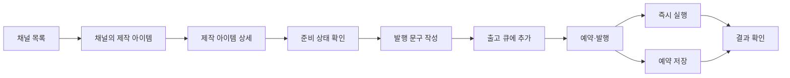

# 비개발자 운영자 기준 발행 플로우 고정 문서

본 문서는 Admin Web(`apps/admin-web`)의 채널/제작 아이템/출고/예약 발행 흐름을 **비개발자 운영자도 완수 가능한 UX**로 고정하기 위한 기준 문서다.

현재 구현은 기능적으로는 `제작 아이템 상세 -> 출고 큐 -> 예약·발행` 흐름이 성립하지만, 사용성 관점에서는 화면 분산, 내부 용어 노출, 전제 조건의 불명확성 때문에 비개발자 사용자가 처음부터 끝까지 수행하기 어렵다.

이 문서는 다음을 고정한다.

- 비개발자 사용자의 목표와 성공 조건
- 화면별 책임과 필수 액션
- 문구/레이블/CTA 수정 기준
- 구현 우선순위
- 완료 판단 기준

관련 문서:

- [`admin-client-revision-workbench.md`](./admin-client-revision-workbench.md)
- [`youtube-channel-metadata-publish-queue-revision.md`](./youtube-channel-metadata-publish-queue-revision.md)

---

## 1. 목표

### 1.1 사용자 목표

비개발자 운영자는 아래 질문에 답할 수 있어야 한다.

1. 이 아이템은 지금 어느 단계까지 왔는가
2. 다음에 내가 해야 할 일은 무엇인가
3. 어디에 발행되는가
4. 언제 발행되는가
5. 발행이 성공했는가, 실패했는가

### 1.2 제품 목표

운영자는 별도 교육 없이도 아래 흐름을 수행할 수 있어야 한다.

1. 채널 선택
2. 제작 아이템 선택
3. 검수 상태 확인
4. 발행 문구 작성
5. 출고 큐에 추가
6. 예약 시각 설정 또는 즉시 실행
7. 발행 결과 확인

### 1.3 비목표

이번 문서의 범위는 운영자 UX 기준 고정이다.

- 멀티 플랫폼 백엔드 일반화 상세 설계 자체는 본 문서의 중심이 아니다
- Step Functions/worker 세부 구현은 별도 문서에서 다룬다
- 시각 디자인 시스템 리뉴얼은 범위 밖이다

---

## 2. 현재 문제 요약

현재 플로우가 비개발자에게 어려운 이유는 아래 다섯 가지다.

### 2.1 발행 플로우가 세 화면으로 분산되어 있다

- 제작 아이템 상세: 초안 작성, 큐 적재
- 출고 큐: 대기 목록 확인
- 예약·발행: 실제 예약/실행

기능은 나뉘어 있으나, 사용자는 이것을 하나의 "발행하기" 흐름으로 인식한다. 현재는 어디서 완료되는지 직관적이지 않다.

### 2.2 전제 조건이 숨겨져 있다

다음 조건이 만족되지 않으면 발행이 사실상 막힌다.

- 제작 아이템이 채널에 연결되어 있어야 함
- 채널에 매체 계정이 연결되어 있어야 함
- 검수/렌더가 완료되어야 함

하지만 현재 UI에서는 이 조건들이 초반에 체크리스트로 보이지 않고, 버튼이 비활성화되거나 경고문으로만 드러난다.

### 2.3 내부 용어가 많이 노출된다

비개발자 기준으로 아래 표현은 이해가 어렵다.

- `잡`
- `upsert`
- `oauthAccountId`
- `accountId`
- `썸네일 에셋 ID`
- `publish target`
- `영상 ID`

### 2.4 리뷰/검수 흐름이 맥락을 잃는다

제작 아이템 상세에서 검수 버튼을 눌렀을 때 현재 아이템 문맥이 유지되지 않고 전역 `/reviews`로 이동하는 구조는 사용자를 불안하게 만든다.

### 2.5 큐 화면의 기대와 실제 기능이 다르다

`출고 큐`라는 이름은 사용자가 "순서를 관리하는 화면"으로 이해하게 만든다. 하지만 현재는 사실상 확인용 화면에 가깝다.

---

## 3. 고정할 사용자 여정

비개발자 운영자 기준의 목표 UX는 아래로 고정한다.

핵심 원칙:

- 사용자는 항상 "다음 할 일 하나"를 볼 수 있어야 한다
- 발행 실행은 채널 화면 하나에서 끝나야 한다
- 준비가 안 된 경우, 왜 안 되는지와 어디로 가야 하는지를 같이 보여줘야 한다

---

## 4. 화면별 책임 고정

### 4.1 채널 목록

역할:

- 운영 라인 선택의 시작점
- 어떤 채널이 발행 준비가 되어 있는지 빠르게 판단

필수로 보여야 하는 정보:

- 채널명
- 연결된 매체 수
- 발행 대기 아이템 수
- 예약된 아이템 수
- 실패/조치 필요 건수

필수 CTA:

- `제작 아이템 보기`
- `예약·발행 보기`
- `매체 연결 설정`

금지:

- "미연결 아이템은 다른 화면에서" 같은 분기 설명을 첫 화면에 과도하게 노출하지 않는다

### 4.2 채널의 제작 아이템 화면

역할:

- 해당 채널 안에서 작업할 아이템을 선택하는 화면

필수로 보여야 하는 정보:

- 제목
- 현재 단계
- 검수 필요 여부
- 발행 준비 여부
- 최근 수정 시각

필수 CTA:

- `열기`
- `출고 준비 계속`

문구 원칙:

- `잡` 대신 `제작 아이템`
- `전역 목록`, `미연결` 같은 내부 관리 개념은 보조 설명으로만 둔다

### 4.3 제작 아이템 상세 > 렌더·출고 준비

역할:

- 발행 전 준비를 끝내는 화면
- 실제 발행 실행 화면이 아님을 명확히 해야 함

이 화면에서 사용자가 할 수 있어야 하는 일:

1. 준비 상태 확인
2. 발행 문구 저장
3. 출고 큐에 추가
4. 채널의 예약·발행 화면으로 이동

이 화면에서 하지 않아야 하는 일:

- 실제 업로드 실행
- 플랫폼별 실제 발행 실행
- 내부 ID 직접 입력

필수 블록:

- `준비 상태`
- `발행 문구`
- `다음 단계`

권장 블록 구조:

1. 준비 상태 카드
2. 발행 문구 카드
3. 다음 단계 카드

다음 단계 카드에서 보여줘야 하는 것:

- 현재 상태: 아직 검수 전 / 큐 적재 가능 / 이미 큐에 있음 / 예약됨 / 발행 완료
- 메인 CTA 1개
- 보조 CTA 1~2개

권장 CTA:

- 메인: `출고 큐에 추가`
- 보조: `예약·발행으로 이동`
- 보조: `작업 현황 보기`

금지:

- `썸네일 에셋 ID` 같은 내부 식별자 입력 노출
- `영상 ID`를 핵심 정보처럼 노출

### 4.4 출고 큐

역할:

- 어떤 아이템이 발행 대기 상태인지 확인
- 예약·발행 화면으로 자연스럽게 넘겨주는 화면

이 화면이 해야 할 일:

- FIFO 순서를 보여준다
- 지금 무엇이 대기 중인지 보여준다
- 예약·발행 화면으로 이동시킨다

이 화면이 과하게 약속하면 안 되는 일:

- 순서 조정 기능이 없는데 "편성 큐"처럼 보이게 하지 않는다

필수 컬럼:

- 순서
- 제작 아이템
- 발행 대상
- 상태
- 추가일
- 다음 단계

필수 CTA:

- `예약·발행으로 이동`

차기 확장 시 추가할 액션:

- `큐에서 제거`
- `보류`
- `맨 앞으로`

### 4.5 예약·발행

역할:

- 발행의 실제 실행 화면
- 운영자가 "언제, 어디에, 어떤 상태로" 발행할지 결정하고 결과를 확인하는 화면

이 화면에서 사용자가 할 수 있어야 하는 일:

1. 지금 실행 가능한 아이템 확인
2. 플랫폼별 예약 시각 저장
3. 예약 해제
4. 즉시 실행
5. 성공/실패 확인
6. 외부 링크 확인

필수 시각 요소:

- 상단 상태 요약: 즉시 실행 가능 / 예약 대기 / 완료
- 아이템별 카드
- 플랫폼별 예약 영역
- 실행 버튼

필수 문구 원칙:

- "publish target" 대신 `발행 대상`
- "run orchestration" 대신 `지금 발행`
- "scheduledAt" 대신 `예약 시간`

실행 규칙도 사용자 언어로 보여줘야 한다:

- 예약 시간이 없으면 즉시 실행 대기
- 예약 시간이 지나야 실행 대상이 됨
- 발행 완료 후 외부 링크로 이동 가능

### 4.6 매체 연결

역할:

- 발행 가능 상태를 만드는 사전 설정 화면

이 화면은 기술 설정 화면이 아니라 연동 설정 화면이어야 한다.

필수 단계:

1. 어떤 플랫폼을 연결할지 선택
2. 계정 연결 여부 확인
3. 기본 공개 설정 저장
4. 기본 태그/설명 정책 저장

보여주면 안 되는 것:

- raw account id
- oauth account id
- `upsert`
- 내부 UUID

대신 보여줘야 하는 것:

- `연결된 계정`
- `계정 상태`
- `기본 공개 범위`
- `기본 해시태그`
- `기본 설명 꼬리말`

---

## 5. 고정 문구/레이블 기준

### 5.1 용어 치환표

| 현재/기술 표현             | 사용자 표현                     |
| -------------------------- | ------------------------------- |
| 잡                         | 제작 아이템                     |
| 작업 현황                  | 검수/작업 현황 또는 검수 큐     |
| 출고 큐                    | 발행 대기 목록 또는 출고 큐     |
| publish target             | 발행 대상                       |
| run orchestration          | 지금 발행                       |
| accountId / oauthAccountId | 연결된 계정                     |
| upsert                     | 저장                            |
| 썸네일 에셋 ID             | 썸네일 선택                     |
| 영상 ID                    | 게시된 영상 번호 또는 숨김 처리 |

### 5.2 문구 수정 기준

현재:

- `실제 업로드·예약은 채널의 출고 큐에서 진행합니다.`

수정:

- `이 화면에서는 발행 준비만 합니다. 실제 예약과 발행은 채널의 예약·발행 화면에서 진행합니다.`

현재:

- `발행 초안 저장`

수정:

- `발행 문구 저장`

현재:

- `작업 현황에서 검수하기`

수정:

- `이 아이템 검수하러 가기`

현재:

- `예약 저장`

수정:

- `예약 시간 저장`

현재:

- `지금 실행 (N)`

수정:

- `지금 발행`

보조 텍스트:

- `지금 바로 발행 가능한 대상 N개`

---

## 6. 필수 UX 보강 요구사항

### 6.1 체크리스트형 준비 상태

제작 아이템 상세 상단에 아래 체크리스트가 있어야 한다.

- 채널 연결 완료
- 매체 연결 완료
- 검수 완료
- 발행 문구 작성 완료
- 출고 큐 적재 완료

각 항목은 다음 중 하나의 상태를 가진다.

- 완료
- 아직 필요
- 이 단계에서 할 수 없음

각 미완료 항목에는 바로 가기 CTA가 있어야 한다.

### 6.2 컨텍스트 유지

어떤 화면으로 이동하더라도 현재 제작 아이템 문맥이 유지되어야 한다.

예:

- 검수 버튼 -> 해당 아이템 기준 필터/딥링크
- 예약·발행 이동 -> 해당 아이템 강조

### 6.3 내부 식별자 숨김

기본 UI에서는 아래 항목을 숨긴다.

- jobId
- uploadVideoId
- assetId raw 입력
- platformConnectionId
- oauthAccountId

필요하면 `고급 정보` 영역으로 접는다.

### 6.4 실패 메시지 재작성

현재 서버 에러를 거의 그대로 보여주기보다 아래 형식으로 정규화한다.

- 무엇이 실패했는지
- 왜 실패했는지
- 사용자가 다음에 무엇을 해야 하는지

예:

- `YouTube 계정 연결이 없어 지금 발행할 수 없습니다. 매체 연결에서 계정을 연결한 뒤 다시 시도하세요.`

---

## 7. 구현 우선순위

### 1순위: 문구/흐름 정렬

- 상세 화면 설명 문구 정리
- `잡` 용어 축소
- `예약·발행`을 실제 실행 화면으로 명확화
- 상세 화면에서 다음 단계 CTA를 하나의 메인 버튼으로 정리

대상 파일:

- `apps/admin-web/src/widgets/content-job-detail/lib/detail-workspace-tabs.ts`
- `apps/admin-web/src/widgets/content-job-detail/ui/publish/content-job-detail-shipping-prep-enqueue-card.tsx`
- `apps/admin-web/src/_pages/content/ui/channel-shipping-queue-page.tsx`
- `apps/admin-web/src/_pages/content/ui/channel-publish-schedule-page.tsx`

### 2순위: 준비 체크리스트/컨텍스트 유지

- 상세 화면 준비 체크리스트 추가
- `/reviews` 이동 시 해당 아이템 기준 문맥 유지
- 예약 화면 진입 시 해당 아이템 강조 유지

대상 파일:

- `apps/admin-web/src/widgets/content-job-detail/ui/publish/content-job-detail-publish-view.tsx`
- `apps/admin-web/src/widgets/content-job-detail/ui/publish/content-job-detail-render-review-view.tsx`
- `apps/admin-web/src/widgets/content-job-detail/model/useContentJobDetailPageData.ts`

### 3순위: 발행 문구 입력 UX 개선

- `썸네일 에셋 ID` 제거 또는 고급 영역으로 이동
- 플랫폼별 실제 대상이 무엇인지 명확화
- `첫 연결` 기반 프로필 요약 제거 또는 명시적 선택 UI로 변경

대상 파일:

- `apps/admin-web/src/widgets/content-job-detail/ui/publish/content-publish-draft-section.tsx`

### 4순위: 큐/예약 실행 UX 개선

- 큐에서 제거
- 보류
- 실패 재시도
- 플랫폼별 실행 결과 카드 정리

대상 파일:

- `apps/admin-web/src/_pages/content/ui/channel-shipping-queue-page.tsx`
- `apps/admin-web/src/_pages/content/ui/channel-publish-schedule-page.tsx`

### 5순위: 매체 연결 화면 리디자인

- 내부 식별자 제거
- 연결 마법사형 구조 도입
- 플랫폼별 기본 설정을 사용자 언어로 재작성

대상 파일:

- `apps/admin-web/src/_pages/content/ui/channel-connections-page.tsx`

---

## 8. 완료 판단 기준

아래 시나리오를 비개발자 운영자가 설명 없이 수행할 수 있으면 완료로 본다.

### 시나리오 A: 이미 연결된 채널에서 발행하기

1. 채널을 선택한다
2. 제작 아이템을 고른다
3. 준비 상태를 확인한다
4. 발행 문구를 저장한다
5. 출고 큐에 추가한다
6. 예약 시간을 넣는다
7. 지금 발행하거나 예약 상태를 확인한다
8. 성공 후 외부 링크를 연다

### 시나리오 B: 발행이 막힌 이유 이해하기

1. 제작 아이템 상세에 들어간다
2. 왜 발행할 수 없는지 한눈에 이해한다
3. 필요한 다음 행동으로 바로 이동한다

### 시나리오 C: 실패 후 재조치하기

1. 실패 상태를 확인한다
2. 실패 이유를 읽는다
3. 다시 시도할 수 있는 위치를 찾는다

완료 조건:

- 사용자 테스트 없이도 화면만 보고 다음 행동을 추론할 수 있어야 함
- 내부 시스템 용어를 몰라도 핵심 행동을 수행할 수 있어야 함
- "이제 어디로 가야 하지?"라는 질문이 최소화되어야 함

---

## 9. 한 줄 결론

현재 구현은 시스템 흐름으로는 맞지만, 비개발자 사용자 기준으로는 아직 "운영 도구"보다 "내부 콘솔"에 가깝다.

고정해야 할 방향은 명확하다.

- 상세 화면은 준비를 끝내는 곳
- 출고 큐는 대기 목록을 확인하는 곳
- 예약·발행은 실제 실행하는 곳
- 매체 연결은 기술 설정이 아니라 연동 설정이어야 한다

이 기준으로 문구, CTA, 체크리스트, 컨텍스트 유지, 내부 용어 숨김을 순서대로 정리하면 비개발자도 완수 가능한 플로우로 수렴할 수 있다.
