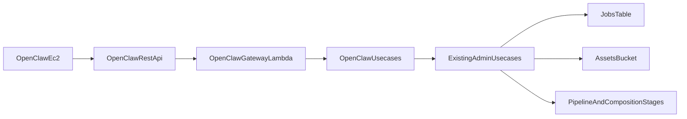

# OpenClaw REST Gateway Plan

## 목적

EC2 위 OpenClaw가 사람 로그인 없이 이 레포의 API를 호출해 영상 job을 생성, 진행, 조회할 수 있도록 한다.

핵심 방향은 기존 Admin GraphQL/AppSync를 외부에 직접 열어주는 것이 아니라, 그 위에 OpenClaw 전용 REST 게이트웨이를 별도로 두는 것이다.

## 현재 구조 기준 판단

- 현재 구조에서 구현은 가능하다.
- 기존 Admin GraphQL은 `lib/modules/publish/graphql-api.ts` 에서 Cognito User Pool 전용으로 구성되어 있다.
- 스택 출력과 Lambda wiring은 `lib/app-stack.ts` 에 모여 있다.
- job 관련 흐름은 이미 Lambda resolver로 연결되어 있다.
  - `createDraftJob`
  - `updateJobBrief`
  - `runJobPlan`
  - `runAssetGeneration`
  - `runFinalComposition`
  - `approvePipelineExecution`
  - `adminJob`
  - `adminJobs`
- 다만 GraphQL resolver entry는 `services/admin/shared/run-audited-admin-resolver.ts` 의 `identity` 와 `Admin` group 검사에 묶여 있으므로, OpenClaw가 resolver를 직접 건드리기보다 별도 REST 계층을 두는 편이 안전하다.

## 권장 구조

- 새 CDK 모듈을 `lib/modules/openclaw/` 아래에 추가한다.
- `lib/app-stack.ts` 에서 `OpenClawApi` 와 `OpenClawGatewayLambda` 를 생성한다.
- `services/openclaw/**` 아래에 런타임을 둔다.
  - `handler.ts`
  - `index.ts`
  - `usecase/`
  - `mapper/`
  - `normalize/`
- 게이트웨이 내부에서는 기존 GraphQL HTTP 재호출이나 grouped resolver invoke 대신, 이미 분리된 admin usecase를 직접 재사용한다.

## 재사용 대상

- `services/admin/jobs/create-draft-job/usecase/create-draft-job.ts`
  - `createAdminDraftJob`
- `services/admin/generations/run-job-plan/usecase/run-job-plan.ts`
  - `runAdminJobPlan`
  - `runJobPlanCore`
- `services/admin/generations/run-asset-generation/usecase/run-asset-generation.ts`
  - `runAssetGenerationCore`
- `services/admin/final/run-final-composition/usecase/run-final-composition.ts`
  - `runAdminFinalComposition`
- `services/admin/pipeline/approve-pipeline-execution/usecase/approve-pipeline-execution.ts`
  - `approvePipelineExecutionUsecase`
- `services/admin/jobs/get-job/usecase/get-admin-job.ts`
  - `getAdminJob`
- `services/admin/jobs/job-executions/usecase/get-job-executions.ts`
  - `getAdminJobExecutions`

## OpenClaw API 초안

### 1. `POST /openclaw/jobs`

외부 입력은 OpenClaw 친화형으로 둔다.

```json
{
  "topic": "string",
  "script": "string",
  "channelId": "string",
  "durationSec": 30,
  "voiceProfileId": "string",
  "autoPublish": true
}
```

내부 기본 매핑은 다음처럼 잡는다.

- `channelId -> contentId`
- `topic -> titleIdea`
- `script -> creativeBrief`
- `durationSec -> targetDurationSec`
- `voiceProfileId -> setJobDefaultVoiceProfile` 후속 호출

중요한 보완점:

- 현재 `createDraftJob` 는 `presetId` 가 필수다.
- 그런데 OpenClaw 외부 요청안에는 `presetId` 가 없다.
- 따라서 `lib/config.ts` 와 `bin/automata-studio.ts` 에 아래 중 하나가 필요하다.
  - `defaultPresetId`
  - `channelPresetMap`

### 2. `POST /openclaw/jobs/{jobId}/run`

입력 예시:

```json
{
  "stage": "plan|assets|compose|approve"
}
```

기본 매핑:

- `plan -> runJobPlan`
- `assets -> runAssetGeneration`
- `compose -> runFinalComposition`
- `approve -> approvePipelineExecution`

중요한 보완점:

- `approvePipelineExecution` 는 현재 `jobId` 만으로 실행되지 않는다.
- 실제로는 `executionId` 가 필요하다.
- 따라서 아래 중 하나가 필요하다.
  - REST 입력에 `executionId` 를 추가
  - 게이트웨이가 `jobExecutions` 조회 후 최신 `SUCCEEDED` 실행을 자동 선택

### 3. `GET /openclaw/jobs/{jobId}`

외부 응답은 OpenClaw가 polling 하기 쉬운 형태로 단순화한다.

```json
{
  "jobId": "string",
  "status": "string",
  "previewUrl": "string|null",
  "finalAssetUrl": "string|null",
  "youtube": {
    "uploadStatus": "string|null",
    "uploadVideoId": "string|null"
  }
}
```

보완점:

- 현재 내부 `AdminJob` 응답은 `previewS3Key`, `finalVideoS3Key`, `uploadVideoId` 같은 내부 필드 위주다.
- 따라서 게이트웨이에서 URL 변환과 응답 축약이 필요하다.
- `services/shared/lib/asset-url.ts` 의 `buildPreviewAssetUrl()` 을 재사용하는 방식이 적합하다.

## 상태 계약

외부에는 내부 상세 상태를 그대로 노출하지 않고 아래로 축약한다.

- `DRAFT`
- `PLANNING`
- `ASSET_GENERATION`
- `COMPOSITION`
- `APPROVED`
- `PUBLISHED`
- `FAILED`

내부 상태는 `services/admin/shared/types.ts` 와 `services/shared/lib/store/video-jobs-shared.ts` 에 더 세분화되어 있으므로, OpenClaw 전용 status mapper가 필요하다.

## 인증 방향

초기 방향:

- 같은 URL에서 `x-openclaw-key` 와 IAM 을 모두 지원
- 기존 Admin UI 인증은 유지
- OpenClaw는 DynamoDB 직접 접근 금지

현실적인 판단:

- 현재 레포에는 OpenClaw용 M2M auth abstraction 이 없다.
- `lib/modules/publish/api.ts` 의 기존 REST API도 인증이 붙어 있지 않다.
- v1 기본안은 `x-openclaw-key` 를 Secrets Manager 값으로 검증하는 방식이 가장 단순하다.
- 다만 같은 URL에서 `API key + IAM` 을 동시에 허용하려면 custom auth layer 설계가 추가로 필요하다.

## Config 및 Output 보완안

`lib/config.ts` 에 OpenClaw 설정 추가:

- `enabled`
- `apiKeySecretId`
- `defaultPresetId` 또는 `channelPresetMap`
- `allowedSourceIps`
- 필요 시 내부 옵션으로 `authMode`

`lib/app-stack.ts` 에 Output 추가:

- `OpenClawApiUrl`
- `OpenClawApiKeySecretArn` 또는 secret name
- 선택 시 `OpenClawAllowedSourceIps`

## 권한 원칙

- OpenClaw 외부 주체에는 DynamoDB 권한을 주지 않는다.
- OpenClaw는 REST API만 호출한다.
- 내부 게이트웨이 Lambda만 필요한 read/write 및 secret read 권한을 가진다.
- 기존 admin resolver가 가진 broad permission을 EC2/OpenClaw 쪽에 직접 넘기지 않는다.

## 자동 생성 전에 꼭 닫아야 할 공백

- `presetId` 기본 결정 규칙이 아직 없다.
- `script` 를 어느 필드까지 반영할지 명확하지 않다.
  - 현재 구조상 가장 자연스러운 기본 매핑은 `creativeBrief`
- `approve` 단계의 `executionId` 선택 정책이 필요하다.
- `youtube` 응답은 full publish graph 대신 `uploadStatus` 와 `uploadVideoId` 중심으로 제한하는 것이 안전하다.
- 같은 URL에서 `API key + IAM` 둘 다 받는 인증 계층은 현재 레포에 재사용 가능한 패턴이 없다.

## 구현 범위 초안

- `lib/modules/openclaw/`
  - `api.ts`
  - `types.ts`
- `services/openclaw/`
  - `handler.ts`
  - `index.ts`
  - `usecase/*`
  - `mapper/*`
  - `normalize/*`
- `lib/config.ts`
- `bin/automata-studio.ts`
- `lib/app-stack.ts`
- 필요 시 `docs/` 아래 예시 요청/응답 및 Python 호출 예제 추가

## 흐름도


