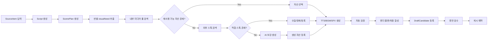

# 스톡 재활용 중심 스토리형 숏츠 공장 적용 계획

## Goal

이 문서는 현재 `ai-pipeline-studio` 코드베이스에 **스톡 재활용 중심 공장형 숏츠 자동생성 시스템**을 도입하기 위한 적용 계획을 정리한다.

핵심 목표는 다음과 같다.

- 30~60초 이야기형 숏츠를 안정적으로 대량 생산한다.
- 씬 단위 요구사항을 기준으로 비주얼을 조립한다.
- 자산 선택 우선순위를 `내부 미디어 풀 -> 외부 스톡 -> AI 생성 -> 텍스트 카드/기본 템플릿`으로 고정한다.
- 결과물의 중심 가치를 스톡 소스 자체가 아니라 `스크립트`, `씬 구조`, `TTS`, `자막`, `편집 리듬`에 둔다.
- 최종 게시 전에는 항상 휴먼 검수를 거친다.

한 줄 요약:

**이 계획의 본질은 "스톡 다운로드 자동화"가 아니라 "스토리 기반 비주얼 자산 조립 공장"을 현재 파이프라인 위에 얹는 것이다.**

## 현재 리포와의 연결점

현재 리포에는 이미 이 계획을 수용할 수 있는 기초 축이 있다.

- 잡 생성과 브리프 저장: `services/admin/jobs/create-draft-job/repo/create-draft-job.ts`
- 잡 플랜 생성: `services/plan/usecase/create-job-plan.ts`
- 씬 JSON 생성: `services/admin/generations/run-scene-json/usecase/run-scene-json.ts`, `services/script/index.ts`
- 에셋 생성 오케스트레이션: `services/admin/generations/run-asset-generation/usecase/run-asset-generation.ts`
- 외부 스톡 검색: `services/admin/generations/search-scene-stock-assets/usecase/search-scene-stock-assets.ts`
- 렌더 플랜과 최종 합성: `services/composition/render-plan/`, `services/admin/final/run-final-composition/`
- 공용 계약: `services/shared/lib/contracts/canonical-io-schemas.ts`

즉, 완전히 새로운 파이프라인을 만드는 것이 아니라 아래 방향으로 기존 축을 재정렬하는 작업에 가깝다.

- Scene JSON을 더 강한 기준 데이터로 승격
- 스톡 검색을 "보조 공급원"으로 재위치
- 내부 미디어 풀을 독립 도메인으로 추가
- 에셋 선택 정책을 우선순위/점수 기반으로 일원화
- 렌더 이전 검수와 휴먼 승인 단계를 더 명시적으로 강화

## 현재 구조 위에 얹기 위한 실제 수정 포인트

현재 리포는 `preset -> jobBrief/contentBrief -> sceneJson -> scene candidates -> render` 흐름이 이미 있으므로, 이 플랜은 전면 교체보다 아래 계층을 확장하는 방식으로 들어가는 것이 적절하다.

### 1. Scene JSON 계약을 씬 요구사항 계약으로 확장

현재 `sceneJson`은 `imagePrompt`, `videoPrompt`, `subtitle` 중심이라 플랜의 `visualNeed`를 담지 못한다.

수정 대상:

- `services/shared/lib/contracts/canonical-io-schemas.ts`
- `types/render/scene-json.ts`
- `services/script/usecase/build-scene-json.ts`
- `services/admin/shared/mapper/map-scene-json-draft.ts`
- `services/admin/shared/types.ts`
- `lib/modules/publish/graphql/schema.graphql`

반영할 필드:

- `storyBeat`
- `visualNeed.semanticType`
- `visualNeed.moodTags`
- `visualNeed.visualTypePriority`
- `visualNeed.motionHint`
- `visualNeed.avoidTags`

권장 결정:

- `sceneId`는 현재 구조와 호환되게 숫자형 유지
- `durationSec`는 3.8초 같은 씬 길이를 표현할 수 있도록 GraphQL까지 `Float`로 승격

### 2. `run-asset-generation` 앞에 Asset Resolver 단계 추가

현재 구조는 씬 자산 생성과 스톡 검색이 분리되어 있고, 내부 미디어 풀 우선 탐색 계층이 없다.

수정 대상:

- 신규 `services/admin/generations/resolve-scene-assets/*`
- 기존 `services/admin/generations/run-asset-generation/*`
- 기존 `services/admin/generations/search-scene-stock-assets/*`

역할 분리:

1. `resolve-scene-assets`
2. 내부 미디어 풀 후보 조회
3. 점수 계산 후 충분하면 자동 선택
4. 부족하면 기존 `search-scene-stock-assets` 실행
5. 그래도 부족하면 AI 생성 fallback 실행

즉, 기존 `search-scene-stock-assets`는 메인 경로가 아니라 fallback provider로 재배치하는 것이 맞다.

### 3. 내부 미디어 풀 저장소와 ingest 도메인 추가

현재 저장 구조는 씬별 후보와 선택 결과를 잡 단위로 저장하는 데는 적합하지만, 재사용 가능한 글로벌 자산 풀은 없다.

수정 대상:

- 신규 `services/shared/lib/store/asset-pool.ts`
- 신규 `services/shared/lib/contracts/asset-pool.ts`
- 신규 `services/media-pool/*` 또는 `services/admin/media-pool/*`

추가돼야 할 데이터:

- `assetId`
- `type`
- `provider`
- `storageKey`
- `sourceUrl`
- `licenseType`
- `attributionRequired`
- `commercialUseAllowed`
- `visualTags`
- `moodTags`
- `containsLogo`
- `containsText`
- `containsWatermark`
- `qualityScore`
- `reusabilityScore`
- `reviewStatus`

### 4. 씬 후보/선택 모델에 provenance 추가

현재 후보 선택은 가능하지만, "왜 이 자산을 골랐는지"와 "어디서 왔는지"가 약하다.

수정 대상:

- `services/shared/lib/store/video-jobs-shared.ts`
- `services/admin/shared/mapper/map-scene-asset-draft.ts`
- `services/admin/shared/mapper/map-scene-asset-record-draft.ts`
- `lib/modules/publish/graphql/schema.graphql`

추가 권장 필드:

- `assetId`
- `selectionSource` (`pool`, `stock`, `ai`, `template`)
- `matchScore`
- `licenseSummary`
- `riskFlags`
- `selectedReason`

### 5. 자동 검수 규칙 확장

현재 검수는 파일 존재 여부와 기본 길이 확인 중심이다. 플랜에서 요구한 리스크 검수와 반복 사용 검수는 아직 없다.

수정 대상:

- `services/composition/validate-assets/*`
- 필요 시 신규 `services/admin/review/*`

추가 검수 항목:

- 씬 길이 2.5~4.5초 범위
- TTS 길이와 씬 길이 정합성
- 동일 asset 과다 반복
- 로고/텍스트/워터마크 리스크
- 장르/분위기 급변 경고

### 6. Render Plan에 자산 유형별 연출 메타 추가

현재 렌더 플랜은 선택된 파일 key를 씬에 매핑하는 정도라, `stock_video`, `stock_image`, `ai_image`, `title_card`별 연출 차이를 표현하기 어렵다.

수정 대상:

- `types/render/render-plan.ts`
- `services/composition/render-plan/types.ts`
- `services/composition/render-plan/usecase/build-render-plan-scenes.ts`
- `services/admin/final/run-final-composition/*`

추가 권장 필드:

- `visualSourceType`
- `cropPolicy`
- `motionPreset`
- `overlayPreset`
- `safeAreaPolicy`

### 7. Admin 검수 표면에 자산 근거 노출

현재 Admin 표면은 후보 선택에는 적합하지만, 라이선스/출처/리스크를 검수자가 판단하기엔 정보가 부족하다.

수정 대상:

- `services/admin/jobs/get-job-draft/usecase/get-job-draft.ts`
- `services/admin/shared/types.ts`
- `lib/modules/publish/graphql/schema.graphql`
- Admin web의 scene asset 상세 표면

추가 노출 정보:

- 출처 URL
- provider
- 라이선스 요약
- AI 생성 여부
- 위험 태그
- 선택 근거와 점수

## 설계 원칙

### 1. 스톡은 결과물이 아니라 부품이다

최종 영상의 핵심 가치는 아래 요소에서 나온다.

- 소재 선정
- 스크립트 구조
- 씬 전개
- 자막 리듬
- TTS 전달력
- 편집 흐름

따라서 스톡 영상과 이미지는 결과물의 중심이 아니라 씬을 채우는 비주얼 부품으로 다뤄야 한다.

### 2. 내부 미디어 풀 재활용을 최우선으로 한다

외부 스톡을 매번 새로 검색하면 비용, 속도, 품질, 라이선스 관리가 모두 흔들린다.

자산 해소 우선순위는 반드시 아래 순서를 따른다.

1. 내부 미디어 풀 영상
2. 내부 미디어 풀 이미지
3. 외부 스톡 영상
4. 외부 스톡 이미지
5. AI 이미지 생성
6. AI 영상 생성
7. 텍스트 카드/기본 템플릿 대체

### 3. AI 생성은 기본 경로가 아니라 fallback 이다

AI 생성은 비용과 품질 편차가 크므로 기본 경로가 아니라 예외 처리 경로로 둔다.

권장 순서는 아래와 같다.

1. AI 이미지 생성
2. 이미지 기반 모션화
3. 필요한 경우에만 AI 영상 생성

### 4. 자동화의 끝은 휴먼 검수다

자동화는 기획, 생성, 수집, 조립 속도를 높여주지만 최종 책임을 대신하지 않는다.

휴먼 검수는 아래를 확인해야 한다.

- 권리/출처/라이선스 적합성
- 로고/텍스트/워터마크 노출 여부
- 장면과 내레이션의 맥락 적합성
- TTS/자막/화면의 정합성
- 지나친 반복 사용 여부

## 대상 콘텐츠

### 대상 포맷

- 플랫폼: YouTube Shorts, TikTok, Instagram Reels
- 길이: 30~60초
- 화면비: 9:16
- 구성: 3~4초 길이 씬 8~15개
- 형태: 내레이션 기반 이야기형 숏츠

### 적합 장르

- 공포 이야기
- 도시전설
- 실화/사건 요약
- 인간관계 썰
- 교훈형 이야기
- 역사/상식 짧은 서사
- 심리학/미스터리형 짧은 내러티브

### 비권장 장르

- 정교한 연기 중심 드라마
- 강한 캐릭터 일관성이 필요한 애니메이션
- 립싱크 중심 대사극
- 고난도 액션 재현
- 특정 인물/브랜드/IP 의존 콘텐츠

## 목표 아키텍처



현재 코드베이스에 매핑하면 아래처럼 볼 수 있다.

- `SourceItem` / 브리프 입력: Admin job 생성 계층
- `Script`, `ScenePlan`: `services/plan`, `services/script`
- 자산 선택/수집/생성: `services/admin/generations/*`
- 오디오/렌더: `services/voice`, `services/composition/*`
- 검수/게시: `services/admin/final/*`, `services/publish/*`

## 핵심 도메인 모델

### 1. SourceItem

콘텐츠 시작점이 되는 소재 단위다.

예:

- "새벽 병원에서 들린 이상한 방송"
- "지하철에서 아무도 없는데 벨이 울린 이유"
- "고대 철학자가 남긴 인간관계 조언"

권장 필드:

- `sourceItemId`
- `title`
- `topic`
- `genre`
- `tone`
- `language`
- `targetPlatform`
- `status`

### 2. Script

숏츠용 내레이션 구조다.

역할:

- 훅
- 전개
- 긴장 상승
- 결말/반전

권장 필드:

- `scriptId`
- `sourceItemId`
- `hookText`
- `bodyText`
- `endingText`
- `fullNarration`
- `estimatedDurationSec`

### 3. ScenePlan

스크립트를 3~4초 단위로 분해한 실행 계획이다.

권장 상위 필드:

- `scenePlanId`
- `scriptId`
- `totalDurationSec`
- `scenes[]`

각 씬은 현재 `sceneJson`보다 한 단계 더 풍부한 `visualNeed`를 가져야 한다.

예시:

```json
{
  "sceneId": "scene_04",
  "order": 4,
  "durationSec": 3.8,
  "narration": "복도 끝에서 누군가 서 있는 것 같았다.",
  "subtitle": "복도 끝에 누군가 서 있었다",
  "storyBeat": "긴장 고조",
  "visualNeed": {
    "visualTypePriority": [
      "pool_video",
      "pool_image",
      "stock_video",
      "stock_image",
      "ai_image"
    ],
    "semanticType": "dark_hallway_figure",
    "moodTags": ["dark", "eerie", "suspense"],
    "motionHint": "slow_push_in",
    "avoidTags": [
      "logo",
      "text",
      "watermark",
      "celebrity",
      "recognizable_brand"
    ]
  }
}
```

### 4. Asset

재사용 가능한 미디어 풀 자산이다.

자산 유형:

- `pool_video`
- `pool_image`
- `stock_video`
- `stock_image`
- `ai_image`
- `ai_video`
- `internal_2d`
- `internal_3d`

권장 필드:

- `assetId`
- `type`
- `provider`
- `sourceUrl`
- `storageKey`
- `thumbnailKey`
- `durationSec`
- `width`
- `height`
- `aspectRatio`
- `fps`
- `visualTags`
- `moodTags`
- `containsPeople`
- `containsLogo`
- `containsText`
- `containsWatermark`
- `qualityScore`
- `reusabilityScore`
- `licenseType`
- `creatorName`
- `attributionRequired`
- `commercialUseAllowed`
- `reviewStatus`
- `ingestedAt`

### 5. DraftCandidate

렌더 완료 후 검수 대기 상태의 후보 영상이다.

권장 필드:

- `draftId`
- `sourceItemId`
- `scriptId`
- `scenePlanId`
- `renderedVideoKey`
- `thumbnailKey`
- `durationSec`
- `sceneAssetRefs[]`
- `ttsVoice`
- `bgmKey`
- `reviewStatus`
- `scheduledAt`

## 내부 미디어 풀 설계

### 역할

내부 미디어 풀은 단순 파일 저장소가 아니라 **재활용 가능한 시각 자산 DB**다.

목표:

- 반복 검색 비용 절감
- 장르별 재사용률 향상
- 라이선스 추적
- 품질 통제
- AI 생성 비용 절감

### 저장 전략

- 바이너리: `S3`
- 검색 메타데이터: `DynamoDB` 또는 필요 시 `OpenSearch`
- 태깅/임베딩 인덱스: 별도 테이블 또는 전용 검색 인덱스

현재 리포 관점에서 1차는 `DynamoDB + S3` 조합으로 시작하는 것이 가장 자연스럽다.

### 내부 풀 검색 방식

질문은 결국 이것이다.

**"씬이 `dark_hallway_figure` 같은 요구사항을 가질 때, 우리 풀에서 이미지를 어떻게 찾을 것인가?"**

권장 답은 아래와 같다.

#### 1차: `OpenSearch` 없이도 시작 가능

초기에는 `DynamoDB + 정규화 태그 + 애플리케이션 점수 계산`으로 충분하다.

흐름:

1. 씬에서 `visualNeed`를 만든다.
2. `semanticType`를 내부 공통 태그 집합으로 변환한다.
3. `moodTags`, `avoidTags`, 화면비, 사람 포함 여부 같은 필터를 만든다.
4. 내부 미디어 풀에서 후보를 여러 축으로 조회한다.
5. 애플리케이션 레이어에서 후보를 합치고 `matchScore`를 계산한다.
6. 점수가 기준 이상이면 선택하고, 아니면 외부 스톡으로 넘어간다.

예:

- 씬 입력:
  - `semanticType = dark_hallway_figure`
  - `moodTags = ["dark", "eerie", "suspense"]`
  - `avoidTags = ["logo", "text", "watermark"]`
- 내부 변환 태그:
  - `hallway`
  - `corridor`
  - `silhouette`
  - `night`
  - `low_light`

이 상태에서 아래 조건을 조합 조회한다.

- `type = image`
- `visualTags` includes `hallway` or `corridor`
- `moodTags` overlaps `eerie`, `suspense`
- `containsLogo = false`
- `containsText = false`
- `containsWatermark = false`
- `reviewStatus = approved`

즉, 1차 검색은 "자연어 검색 엔진"보다 "태그 기반 후보 압축 + 점수 계산" 문제로 보는 것이 맞다.

#### 2차: 태그 인덱스는 역색인처럼 운영

권장 방식은 단일 자산 레코드만 두는 것이 아니라, 조회를 빠르게 하기 위한 태그/축 인덱스를 함께 두는 것이다.

예시 인덱스 축:

- `TYPE#image`
- `TAG#hallway`
- `TAG#corridor`
- `MOOD#eerie`
- `MOOD#suspense`
- `ASPECT#9_16`
- `RISK#SAFE`
- `PEOPLE#true`

실제 구현은 두 가지 중 하나로 시작하면 된다.

1. Asset 테이블 + 몇 개의 GSI
2. Asset 테이블 + 보조 inverted-index 테이블

초기에는 두 번째가 더 유연하다. 이유는 태그 종류가 늘어나도 GSI를 계속 추가하지 않아도 되기 때문이다.

#### 3차: 점수 계산은 애플리케이션 레이어에서 한다

검색 엔진이 모든 결정을 대신할 필요는 없다.

권장 방식:

- DB는 후보를 20~100개 정도로 줄인다.
- 최종 순위는 `Asset Resolver`가 계산한다.

예:

```text
finalScore =
  semanticTagOverlap * 0.35 +
  moodOverlap * 0.20 +
  aspectFit * 0.10 +
  qualityScore * 0.15 +
  reusabilityScore * 0.10 +
  recentSuccessBoost * 0.10 -
  riskPenalty
```

이 방식의 장점은 검색 저장소를 바꾸더라도 랭킹 로직을 도메인 코드에서 유지할 수 있다는 점이다.

#### 4차: `OpenSearch`는 필요할 때만 붙인다

다음 조건이 생기면 `OpenSearch`나 hybrid search를 고려할 가치가 있다.

- 자산 수가 수만~수십만 단위로 커진다.
- 태그만으로는 회수가 잘 안 된다.
- 동의어/유사어 검색이 중요해진다.
- 다국어 자연어 질의를 직접 받고 싶다.
- 벡터 검색과 메타 필터를 함께 쓰고 싶다.
- 검수 UI에서 faceted search와 복합 필터링이 필요해진다.

즉, 이 플랜에서는 `OpenSearch`가 필수 전제는 아니다.

권장 순서:

1. `DynamoDB + 태그 역색인 + 점수 계산`
2. 필요 시 임베딩 추가
3. 그 다음에 `OpenSearch` 또는 vector-capable 검색 계층 도입

#### 5차: 현실적인 권장안

이 리포의 현재 성숙도를 기준으로 하면 아래가 가장 현실적이다.

1. 내부 풀 ingest 시 태그를 강하게 정규화한다.
2. `semanticType -> internal tags[]` 매퍼를 만든다.
3. `resolve-scene-assets`에서 먼저 내부 풀 후보를 조회한다.
4. 후보를 애플리케이션 코드에서 재점수화한다.
5. 점수 미달일 때만 `search-scene-stock-assets`를 호출한다.
6. `OpenSearch`는 2차 확장 과제로 둔다.

### 태그 체계

태그는 최소 3층으로 관리한다.

내용 태그 예시:

- `hallway`
- `forest`
- `city_street`
- `office`
- `hospital`
- `rain`
- `silhouette`
- `person_back`

분위기 태그 예시:

- `eerie`
- `calm`
- `tense`
- `mysterious`
- `warm`
- `nostalgic`

사용 제한 태그 예시:

- `logo_detected`
- `watermark_risk`
- `text_present`
- `face_closeup`
- `trademark_risk`

## 씬별 자산 해소 전략

### 검색/선택 우선순위

각 씬은 아래 우선순위로 자산을 찾는다.

1. 내부 미디어 풀 영상
2. 내부 미디어 풀 이미지
3. 외부 스톡 영상
4. 외부 스톡 이미지
5. AI 이미지 생성
6. AI 영상 생성
7. 텍스트 카드/기본 템플릿

### 씬-자산 매칭 점수

씬과 자산의 적합성은 점수 기반으로 계산해야 한다.

기본 항목:

- 의미 일치도
- 분위기 일치도
- 길이 적합성
- 화면비 적합성
- 품질 점수
- 재사용 가치
- 위험 태그 감점

예시:

```text
matchScore =
  semanticScore * 0.35 +
  moodScore * 0.20 +
  durationFitScore * 0.10 +
  visualQualityScore * 0.15 +
  platformFitScore * 0.10 +
  reusabilityScore * 0.10 -
  riskPenalty
```

### 검색 질의 생성

씬의 `semanticType`, `moodTags`, `avoidTags`를 기반으로 외부 검색 질의를 자동 생성한다.

예:

- `semanticType = dark_hallway_figure`
- `moodTags = eerie, suspense`

자동 생성 질의 예시:

- `dark hallway night`
- `empty corridor horror`
- `creepy hallway silhouette`
- `hospital corridor dim light`

## 외부 스톡 수집 정책

외부 스톡은 "핵심 공급원"이 아니라 "부족한 장면을 보완하는 재료 공급원"으로 둔다.

수집 시 최소 저장 항목:

- 원본 제공처
- 원본 URL
- 원본 제목
- 크리에이터명
- 라이선스 종류
- 상업적 이용 가능 여부
- 출처 표기 필요 여부
- 로고/텍스트/워터마크 탐지 결과
- 내부 검수 상태

수집 후에는 바로 렌더에 쓰지 않고 반드시 정제 단계를 거친다.

1. 파일 저장
2. 썸네일 생성
3. 메타 추출
4. 로고/워터마크/텍스트 탐지
5. 대표 태그 생성
6. 품질 점수 계산
7. 리뷰 상태 초기화
8. 내부 미디어 풀 등록

현재 리포의 `search-scene-stock-assets`는 검색과 후보 저장은 이미 담당하므로, 다음 단계는 "검색 후보 -> 정제 등록 -> 재사용 가능한 Asset 엔터티"를 분리해 붙이는 것이다.

## AI 보강 생성 정책

AI 생성은 아래 조건에서만 수행한다.

- 내부 미디어 풀에 적절한 자산이 없다.
- 외부 스톡 검색 결과가 기준 점수 미만이다.
- 장면 핵심 비주얼을 확보하지 못했다.
- 장르 분위기에 맞는 기존 자산이 부족하다.

원칙:

1. AI 이미지 생성 우선
2. 필요 시 이미지 기반 모션화
3. 최후 수단으로 AI 영상 생성

생성 결과는 즉시 내부 미디어 풀에 등록해 후속 씬과 후속 잡에서 재사용 가능하게 해야 한다.

## TTS 및 오디오 설계

### TTS 원칙

TTS는 씬 길이와 강하게 결합된다.

필수 검증:

- 씬 길이 대비 음성 길이 과다 여부
- 과도한 말속도 방지
- 자막 길이와 TTS 길이 불일치 여부

### BGM/SFX 원칙

공포, 미스터리, 썰 콘텐츠는 오디오가 몰입감을 크게 좌우한다.

오디오 전략:

- 장르별 BGM 템플릿
- 씬 전환 효과음
- 긴장 강조용 저주파 효과
- 볼륨 자동 정규화

## 렌더링 설계

렌더는 코드 기반 합성으로 유지한다.

필수 처리:

- 씬별 타임라인 생성
- 자산 크롭/패닝/줌
- 자막 오버레이
- TTS 오디오 배치
- BGM/SFX 믹스
- 9:16 출력

자산 종류별 연출 기본값:

- `stock_video`: 9:16 크롭, 스마트 리프레이밍, 속도 조정
- `stock_image`: 켄번즈, 슬로우 줌, 패닝
- `ai_image`: 시네마틱 줌, 디졸브, 그레인/노이즈 선택 적용
- `title_card`: 텍스트 중심 강조, 긴장 전환용 브레이크 씬

현재 `services/composition/render-plan`과 `services/admin/final/run-final-composition`는 이 정책을 수용할 수 있는 위치이며, 1차 구현에서는 `render plan` 단계에 자산 유형별 연출 정책을 주입하는 방식이 가장 안전하다.

## 검수 시스템

### 자동 검수

렌더 전/후 자동 검수 항목:

- 총 길이 30~60초 범위 확인
- 씬 길이 2.5~4.5초 범위 확인
- TTS 길이와 씬 길이 정합성 확인
- 로고/텍스트/워터마크 탐지
- 동일 자산 과도 반복 여부
- 분위기 급변 여부
- 저품질 자산 비중 과다 여부

### 휴먼 검수

검수 화면 필수 정보:

- 최종 영상 미리보기
- 씬별 사용 자산 목록
- 각 자산의 출처/라이선스 정보
- AI 생성 자산 여부
- 워터마크/텍스트/로고 경고
- 수정 요청 액션
- 승인 / 반려 / 보류

## 권장 서비스 경계

### 1. Content Planner

역할:

- 소재 입력
- 스크립트 생성
- 씬 플랜 생성

현재 연결 후보:

- `services/admin/jobs/create-draft-job`
- `services/plan`
- `services/script`

### 2. Asset Resolver

역할:

- 씬 요구사항 분석
- 내부 미디어 풀 검색
- 외부 스톡 검색
- AI fallback 결정

현재 연결 후보:

- 기존 `services/admin/generations/search-scene-stock-assets`
- 신규 `services/admin/generations/resolve-scene-assets`

### 3. Asset Ingestor

역할:

- 외부/생성 자산 저장
- 메타데이터 추출
- 태깅/정제
- 미디어 풀 등록

권장 신규 위치:

- `services/media-pool/*` 또는 `services/admin/media-pool/*`

### 4. Audio Generator

역할:

- TTS 생성
- BGM/SFX 매핑

현재 연결 후보:

- `services/voice/*`

### 5. Renderer

역할:

- 씬 조립
- 자막 합성
- 최종 영상 출력

현재 연결 후보:

- `services/composition/render-plan`
- `services/admin/final/run-final-composition`

### 6. Review Manager

역할:

- 후보 등록
- 검수 대기
- 승인/반려 처리

현재 연결 후보:

- Admin GraphQL/Final composition/Publish readiness 계층

### 7. Publisher

역할:

- 게시 예약
- 플랫폼별 업로드

현재 연결 후보:

- `services/publish/*`

## 현재 리포 기준 계약 변경 방향

현재 `services/shared/lib/contracts/canonical-io-schemas.ts`에는 이미 `presetId`, `presetSnapshot`, `resolvedPolicy` 축이 들어가 있다.

이 위에 아래 확장을 붙이는 것이 적절하다.

### 1. Scene JSON 확장

현재 `sceneJson`은 `narration`, `imagePrompt`, `videoPrompt`, `subtitle` 중심이다.

추가 권장 필드:

- `storyBeat`
- `visualNeed.semanticType`
- `visualNeed.moodTags`
- `visualNeed.visualTypePriority`
- `visualNeed.motionHint`
- `visualNeed.avoidTags`

### 2. Asset 계약 분리

현재는 씬별 산출물과 manifest 중심이므로, 재사용 가능한 풀 자산 계약을 별도 schema로 분리하는 것이 좋다.

권장 신규 계약:

- `assetPoolItemSchema`
- `sceneAssetCandidateSchema`
- `sceneAssetSelectionSchema`
- `assetLicenseSchema`

추가 권장 필드:

- `selectionSource`
- `matchScore`
- `riskFlags`
- `reviewStatus`
- `assetId`

### 3. DraftCandidate / Review 계약 강화

렌더 결과와 검수 대상 상태를 분리하기 위해 아래를 권장한다.

- `draftCandidateSchema`
- `assetUsageRefSchema`
- `reviewDecisionSchema`

## 적용 단계

### Phase 1. Scene 기반 자산 선택 규칙 고정

목표:

- Scene JSON에 `visualNeed` 추가
- 에셋 해소 우선순위를 정책으로 고정
- 외부 스톡 검색을 fallback 위치로 명확화

작업:

- `sceneJson` 계약 확장
- `run-scene-json`에서 `semanticType`, `moodTags`, `avoidTags` 생성
- `run-asset-generation` 앞단에 `resolve-scene-assets` 정책 계층 추가
- 기존 `search-scene-stock-assets`는 fallback search로 재배치

### Phase 2. 내부 미디어 풀 도입

목표:

- 외부 검색보다 먼저 조회되는 재사용 풀 확보

작업:

- Asset pool 저장 모델 정의
- S3 + Dynamo 기반 ingest/register 흐름 구현
- 수집 자산과 AI 생성 자산을 동일한 Asset 엔터티로 등록
- 기본 태그/품질/라이선스 필드 도입

### Phase 3. 자동 검수와 렌더 정책 강화

목표:

- 품질 흔들림을 렌더 전에 차단

작업:

- 로고/텍스트/워터마크 탐지 결과 저장
- 반복 자산 사용 감점 규칙 추가
- 씬 길이/TTS 길이 자동 검증
- 자산 유형별 렌더 정책 추가

### Phase 4. Admin 검수 표면 강화

목표:

- 승인 전 사람이 자산 근거와 위험을 명확히 볼 수 있게 함

작업:

- 씬별 사용 자산과 출처 노출
- AI 생성 자산 배지 노출
- 위험 경고 노출
- 승인/반려/보류 사유 구조화

### Phase 5. 비용/재사용 최적화

목표:

- 운영 안정화 이후 비용 효율과 승인율 개선

작업:

- 장르별 재사용률 리포트
- AI fallback 비율 리포트
- 신규 수집 대비 재사용 비율 추적
- 매칭 점수와 검수 결과의 상관관계 분석

## 실패 시 대체 전략

### 실패 케이스 1

적절한 자산을 찾지 못함

대응:

- 텍스트 카드
- 분위기 컷
- 기본 템플릿 씬

### 실패 케이스 2

AI 생성 품질이 낮음

대응:

- 기존 풀 자산 재검색
- 텍스트 중심 씬 대체
- 내부 템플릿 컷 삽입

### 실패 케이스 3

TTS가 씬 길이를 초과

대응:

- 문장 축약
- 씬 길이 재분배
- 자막/나레이션 재작성

### 실패 케이스 4

렌더 결과가 단조로움

대응:

- B-roll 다양성 규칙 적용
- 동일 자산 반복 상한 적용
- 이미지 씬에 모션 템플릿 주입

## 핵심 KPI

### 생산성

- 영상 1개당 평균 생성 시간
- 일일 생성 후보 수
- 렌더 성공률

### 재사용 효율

- 내부 미디어 풀 재사용률
- 외부 스톡 신규 수집 비율
- AI 생성 fallback 비율

### 품질

- 검수 승인율
- 반려 사유 분포
- 장면 부적합률
- 워터마크/로고 검출률

### 비용

- 영상 1개당 외부 스톡 수집 비용
- 영상 1개당 AI 생성 비용
- 영상 1개당 렌더 비용

## 최종 권장안

현재 리포에 이 계획을 적용할 때 가장 중요한 결정은 아래 다섯 가지다.

1. `Scene JSON`을 단순 프롬프트 묶음이 아니라 `씬 요구사항 계약`으로 강화한다.
2. 자산 선택의 기준을 `내부 풀 -> 스톡 -> AI` 우선순위로 고정한다.
3. 외부에서 들어온 자산과 AI 생성 자산을 모두 `재사용 가능한 Asset 엔터티`로 저장한다.
4. 렌더 전 자동 검수와 렌더 후 휴먼 검수를 분리해 품질 책임을 명확히 한다.
5. 성과 지표를 "생성량"보다 `재사용률`, `승인율`, `AI fallback 비율`, `권리 리스크` 중심으로 본다.

결론적으로 이 설계는 새 기능 하나를 추가하는 수준이 아니라, 기존 파이프라인을 아래 방향으로 재정렬하는 작업이다.

- 스토리가 먼저다.
- 씬 요구사항이 자산 선택을 결정한다.
- 내부 미디어 풀 재사용이 최우선이다.
- 외부 스톡은 보완재다.
- AI 생성은 예외 경로다.
- 영상의 가치는 편집 구조와 연출에서 나온다.
- 마지막 책임은 휴먼 검수에 있다.

이 원칙이 지켜질 때, 현재 `ai-pipeline-studio`는 단발성 생성기보다 훨씬 안정적인 **스토리 기반 비주얼 자산 조립 공장**으로 진화할 수 있다.
