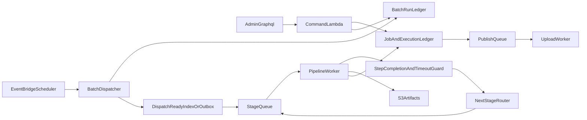

# Studio Job Batch Automation

## Overview

현재 Studio의 `Job` 기반 반자동 제작 흐름을, 여러 건을 안전하게 자동 생산하는 배치 파이프라인으로 확장하기 위한 계획이다.
기존의 `Job` 저장 모델, `JobExecution` 실행 원장, async pipeline worker, Fargate 렌더 패턴은 재사용하되, 배치 제어면, 종료 보장 규칙, 템플릿 기반 에셋 결합, 전역 운영 가시성을 우선 보강한다.

## Current State

- 제작의 핵심 단위는 `Job`이고, GraphQL도 대부분 단건 `jobId` 중심이다.
- `createDraftJob`는 기본적으로 생성 직후 바로 플랜 단계까지 시작한다.
- 장기 실행은 비동기화되어 있지만, 현재 구현은 `Lambda async invoke` 기반 단건 워커 호출이며 durable queue, backpressure, DLQ가 없다.
- 전역 운영 조회는 배치 규모에 맞지 않는다. `adminJobs`는 status별 조회를 메모리 병합하고, `/executions`는 최근 잡 N건의 실행 이력을 클라이언트에서 합산한다.
- 저장소 문서도 목표 구조를 `AppSync/Lambda + Step Functions/SQS + Fargate` 혼합형으로 보고 있다.

## Target Architecture

## Core Design Decisions

### 1. Keep coarse stages, add fine-grained steps

- 기존 `JOB_PLAN`, `SCENE_JSON`, `ASSET_GENERATION`, `FINAL_COMPOSITION` coarse stage는 유지한다.
- 그 아래에 fine-grained step을 추가한다.
- 기존 승인 포인터, 타임라인, 단건 상세 UI를 깨지 않기 위해 `stageType`은 유지하고 `stepType` 또는 `substageType`을 추가한다.

예시 step 분해:

- `JOB_PLAN_REQUEST`
- `JOB_PLAN_VALIDATE`
- `SCENE_JSON_REQUEST`
- `SCENE_JSON_VALIDATE`
- `ASSET_TEMPLATE_RESOLVE`
- `ASSET_BIND`
- `ASSET_GENERATE_MISSING`
- `FINAL_COMPOSITION`
- `PUBLISH_REQUEST`

### 2. Add a first-class batch control entity

- `Job` 위에 `BatchRun` 또는 `ProductionRun`을 둔다.
- 최소 필드:
  - `batchRunId`
  - 대상 preset/content/policy
  - 생성 수량 또는 소스 집합
  - priority
  - concurrency lane
  - budget/quota
  - retry policy
  - autoAdvance rules
  - startedAt/completedAt/failedAt

### 3. Use queue-backed orchestration

- `runAdminStageExecution`의 실행 원장 패턴은 재사용한다.
- 실제 비동기 소비는 direct Lambda async invoke 대신 queue-backed orchestration으로 승격한다.
- 필요 요소:
  - stage별 SQS 큐 또는 Step Functions 상태 머신
  - DLQ
  - visibility timeout
  - redrive 정책
  - queue depth 기반 동시성 제어

### 4. Dispatch via ready index or outbox

- scheduler가 단순히 `pending` Job을 주기 스캔하는 구조만으로는 부족하다.
- 중복 claim, 누락, race condition을 피하기 위해 `dispatch-ready` 전용 인덱스 또는 outbox row를 둔다.
- dispatcher는 다음을 만족해야 한다.
  - claim 전용 conditional update
  - lease expiry 후 재claim 가능
  - priority와 `nextEligibleAt`를 반영한 순서
  - 같은 item을 여러 인스턴스가 동시에 잡아도 한 번만 진행

## Safe Step Progression

### Step states

- `REQUESTED`
- `RUNNING`
- `SUCCEEDED`
- `FAILED_RETRYABLE`
- `FAILED_TERMINAL`
- `TIMED_OUT`
- `CANCELLED`

### Advance conditions

다음 단계는 아래가 모두 충족될 때만 진행한다.

- 이전 step execution이 `SUCCEEDED`
- 산출물 저장 완료
- 산출물 계약 검증 완료
- 승인 또는 자동 채택 포인터 갱신 완료

### Termination guarantees

모든 자동 전이는 finite state transition으로 제한한다.

- execution마다 `attemptCount`와 `maxAttempts`
- step마다 `deadlineAt` 또는 `maxRuntimeSec`
- retry 가능 에러만 backoff 후 재시도
- 동일 입력 해시에서 동일 step 재기동 시 idempotent no-op 또는 기존 execution 재사용
- `SUCCEEDED`, `FAILED_TERMINAL`, `TIMED_OUT`, `CANCELLED`는 최종 종료 상태
- dispatcher는 같은 `jobId + stage + inputSnapshotId` 조합을 중복 enqueue하지 않음
- batch/job 전체에도 wall-clock timeout 상한을 둠
- 일정 시간 이상 진척이 없으면 `STALLED` 또는 `TIMED_OUT`
- timeout 이후에는 자동 재진입 없이 운영자 판단 대기

## LLM Safety Pattern

LLM 단계는 “요청 성공”과 “산출물 usable”을 분리해서 다룬다.

- 요청 payload와 기대 schema version 저장
- 응답 수신 후 shared `zod` 계약으로 검증
- 검증 실패 시 retryable 또는 terminal로 분류
- 산출물 저장 후 checksum 또는 snapshot pointer 기록
- 그 후에만 다음 단계 unlock

명시적으로 노출해야 하는 실패 유형:

- provider timeout
- partial response
- malformed JSON
- schema mismatch
- invalid input
- policy violation
- rate limit

## Timeout And Compensation

타임아웃 설계만으로는 충분하지 않다. 외부 provider나 Fargate 작업이 이미 시작된 뒤라면 execution만 종료되고 실제 작업은 계속 살아 있을 수 있다.

필수 보상 규칙:

- cancel 가능한 provider는 명시적 cancel 호출
- cancel 불가능한 provider는 orphan marker와 result quarantine 처리
- 늦게 도착한 성공 callback/result는 closed execution에 자동 채택되지 않음
- timeout 이후 재시도는 새 execution으로 분리하되 lineage를 남김

## Template-Based Asset Binding

각 단계의 필요 에셋은 ad hoc 검색이 아니라 template/preset 기반으로 선언한다.

권장 흐름:

- preset/template이 `requiredAssets`를 가짐
- 각 asset slot은 타입, 비율, 길이, 우선 source, 품질 기준, fallback 생성 허용 여부를 가짐
- `ASSET_TEMPLATE_RESOLVE`가 slot별 요구사항 계산
- `ASSET_BIND`가 asset pool, 기존 scene assets, preset default assets에서 후보 결합
- 부족한 slot만 `ASSET_GENERATE_MISSING`으로 넘김

구현 전에 먼저 정의해야 하는 계약:

- `RequiredAssetSlot`
- hard constraints: `assetType`, `aspectRatio`, `duration`, `license`, `commercialUseAllowed`
- soft preferences: tags, mood, provider preference, freshness
- fallback order
- 생성 허용/금지 규칙

## Admin Visibility Requirements

어드민에서는 최소 아래가 보이도록 설계한다.

- 현재 batch/job/stage 진행률
- 현재 대기 중인 step과 다음 예정 step
- 마지막 성공 시각
- 마지막 실패 시각
- 실패 이유 코드와 사용자 친화 메시지
- retry 예정 시각과 남은 시도 횟수
- timeout, stuck, manual-review-required 운영 경보

핵심 원칙:

- 단순 status 문자열이 아니라 `progress + reason + nextAction` 모델이어야 한다.
- 배치 운영 UI는 기존 단건 query 조합이 아니라 server-side aggregate/read model을 기준으로 설계해야 한다.

권장 조회면:

- `batchExecutions`
- `jobExecutionFeed`
- `stuckJobs`
- `failedSteps`

## Publish Control Plane

현재 publish 계약은 `ChannelPublishQueueItem`, `PublishTarget`, `channelContentItemId`를 암시하지만 실제 구현은 `jobId` 중심인 부분이 남아 있다.

따라서 batch 오케스트레이션 초반에 아래를 먼저 고정해야 한다.

- `Job`과 publish 대상 식별자의 관계
- `ProductionOutput` 또는 `ChannelContentItem` 도입 여부
- publish retry와 failure classification
- scheduled publish consumer
- platform별 target 상태 추적

## Compatibility Strategy

- 기존 `runJobPlan`, `runSceneJson`, `runAssetGeneration`, `runFinalComposition` mutation은 유지한다.
- 신규 batch/ops query와 mutation을 병행 추가한다.
- coarse stage approval pointer는 유지하고 내부적으로만 fine-grained step을 도입한다.
- shared `zod` 계약을 먼저 추가한 뒤 resolver, schema, UI를 순차 마이그레이션한다.

## Priority

1. `coarse stage + fine-grained step` 공존 모델과 shared contract 마이그레이션부터 확정한다.
2. `BatchRun + dispatcher + dispatch-ready index/outbox + queue`를 설계하고, `step completion / timeout / termination rules`를 함께 정의한다.
3. `JobStepExecution`, `AssetTask`, `PublishTask`와 timeout compensation/orphan cleanup을 포함한 실행 원장 강화를 진행한다.
4. 템플릿 기반 asset binding 계약과 missing-asset generation 경로를 붙인다.
5. 전역 execution 조회와 운영 메트릭, 실패 이유 노출을 server-side aggregate 기준으로 붙인다.
6. publish target identity를 고정한 뒤 publish scheduling/auto-approval을 연결한다.

## Main Risks And Responses

### Risk: breaking existing single-job flows

- 대응: coarse stage는 유지하고 fine-grained step만 내부 확장으로 도입한다.

### Risk: dispatcher scan not scaling

- 대응: ready index 또는 outbox 기반 claim 모델을 먼저 설계한다.

### Risk: template asset binding becoming loose tag search

- 대응: `RequiredAssetSlot` 계약과 hard/soft constraint를 먼저 정의한다.

### Risk: timed-out executions leaving orphan provider tasks

- 대응: cancel, quarantine, late-result-ignore, lineage 규칙을 execution 모델에 포함한다.

### Risk: ops UI built from client-side query fanout

- 대응: 처음부터 server-side aggregate/read model 기반 query를 설계한다.

## Main Files To Start From

- `lib/modules/publish/graphql/schema.graphql`
- `lib/modules/publish/graphql-api.ts`
- `lib/app-stack.ts`
- `services/admin/shared/usecase/run-admin-stage-execution.ts`
- `services/admin/pipeline/pipeline-worker/index.ts`
- `services/shared/lib/store/job-execution.ts`
- `services/shared/lib/store/video-jobs-meta.ts`
- `services/shared/lib/contracts/content-presets.ts`
- `services/shared/lib/contracts/admin-asset-pool.ts`
- `services/shared/lib/contracts/canonical-io-schemas.ts`
- `lib/modules/publish/contracts/publish-domain.ts`
- `services/publish/upload/usecase/request-upload.ts`
