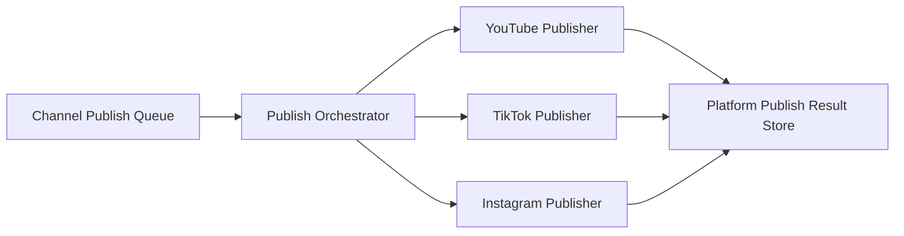

# 채널 중심 출고 큐 및 멀티 플랫폼 발행 구조 (수정 문서)

**한 줄 요약:** 목표는 **“유튜브 업로드 기능”**이 아니라 **멀티 플랫폼 발행 운영 모델**이다. **소재(Source)·마스터**와 **채널별 제작·배포 아이템**을 분리하고, 실제 발행 단위는 **Publish Target(특정 PlatformConnection 1개)** 로 둔다. 메타데이터는 **공통 초안 + 플랫폼 override + 큐 최종 확정**으로 쌓고, 실행은 **플랫폼별 Publisher adapter**가 담당한다.

**관련 문서:** Admin 전반 방향은 [`admin-improvement-direction-cursor-handoff.md`](./admin-improvement-direction-cursor-handoff.md), 워크벤치·continuation 추적은 [`admin-pipeline-workbench-continuation-review.md`](./admin-pipeline-workbench-continuation-review.md), GraphQL 스키마 원본은 [`../../lib/modules/publish/graphql/schema.graphql`](../../lib/modules/publish/graphql/schema.graphql).

---

## 0. 결론: 다섯 축으로 일반화한다

기존의 **채널 중심 YouTube 연동 + 출고 큐** 구조를, 아래 **5개 축**으로 재설계하면 된다.

| 축                                     | 역할                                                                                                         |
| -------------------------------------- | ------------------------------------------------------------------------------------------------------------ |
| **Platform Connection**                | 채널에 붙는 외부 배포 계정(OAuth, 네이티브 account id, 동기화, capability)                                   |
| **Platform Publish Profile**           | 연결(또는 채널×플랫폼) 단위 기본 게시 정책·footer·해시태그·플랫폼별 기본값                                   |
| **Content Publish Draft**              | **채널별 제작 아이템** 단위 **글로벌 초안 + 플랫폼별 draft/override**                                        |
| **Channel Publish Queue**              | 채널 단위 편성·예약·발행 순서(항목은 **채널별 제작 아이템**을 가리키고, 발행 시도는 **Publish Target** 단위) |
| **Platform-specific Publisher Worker** | YouTube / TikTok / Instagram 등 **실제 API 호출·후처리 adapter**                                             |

그 위에 **논리 계층**으로 **SourceItem(소재 원본)** 을 두어, 한 소재에서 **여러 채널용 제작 아이템**이 파생되게 한다([§3](#3-소재-원본과-채널별-배포-버전-분리)).

아키텍처는 공통화하되, **실제 발행 capability는 플랫폼별 adapter와 validation으로 흡수**한다. **“YouTube 설계를 세 번 복붙”하면 안 된다.**

### 0.1 플랫폼별 현실(요약)

- **YouTube:** 영상 업로드와 메타데이터 설정이 공식 API로 비교적 명확하다. 예: 업로드·조회·재생목록 항목 추가 등은 [Videos: insert](https://developers.google.com/youtube/v3/docs/videos/insert) 등 Data API 문서에 정리되어 있다.
- **TikTok:** Content Posting API 등으로 업로드·초안·게시 흐름이 있으나, **제품 승인·시나리오·권한 제약**을 전제로 봐야 한다. 개요는 [TikTok Content Posting API](https://developers.tiktok.com/products/content-posting-api/) 제품 페이지를 참고한다.
- **Instagram:** Instagram Platform의 [Content Publishing](https://developers.facebook.com/docs/instagram-platform/content-publishing/)으로 이미지·비디오·릴스·캐러셀 등 게시가 가능하다는 점이 공식 문서에 명시된다.

즉 **공통 모델 + adapter**가 맞고, 플랫폼마다 같은 동작이 모두 가능하지는 않다. `PlatformConnection.capabilities`로 “지금 이 연결으로 무엇이 되는지”를 드러내는 것이 중요하다.

---

## 1. 현재 코드베이스와 본 문서의 관계

아래는 **2025-03 기준** 저장소 스냅샷이다. **현재 구현은 YouTube·단일 플랫폼 큐에 가깝고**, 본 문서는 **소재·채널별 아이템 분리**와 **멀티 플랫폼**을 함께 지향한다.

| 영역              | 현재 (스냅샷)                                               | 본 문서에서 지향하는 확장                                                                                         |
| ----------------- | ----------------------------------------------------------- | ----------------------------------------------------------------------------------------------------------------- |
| 소재 vs 제작      | `AdminJob` 등이 소재·채널 파생을 한 레코드에 담기 쉬움      | **SourceItem 1 : N ChannelContentItem** — 채널별 제목·길이·씬·메타가 다르면 **행을 나눔**                         |
| 채널 vs 외부 계정 | `Content`/`contentId` 중심, YouTube 전용 필드가 섞이기 쉬움 | **Channel** = 내부 운영 단위, **PlatformConnection** = 매체 계정 연결([§3.4](#34-platformconnection과-채널-제약)) |
| 발행 단위         | 큐가 `jobId` 단일 가정에 가까움                             | **ChannelContentItem 1 : N PublishTarget**, 타깃마다 **PlatformConnection 1개**만                                 |
| 제작 아이템 상태  | `JobStatus`에 `READY_TO_SCHEDULE` 존재                      | **ChannelContentItem** 수명주기로 정리(기존 Job과 매핑은 점진적)                                                  |
| 출고 큐           | `ChannelPublishQueueItem` (단일 플랫폼 가정)                | 큐 행은 **channelContentItemId** 중심, 스케줄·성공/실패는 **PublishTarget**·adapter와 연결                        |
| 메타데이터        | 글로벌+플랫폼 `publishDraft` 미완                           | **ContentPublishDraft**는 **채널별 제작 아이템**에 귀속                                                           |
| 발행 실행         | YouTube 업로드 중심 서술이 많음                             | **Publish Orchestrator** + 플랫폼 adapter                                                                         |

이 표는 구현 우선순위를 잡을 때 **중복 작업을 줄이기 위한 앵커**다.

---

## 2. 문제 정의

현재 구조는 제작 아이템 상세 내부에 **업로드/내보내기**가 붙은 형태에 가깝다. 실제 운영 의도는 아래에 더 가깝다.

1. **채널(내부 라인)**별로 제작·배포 아이템이 계속 생성된다.
2. 렌더/검수 완료된 아이템만 출고 후보가 된다.
3. 사람이 **채널 관점**에서 무엇을 다음에 내보낼지 고른다.
4. **플랫폼마다** 제목·캡션·해시태그·썸네일·예약을 확정한다.
5. 실제 게시는 **각 플랫폼 API**(및 제품 제약)에 맡긴다.

즉 “내보내기”는 제작 아이템의 마지막 버튼 한 번이 아니라, **채널 운영자의 편성·일정·멀티 플랫폼 타깃 결정**이다.

제작 아이템 안에 업로드 책임을 몰리면 다음 문제가 생긴다.

- “만들면 바로 올린다”는 UX로 오해됨
- 채널별 편성·간격·우선순위·**플랫폼 믹스** 제어가 어려움
- **플랫폼별 기본 정책**을 연결 단위로 관리하기 어려움
- 제작 완료와 발행 시도/성공이 한 상태에 섞임

---

## 3. 소재 원본과 채널별 배포 버전 분리

### 3.1 권장 결론(한 줄)

**아이템과 채널을 직접 `1:N`으로만 묶지 말고**, **소재 원본(Source / Master)** 과 **채널별 배포·제작 아이템(Channel Content Item)** 을 분리한다. 실제 **발행 단위**는 **Publish Target**이며, **각 타깃은 정확히 하나의 PlatformConnection**(하나의 구체적 외부 계정)만 가리킨다.

원하는 운영은 다음과 같이 정리할 수 있다.

- **소재(Source)** 1개
- 그걸 바탕으로 **채널별 배포 아이템** 여러 개 생성
- **각 배포 아이템**은 필요 시 **여러 Publish Target**을 가짐(예: 같은 채널 라인의 YouTube·TikTok·Instagram)
- **한 Publish Target**은 **한 PlatformConnection만** 참조 — 타깃이 동시에 유튜브와 틱톡에 “하나의 레코드로” 걸치지 않음
- 같은 소재에서 **서로 다른 채널용 아이템**을 파생 — 채널마다 제목·훅·길이·씬·썸네일·메타가 달라도 **별도 `ChannelContentItem`**

### 3.2 왜 단순 `아이템 ↔ 채널 = 1:N`만으로는 부족한가

같은 소재(예: “조선 궁중의 금기어”)를 채널 A·B·C에 뿌리면, 현실에서는 거의 항상 다음이 달라진다.

- 제목·훅·길이·씬 구성·썸네일·해시태그·설명·발행 시점

이걸 **한 레코드**에 채널별로 우겨 넣으면 모델이 금방 썩는다. 그래서 계층을 **소재 → 채널별 제작 아이템 → 플랫폼별 발행 타깃**으로 나눈다.

### 3.3 엔티티 역할

#### Source Item / Master Topic

**무엇에 대한 콘텐츠인가** — 소재 주제, 핵심 훅, 조사 노트, 아이데이션 후보, 공통 레퍼런스, 베이스 스토리라인 등 **콘텐츠 씨앗**.

#### Channel Content Item

**그 소재를 이 채널 문법으로 어떻게 만들 것인가** — 실제 파이프라인·렌더·검수·출고 준비가 붙는 **채널별 제작·운영 단위**. 같은 `SourceItem`에서 **여러 개**가 나올 수 있다.

관계:

- **SourceItem 1 : N ChannelContentItem**
- **Channel 1 : N ChannelContentItem**

#### Publish Target / Platform Target

**실제 발행 단위** — 특정 **외부 계정**으로의 한 번의 게시 시도·스케줄·결과 추적.

권장 제약:

- **한 Publish Target은 하나의 PlatformConnection만 가리킨다** (한 타깃이 유튜브+틱톡을 동시에 가리키지 않음).
- **하나의 ChannelContentItem은 여러 PublishTarget을 가질 수 있다** (같은 채널 라인의 YouTube / TikTok / Instagram).

### 3.4 PlatformConnection과 채널 제약

- 관계형으로는 **PlatformConnection : Channel = N : 1** (여러 연결이 한 내부 채널에 붙음: YouTube+TikTok+Instagram).
- **운영 규칙:** **하나의 PlatformConnection은 한 내부 Channel에만 소속**된다 — 같은 YouTube 계정을 Channel A와 Channel B에 동시에 묶지 않는다.

이렇게 두면 기본 메타 정책 충돌, 출고 큐 충돌, 성과 attribution, 권한 책임이 덜 꼬인다.

### 3.5 내부 구조(요약)

```text
SourceItem (원본 소재)
  └─ ChannelContentItem (채널별 제작·배포 아이템)
       └─ PublishTarget (플랫폼별 발행 단위, 각각 PlatformConnection 1개)
```

관계 요약:

- `SourceItem 1 : N ChannelContentItem`
- `Channel 1 : N ChannelContentItem`
- `ChannelContentItem 1 : N PublishTarget`
- `PlatformConnection 1 : N PublishTarget` (같은 계정으로 여러 번 발행 시도가 쌓일 수 있음)
- **`PlatformConnection`은 오직 하나의 Channel에만 소속** (운영 제약)

### 3.6 예시

**SourceItem** — `src_001`, topic: “조선 궁중의 금기어”, masterHook: “왕 앞에서 절대 입에 올리면 안 되던 말”

**ChannelContentItem A** — `sourceItemId: src_001`, `channelId: channel_history_shorts`, title·tone·duration 등 채널 A 문법.

**ChannelContentItem B** — 동일 소재, `channelId: channel_korean_ambient`, 다른 제목·길이·톤.

**PublishTarget A1** — `channelContentItemId: A`, `platformConnectionId: youtube_history`, `platform: youtube`  
**PublishTarget A2** — 동일 ChannelContentItem A, `platformConnectionId: tiktok_history`  
**PublishTarget B1** — `channelContentItemId: B`, `platformConnectionId: youtube_ambient`

### 3.7 이 구조가 주는 이점

1. **소재 재사용** — 좋은 소재를 채널 문법별로 재가공하기 쉬움
2. **채널별 최적화** — tone·length·scene·metadata 분리
3. **멀티 플랫폼** — 같은 채널용 아이템을 여러 매체로 자연스럽게 확장
4. **성과·분석** — 소재 단위 / 채널 포지셔닝 단위 / 플랫폼 단위 성과를 분리해 볼 수 있음 (한 레코드에 채널 여러 개를 달면 분석이 흐려짐)

### 3.8 하지 말 것 / 해야 할 것

**하지 말 것**

- 아이템 하나에 채널 여러 개를 직접 매핑해, 채널별 제목·씬·메타를 한 레코드에 우겨 넣기
- 하나의 외부 플랫폼 계정을 **여러 내부 채널**에 걸쳐 공유하기

**해야 할 것**

- **SourceItem** 도입
- **ChannelContentItem** 을 실제 제작·운영 단위로 사용 (현 코드의 Job/제작 아이템과 점진적 정렬)
- **PublishTarget** 을 실제 플랫폼 발행·스케줄·결과 추적 단위로 사용
- **PlatformConnection** 은 **한 Channel에만** 소속되게 제한

### 3.9 추천 엔티티 초안

```ts
type SourceItem = {
  id: string;
  topic: string;
  masterHook?: string;
  sourceNotes?: string;
  status: "IDEATING" | "READY_FOR_DISTRIBUTION" | "ARCHIVED";
};

type ChannelContentItem = {
  id: string;
  sourceItemId: string;
  channelId: string;
  title: string;
  tone?: string;
  targetDurationSec?: number;
  status: "DRAFT" | "IN_PRODUCTION" | "READY_TO_SCHEDULE" | "PUBLISHED";
};

type PublishTarget = {
  id: string;
  channelContentItemId: string;
  platformConnectionId: string;
  platform: "youtube" | "tiktok" | "instagram";
  status: "QUEUED" | "SCHEDULED" | "PUBLISHED" | "FAILED";
  scheduledAt?: string;
  externalPostId?: string;
  externalUrl?: string;
};
```

(상태·필드는 파이프라인 단계와 합치면서 확장한다.)

---

## 4. 목표 상태

### 4.1 Channel(내부 운영 채널)

앞으로 채널은 **단일 YouTube 채널이 아니라** 브랜드/콘텐츠 라인(예: Mystic Daily Shorts, Korean Tale Ambient)이다.

```ts
type Channel = {
  id: string;
  name: string;
  brandKey: string;
  formatPreset: "shorts" | "longform" | "mixed";
  defaultLanguage?: string;
  defaultTone?: string;
};
```

### 4.2 채널별 제작 아이템(Channel Content Item)

아이데이션부터 렌더·검수까지, 그리고 **게시용 초안(글로벌 + 플랫폼별)** 준비까지 담당한다. **실제 멀티 플랫폼 발행 실행**은 Publish Target·채널 출고 큐·오케스트레이터가 담당한다. 한 소재에서 **채널마다 별도의 ChannelContentItem**이 생긴다([§3](#3-소재-원본과-채널별-배포-버전-분리)).

### 4.3 외부 매체 연결 및 발행

- **PlatformConnection**으로 YouTube·TikTok·Instagram 계정을 **한 내부 채널에** 붙인다.
- **PlatformPublishProfile**으로 연결마다 기본 게시 정책을 둔다.
- **ChannelPublishQueue**는 채널 단위로 **ChannelContentItem**을 편성한다.
- **PublishTarget** 단위로 스케줄·재시도·`externalPostId`/URL을 추적한다.
- **Publisher Worker(adapter)**가 플랫폼별로 실제 API를 호출한다.

---

## 5. 핵심 원칙

### 5.1 “채널”과 “플랫폼 연결”을 분리한다

- **Channel** = 내부 운영 단위
- **Platform Account Connection** = 외부 배포 계정 연결(채널당 복수 가능, **계정은 채널 간 공유하지 않음** — [§3.4](#34-platformconnection과-채널-제약))

### 5.2 소재와 채널별 제작물을 분리한다

**SourceItem 1 : N ChannelContentItem** — “아이템 하나에 채널 여러 개”가 아니라, **소재 하나에서 채널별 행이 여러 개**([§3](#3-소재-원본과-채널별-배포-버전-분리)).

### 5.3 발행 단위는 Publish Target이다

**ChannelContentItem 1 : N PublishTarget**, 각 타깃은 **PlatformConnection 1개**만 참조. 한 타깃이 여러 매체를 동시에 가리키지 않는다.

### 5.4 출고 큐는 채널 단위로 유지한다

큐는 **어느 ChannelContentItem을 언제 내보낼지** 편성하는 뷰이고, 실행·스케줄·성공 여부는 **PublishTarget**(또는 동일 의미의 id)과 연결한다.

### 5.5 메타데이터는 공통층 + 플랫폼 override + 큐 최종 확정

- **Global publish draft** (ChannelContentItem 단위)
- **Per-platform** (PublishTarget / PlatformConnection 맥락)
- **Queue final override**

### 5.6 외부 API는 확정 발행 단계에서 집중 호출

draft/queue는 내부 DB로 관리하고 **확정 발행 시점에** 플랫폼 API를 호출한다.

### 5.7 제작과 출고를 분리한다

ChannelContentItem에서 “만드는 일”과, 큐·타깃에서 “언제 어디에 올릴지”를 분리한다.

---

## 6. 권장 도메인 모델

### 6.1 SourceItem, ChannelContentItem, PublishTarget

[§3.9](#39-추천-엔티티-초안) 초안을 기준으로, 저장소·API에서는 `ChannelContentItem.id`가 현재 `jobId` / 제작 아이템 id와 **점진적으로 정렬**되면 된다.

### 6.2 PlatformConnection

채널과 외부 플랫폼 계정의 연결. **`channelId` 필수**, 동일 외부 계정을 두 내부 채널에 연결하지 않는다는 **비즈니스 규칙**을 둔다.

```ts
type PlatformConnection = {
  id: string;
  channelId: string;
  platform: "youtube" | "tiktok" | "instagram";
  accountId: string;
  accountHandle?: string;
  oauthAccountId: string;
  status: "CONNECTED" | "EXPIRED" | "ERROR" | "DISCONNECTED";
  connectedAt: string;
  lastSyncedAt?: string;
  capabilities?: {
    uploadVideo: boolean;
    schedulePost: boolean;
    updateMetadata: boolean;
    addToPlaylist?: boolean;
  };
};
```

### 6.3 PlatformPublishProfile

```ts
type PlatformPublishProfile = {
  id: string;
  channelId: string;
  platformConnectionId: string;
  platform: "youtube" | "tiktok" | "instagram";
  defaultVisibility?: "private" | "unlisted" | "public";
  defaultLanguage?: string;
  defaultHashtags: string[];
  captionFooterTemplate?: string;
  preferredSlots?: string[];
  youtube?: {
    defaultCategoryId?: string;
    defaultPlaylistIds: string[];
    defaultTags: string[];
  };
  tiktok?: { disclosureTemplate?: string };
  instagram?: { defaultFirstCommentTemplate?: string };
};
```

### 6.4 ContentPublishDraft

**채널별 제작 아이템**에 귀속: `channelContentItemId` (기존 `contentItemId` 명명과 병행·이관 가능).

```ts
type ContentPublishDraft = {
  channelContentItemId: string;
  globalDraft: {
    title?: string;
    caption?: string;
    description?: string;
    hashtags: string[];
    thumbnailAssetId?: string;
  };
  platformDrafts: Array<{
    platform: "youtube" | "tiktok" | "instagram";
    targetConnectionId: string;
    enabled: boolean;
    metadata: {
      /* … */
    };
    overrideFields?: string[];
    validationStatus?: "VALID" | "INVALID" | "INCOMPLETE";
  }>;
};
```

### 6.5 ChannelPublishQueueItem과 PublishTarget의 정렬

**두 가지 구현 스타일이 가능하다.**

1. **정규화:** 스케줄·발행 상태는 **PublishTarget**에 두고, 큐는 `channelContentItemId` + 우선순위만 관리하거나, 큐 행이 `publishTargetId` 목록을 참조한다.
2. **큐 임베드:** 기존처럼 `ChannelPublishQueueItem`에 `targets[]`를 두되, 각 원소가 **`publishTargetId`** 를 가지며 **PlatformConnection당 최대 하나**로 제약한다.

권장 의미:

```ts
type ChannelPublishQueueItem = {
  id: string;
  channelId: string;
  channelContentItemId: string;
  status:
    | "QUEUED"
    | "PARTIALLY_SCHEDULED"
    | "SCHEDULED"
    | "PUBLISHED"
    | "FAILED"
    | "REMOVED";
  priority: number;
  targets: Array<{
    publishTargetId: string;
    platform: "youtube" | "tiktok" | "instagram";
    platformConnectionId: string;
    status:
      | "QUEUED"
      | "SCHEDULED"
      | "PUBLISHING"
      | "PUBLISHED"
      | "FAILED"
      | "SKIPPED";
    scheduledAt?: string;
    finalMetadata: Record<string, unknown>;
    externalPostId?: string;
    externalUrl?: string;
    publishError?: string;
  }>;
};
```

`targets[]`는 **PublishTarget**과 1:1에 가깝게 맞추거나, 큐 전용 스냅샷으로 두고 발행 시 PublishTarget을 갱신한다.

**저장소 메모:** 현재 GraphQL의 `ChannelPublishQueueItem`은 `jobId` 중심이다. **SourceItem / ChannelContentItem** 도입 시 `jobId` → `channelContentItemId` 정렬·마이그레이션을 한 번에 설계한다.

---

## 7. 상태 모델 (요약)

### 7.1 ChannelContentItem

`READY_TO_SCHEDULE` = 제작·검수 완료, 출고 후보 가능 — 기존 `JobStatus` 아이디어와 정렬. 파이프라인 단계 enum은 저장소 현실과 병존할 수 있다.

### 7.2 PublishTarget·큐

- PublishTarget별 `QUEUED` → … → `PUBLISHED` / `FAILED`
- 큐 아이템 상위 `status`는 타깃들의 **집계**(예: `PARTIALLY_SCHEDULED`)

---

## 8. API / 워커 계층

### 8.1 공통 Publish Orchestrator

1. 채널 출고 큐에서 **ChannelContentItem** 선택
2. **PublishTarget** 단위로 검증
3. publish task 생성
4. 플랫폼 adapter 호출
5. 결과를 **PublishTarget**·execution에 저장
6. 후처리



### 8.2 플랫폼 adapter 책임(요약)

| Adapter                | 책임                                                                                                                                    |
| ---------------------- | --------------------------------------------------------------------------------------------------------------------------------------- |
| **YouTubePublisher**   | 비디오 업로드, 메타데이터, 재생목록, videoId/url·상태 저장 ([Data API](https://developers.google.com/youtube/v3/docs/videos/insert) 등) |
| **TikTokPublisher**    | Content Posting API 흐름, capability 확인 ([제품 문서](https://developers.tiktok.com/products/content-posting-api/))                    |
| **InstagramPublisher** | Content Publishing API ([Publishing](https://developers.facebook.com/docs/instagram-platform/content-publishing/))                      |

### 8.3 Execution 추적

`sourceItemId`(선택), `channelContentItemId`, `publishTargetId`, `queueItemId`, `platform`, `platformConnectionId`를 남겨 **소재·채널·매체** 관점 성과를 추적한다.

---

## 9. 백엔드 변경 방향 (요약)

- **SourceItem** CRUD·파생(채널별 아이템 생성) 흐름
- **ChannelContentItem** = 기존 제작 파이프라인의 주 레코드로 수렴
- **PublishTarget** 생성·스케줄·재시도
- 제작 상세 **렌더/출고 준비**는 **ChannelContentItem** + draft + “어떤 PublishTarget을 켤지”까지
- `channelPublishQueue` / `enqueueToChannelPublishQueue` 는 **`channelContentItemId`**·**publishTarget** 개념을 수용하도록 일반화

---

## 10. 프론트 / Admin UI

### 10.1 채널 상세 탭(권장)

- 개요
- **소재 / 제작 아이템** (용어 통일: ChannelContentItem 목록)
- 출고 큐
- 예약/발행 일정
- 매체 연결 · 매체별 게시 프로필
- 성과
- 설정

### 10.2 제작 아이템 상세 — `렌더/출고 준비`

**ChannelContentItem** 기준: 글로벌 draft, 플랫폼별 draft, **PublishTarget** 후보 on/off, 큐에 올리기.

### 10.3 채널 > 출고 큐

**ChannelContentItem** 단위로 편성, 행·타깃에서 **플랫폼별** 상태·`scheduledAt`·재시도.

### 10.4 소재 라이브러리(선택)

같은 **SourceItem**에서 파생된 채널별 아이템을 한 화면에서 비교.

---

## 11. 구현 우선순위 (통합)

### 1순위

- **SourceItem**, **ChannelContentItem** 모델(또는 기존 Job과의 매핑) 정의
- **PublishTarget** (`platformConnectionId` 단일 참조)
- **PlatformConnection** — **Channel 단일 소속** 제약
- **ContentPublishDraft** — `channelContentItemId` 귀속

### 2순위

- **PlatformPublishProfile**
- `ChannelPublishQueueItem` — `channelContentItemId`, `targets[]` ↔ **PublishTarget** 정렬
- 채널 상세 **매체 연결** 탭

### 3순위

- **Publish Orchestrator** + YouTube / TikTok / Instagram adapter 분리

### 4순위

- 플랫폼별 validation·에러·재시도
- 예약/발행 일정 UI에서 **PublishTarget**별 상태

### 5순위

- 성과 수집·동기화(소재·채널·플랫폼별)
- 추천 슬롯·타깃(선택)

**저장소 메모:** `READY_TO_SCHEDULE`, `enqueueToChannelPublishQueue` 는 **ChannelContentItem + PublishTarget** 모델로 옮기는 동안 **호환 레이어**로 두는 편이 안전하다.

---

## 12. 최종 결론

목표는 YouTube 업로드 기능을 늘리는 것이 아니라, **소재를 채널 문법별로 쪼개 쌓고**, **매체별로 발행 단위를 명확히 나눈 멀티 플랫폼 발행 모델**을 구축하는 것이다.

정답은 다음이다.

- **소재(Source) ↔ 채널별 제작 아이템(ChannelContentItem) ↔ 발행 타깃(PublishTarget)** 의 2단·3단 분리
- **PlatformConnection** 은 **한 내부 채널에만** 소속
- **플랫폼 연결 / 게시 프로필 / draft / 큐 / adapter** 로 일반화
- **Capability 차이는 adapter와 validation**으로 흡수

한 줄로: **“아이템–채널 1:N”이 아니라 `소재 → 채널별 아이템 → (플랫폼 연결당) 발행 타깃`** 이 맞다.

---

## 부록 A: Cursor 전달용 초안(압축)

**멀티 플랫폼 발행 + 소재 분리** — YouTube 중심 설계를 일반화하고, **SourceItem → ChannelContentItem → PublishTarget(PlatformConnection 1개)** 로 쪼갠다.

**핵심:** Channel = 내부 운영 라인 · PlatformConnection = 외부 계정(채널당, 채널 간 공유 금지) · ChannelContentItem = 채널별 실제 제작 단위 · PublishTarget = 실제 발행·스케줄·결과 단위 · Queue = 채널 편성 · Publisher = adapter.

**엔티티:** SourceItem, ChannelContentItem, PublishTarget, PlatformConnection, PlatformPublishProfile, ContentPublishDraft(channelContentItemId), ChannelPublishQueueItem(channelContentItemId, targets↔PublishTarget).

**백엔드:** Orchestrator, execution에 sourceItemId·channelContentItemId·publishTargetId·platform.

**프론트:** 소재/채널별 제작 상세, 출고 큐·일정에서 타깃별 상태.

---

## 부록 B: 문서 변경 이력

| 일자       | 내용                                                                                                                                                                                          |
| ---------- | --------------------------------------------------------------------------------------------------------------------------------------------------------------------------------------------- |
| 2025-03-22 | 초안: 채널 중심 YouTube·출고 큐 설계를 수정 문서로 정리. 코드베이스 스냅샷·저장소 메모.                                                                                                       |
| 2025-03-22 | 개정: **멀티 플랫폼 발행 운영 모델**로 상향. 5축, PlatformConnection/Profile, ContentPublishDraft, 큐 `targets[]`, Orchestrator·adapter, 플랫폼별 공식 문서 링크, UI·우선순위·최종 판단 반영. |
| 2025-03-22 | 개정: **SourceItem / ChannelContentItem / PublishTarget** 계층, PlatformConnection의 채널 단일 소속, 큐·draft·execution과의 정렬, 분석·안티패턴·우선순위 반영.                                |
